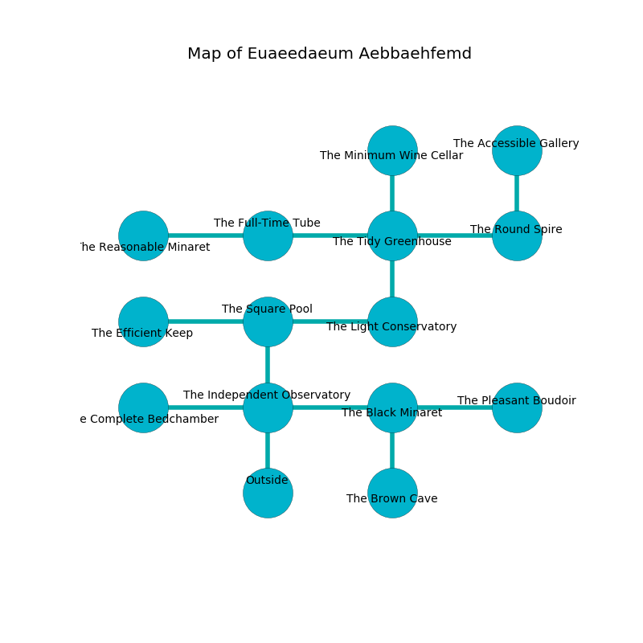

%Ruin Dogs

##Euaeedaeum Aebbaehfemd
###Overview
Euaeedaeum Aebbaehfemd is constructed on a cursed plain. Regions of it are flooded. A massive flood is happening outside. It is occupied by Orcs. Elvis Winston The Naughty, a Hill Giant is here. The Orcs worship Elvis Winston The Naughty. He  is founding a new religion. 

###Artifact
####Amhaema Bed

Amhaema Bed looks like a warm crystal. Psychic energy glows towards it. It smells like juniper. When carried it grants power to its owner. 

###Locations

####the independent observatory
White ferns are sprouting in a patch on the floor. The air tastes like lobster here. 

There is an engraving on the wall written in Orcs Script. 

> I am a coward.
>
> Run away.
>

* To the west a dripping pathway leads to [the complete bedchamber](#the-complete-bedchamber).
* To the east a twisted corridor connects to [the black minaret](#the-black-minaret).
* To the north a small opening connects to [the square pool](#the-square-pool).
* To the south is the entrance.

####the black minaret
The mirrored walls are ruined. Yellow moss is swaying in cracks in the floor. There are two Orc War Chiefs here. The floor is flooded with two inch deep lukewarm water. One of the Orcs is working a mechanism that can open a trapodoor in the floor. 

* To the west a twisted corridor leads to [the independent observatory](#the-independent-observatory).
* To the east a flooded opening connects to [the pleasant boudoir](#the-pleasant-boudoir).
* To the south a long gap opens to [the brown cave](#the-brown-cave).

####the square pool
The floor is flooded with three inch deep cold water. There are an Orc War Chief and an Orc Eye of Gruumsh here. Yellow razorgrass is decaying in broken urns. The Orcs are willing to negotiate. 

* [Elvis Winston The Naughty](#Elvis-Winston-The-Naughty) is here.
* To the west a twisted threshold opens to [the efficient keep](#the-efficient-keep).
* To the east a windy walkway opens to [the light conservatory](#the-light-conservatory).
* To the south a small opening connects to [the independent observatory](#the-independent-observatory).

####the light conservatory

There is an engraving on a stone written in common. 

> Oh pitiful god
>
> yet never odd
>
> enthusiastic and positive
>
> nothing is odd
>

* To the west a windy walkway leads to [the square pool](#the-square-pool).
* To the north a long hall connects to [the tidy greenhouse](#the-tidy-greenhouse).

####the complete bedchamber
The floor is flooded with seven inch deep cold water. 

* There is a roof here.
* To the east a dripping pathway opens to [the independent observatory](#the-independent-observatory).

####the tidy greenhouse
The concrete walls are pristine. The air tastes like banana peel here. Yellow lichens are swaying from the ceiling. There are an Orc War Chief and two Orc Eyes of Gruumsh here. The floor is glossy. The Orcs are willing to negotiate. 

* To the west a narrow passageway opens to [the full-time tube](#the-full-time-tube).
* To the east a hazy corridor leads to [the round spire](#the-round-spire).
* To the north a long artery leads to [the minimum wine cellar](#the-minimum-wine-cellar).
* To the south a long hall leads to [the light conservatory](#the-light-conservatory).

####the full-time tube
The wooden walls are scratched. Green ferns are decaying in a patch on the floor. There are an Orc War Chief and an Orc Eye of Gruumsh here. The floor is sticky. The air smells like peony here. One of the Orcs is pointing a ballista at the entrance. 

* There is a knot here.
* To the west a hazy walkway connects to [the reasonable minaret](#the-reasonable-minaret).
* To the east a narrow passageway opens to [the tidy greenhouse](#the-tidy-greenhouse).

####the efficient keep
Yellow mushrooms are growing in a patch on the floor. The stone walls are covered in mold. 

* There is a chest here.
* To the east a twisted threshold leads to [the square pool](#the-square-pool).

####the reasonable minaret
The floor is smooth. There are three Orc Eyes of Gruumsh here. The air smells like violet leaf here. The crystal walls are covered in mold. Yellow lichens are growing in cracks in the floor. One of the Orcs is working a mechanism that can engulf the room in a fiery blaze. 

* To the east a hazy walkway opens to [the full-time tube](#the-full-time-tube).

####the pleasant boudoir
The floor is smooth. The air tastes like tuberose here. There are a Shadow Demon and a Bearded Devil here. 

* To the west a flooded opening leads to [the black minaret](#the-black-minaret).

####the minimum wine cellar
Yellow ferns are decaying from the walls. The air smells like dairy here. 

* To the south a long artery leads to [the tidy greenhouse](#the-tidy-greenhouse).

####the round spire
There are an Orc War Chief and an Orc Eye of Gruumsh here. The floor is bloodstained. Green mushrooms are swaying in cracks in the floor. If the Orcs notice the Ruin Dogs, one of them will retreat and alert the others. 

* [Amhaema Bed](#Amhaema-Bed) is here.
* To the west a hazy corridor leads to [the tidy greenhouse](#the-tidy-greenhouse).
* To the north a dark opening opens to [the accessible gallery](#the-accessible-gallery).

####the brown cave
Gray moss is growing from the walls. There are a Stirge, a Lion, a Tribal Warrior, an Ettercap, and a Yuan-Ti Malison here. 

* To the north a long gap opens to [the black minaret](#the-black-minaret).

####the accessible gallery
The floor is smooth. 

* To the south a dark opening leads to [the round spire](#the-round-spire).

