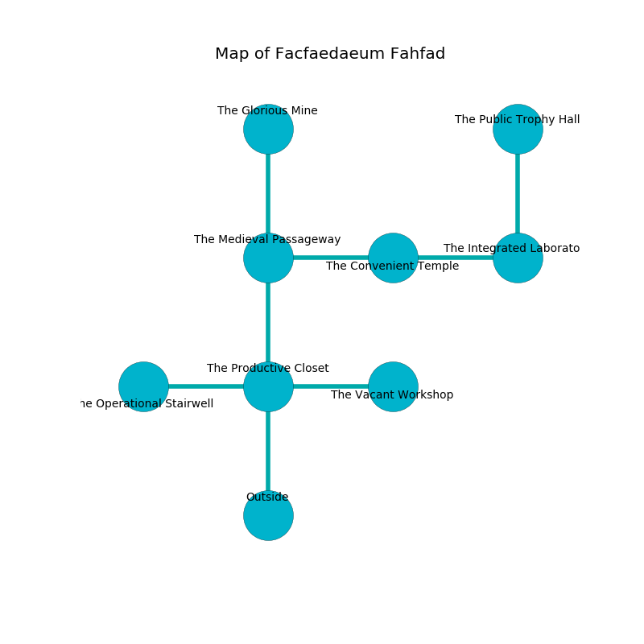

%Ruin Dogs

##Facfaedaeum Fahfad
###Overview
Facfaedaeum Fahfad is located on a spikey rift. Some rooms of Facfaedaeum Fahfad are flooded. A massive flood is happening outside. It is occupied by Gnolls. Camellia Joyner The Conservative, a Cloud Giant is here. The Gnolls have been charmed by Camellia Joyner The Conservative. She  is trying to destroy [The Socialist Moon](#The-Socialist-Moon). 

###Artifact
####The Socialist Moon

The Socialist Moon looks like a glassy rock. It smells like alfalfa. It is a pale green color. When thrown it changes probabilities. 

###Locations

####the productive closet
There are a Gnoll Fang of Yeenoghu, two Gnolls, two Gnoll Pack Lords,  here. There is a trap here. When activated, a magical proximity detector will blast flames. The floor is sticky. The air smells like orangeflower here. If the Gnolls notice the Ruin Dogs, one of them will retreat and alert [Camellia Joyner](#Camellia-Joyner). 

There is an engraving on the ceiling written in Gnolls Script. 

> I am lonely.
>
> Leave now.
>

* To the west a dark opening opens to [the operational stairwell](#the-operational-stairwell).
* To the east a windy corridor connects to [the vacant workshop](#the-vacant-workshop).
* To the north a flooded opening opens to [the medieval passageway](#the-medieval-passageway).
* To the south is the entrance.

####the vacant workshop
There are three Gnoll Fangs of Yeenoghu and a Gnoll here. The floor is sticky. If the Gnolls notice the Ruin Dogs, one of them will retreat and alert [Camellia Joyner](#Camellia-Joyner). 

There is an engraving on the wall written in Gnolls Script. 

> O sad we
>
> it is never free
>
> ethnic, strict, fat
>
> fate is free
>

* There is a bird here.
* To the west a windy corridor connects to [the productive closet](#the-productive-closet).

####the medieval passageway
The floor is bloodstained. There is a trap here. When activated, a tripwire will open a trapdoor in the floor. The air smells like potato here. There are a Sahuagin Priestess and a Mind Flayer here. 

* To the east a windy walkway opens to [the convenient temple](#the-convenient-temple).
* To the north a dark passageway opens to [the glorious mine](#the-glorious-mine).
* To the south a flooded opening leads to [the productive closet](#the-productive-closet).

####the operational stairwell
Green lichens are growing in broken urns. 

* There is a spirit here.
* To the east a dark opening leads to [the productive closet](#the-productive-closet).

####the glorious mine
The floor is smooth. The air tastes like metal here. 

* There is a spirit here.
* [Camellia Joyner The Conservative](#Camellia-Joyner-The-Conservative) is here.
* To the south a dark passageway opens to [the medieval passageway](#the-medieval-passageway).

####the convenient temple
There is a trap here. When activated, a tripwire will open a large pit in the floor. 

* To the west a windy walkway opens to [the medieval passageway](#the-medieval-passageway).
* To the east a torchlit cave opens to [the integrated laboratory](#the-integrated-laboratory).

####the integrated laboratory
There are a Death Dog, a Swarm of Ravens, a Crawling Claw, a Worg, a Drow Mage, and a Gold Dragon Wyrmling here. The floor is smooth. 

* [The Socialist Moon](#The-Socialist-Moon) is here.
* To the west a torchlit cave leads to [the convenient temple](#the-convenient-temple).
* To the north a long gap connects to [the public trophy hall](#the-public-trophy-hall).

####the public trophy hall
The floor is bloodstained. 

* To the south a long gap opens to [the integrated laboratory](#the-integrated-laboratory).

