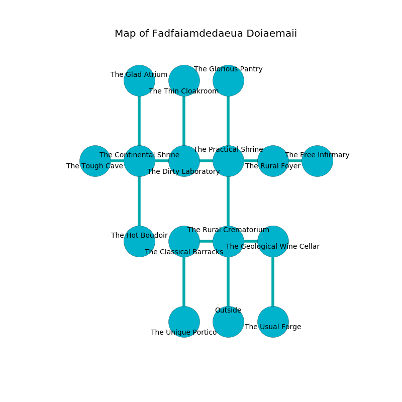

%Ruin Dogs

##Fadfaiamdedaeua Doiaemaii
###Overview
Fadfaiamdedaeua Doiaemaii is constructed on a broken city. Some rooms of it are frozen. The ruin is collapsing slowly. It is occupied by Lizardfolk. Celesta Rosales The Grumpy, a Sahuagin Baron is here. The Lizardfolk have been charmed by Celesta Rosales The Grumpy. She  is founding a new religion. 

###Artifact
####Uahadedha Eiiucaeedaeum

Uahadedha Eiiucaeedaeum has the form of a sharp spear. When held it curses all nearby. 

###Locations

####the rural crematorium
There are a Succubus and a Cambion here. The floor is smooth. The mirrored walls are ruined. Red ferns are growing in a patch on the floor. 

* To the west a narrow opening opens to [the classical barracks](#the-classical-barracks).
* To the east a windy artery leads to [the geological wine cellar](#the-geological-wine-cellar).
* To the north a dark cavern connects to [the practical shrine](#the-practical-shrine).
* To the south is the entrance.

####the classical barracks
The floor is sticky. The air smells like wormwood here. Blue razorgrass is growing in cracks in the floor. The glass walls are bloodstained. 

* [Celesta Rosales The Grumpy](#Celesta-Rosales-The-Grumpy) is here.
* To the east a narrow opening opens to [the rural crematorium](#the-rural-crematorium).
* To the south a flooded hallway opens to [the unique portico](#the-unique-portico).

####the practical shrine

* To the west a flooded artery connects to [the dirty laboratory](#the-dirty-laboratory).
* To the east a hazy hallway connects to [the rural foyer](#the-rural-foyer).
* To the north a torchlit artery leads to [the glorious pantry](#the-glorious-pantry).
* To the south a dark cavern connects to [the rural crematorium](#the-rural-crematorium).

####the dirty laboratory
The air smells like fish here. Red moss is sprouting in cracks in the floor. There are an Intellect Devourer and a Bone Naga here. The floor is smooth. 

* [Uahadedha Eiiucaeedaeum](#Uahadedha-Eiiucaeedaeum) is here.
* To the west a dripping hall leads to [the continental shrine](#the-continental-shrine).
* To the east a flooded artery leads to [the practical shrine](#the-practical-shrine).
* To the north a twisted passageway leads to [the thin cloakroom](#the-thin-cloakroom).

####the unique portico
There are an Aarakocra, a Flumph, a Githzerai Monk, a Reef Shark, a Cat, a Cockatrice, a Bat, and a Will-O’-Wisp here. The air tastes like weed here. Red lichens are sprouting from the walls. The floor is bloodstained. 

There is an engraving on a tablet written in Lizardfolk Script. 

> I am lost in Fadfaiamdedaeua Doiaemaii.
>

* To the north a flooded hallway connects to [the classical barracks](#the-classical-barracks).

####the rural foyer
Green razorgrass is swaying in cracks in the floor. There are two Lizardfolk Shamans and two Lizardfolk here. The Lizardfolk are performing a ritual. If not interrupted, the Lizardfolk will become more powerful. 

* To the west a hazy hallway connects to [the practical shrine](#the-practical-shrine).
* To the east a hazy opening connects to [the free infirmary](#the-free-infirmary).

####the glorious pantry
The floor is flooded with seven inch deep cool water. The air tastes like citrus peel here. The stone walls are covered in mold. White razorgrass is growing from the walls. 

* To the south a torchlit artery opens to [the practical shrine](#the-practical-shrine).

####the geological wine cellar
There are a Giant Bat, a Draft Horse, a Knight, and a Couatl here. Green moss is swaying in cracks in the floor. The floor is sticky. The air tastes like privet here. 

* To the west a windy artery connects to [the rural crematorium](#the-rural-crematorium).
* To the south a hazy artery leads to [the usual forge](#the-usual-forge).

####the free infirmary
The brick walls are unsettled. The floor is bloodstained. 

There is an engraving on the wall written in Lizardfolk Script. 

> I am young.
>
> I tried swimming.
>

* There is a cow here.
* To the west a hazy opening opens to [the rural foyer](#the-rural-foyer).

####the usual forge
The floor is smooth. The glass walls are scratched. The air tastes like green peas here. Blue ferns are growing from the walls. 

* There is a salamander here.
* To the north a hazy artery connects to [the geological wine cellar](#the-geological-wine-cellar).

####the continental shrine
The air tastes like honeysuckle here. White moss is swaying from the walls. There are ten Lizardfolk here. The Lizardfolk are celebrating. 

* To the west a dripping hallway opens to [the tough cave](#the-tough-cave).
* To the east a dripping hall connects to [the dirty laboratory](#the-dirty-laboratory).
* To the north a flooded opening opens to [the glad atrium](#the-glad-atrium).
* To the south a long gap connects to [the hot boudoir](#the-hot-boudoir).

####the glad atrium
The floor is bloodstained. The brick walls are unsettled. There are a Myconid Sprout, a Warhorse Skeleton, a Druid, a Swarm of Insects, a Dust Mephit, and a Swarm of Quippers here. Blue ferns are swaying in cracks in the floor. 

There is an engraving on a tablet written in Lizardfolk Script. 

> I want to find [Uahadedha Eiiucaeedaeum](#Uahadedha-Eiiucaeedaeum).
>
> I could not try hiding.
>

* To the south a flooded opening connects to [the continental shrine](#the-continental-shrine).

####the hot boudoir
The air tastes like juice here. The floor is glossy. Red lichens are decaying in cracks in the floor. There are three Lizardfolk Shamans and a Lizardfolk here. One of the Lizardfolk is pointing a ballista at the entrance. 

* There is a horse here.
* To the north a long gap opens to [the continental shrine](#the-continental-shrine).

####the tough cave
The crystal walls are covered in mold. 

There is an engraving on the wall written in Lizardfolk Script. 

> I thought about praying.
>

* To the east a dripping hallway opens to [the continental shrine](#the-continental-shrine).

####the thin cloakroom
The floor is bloodstained. The air smells like whiskey here. 

* To the south a twisted passageway opens to [the dirty laboratory](#the-dirty-laboratory).

