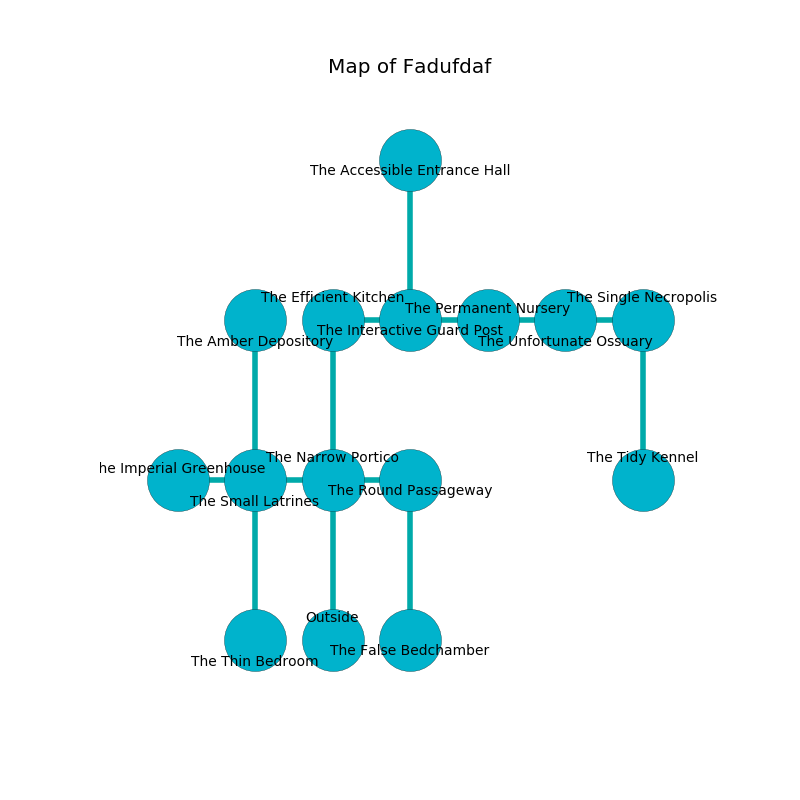

%Ruin Dogs

##Fadufdaf
###Overview
Fadufdaf is located in a haunted mountain. Parts of it are unbearably hot. A blizzard is happening outside. It is occupied by Pixies. Nicolas Roldan The Obsessive, a Hobgoblin Warlord is here. The Pixies worship Nicolas Roldan The Obsessive. He  is trying to discover [Daedha](#Daedha). 

###Artifact
####Daedha

Daedha looks like a smooth blade. It is a light yellow color. Power slides around it. When thrown it emits dust. 

###Locations

####the narrow portico
The air tastes like coumarinic here. The floor is sticky. 

* To the west a hazy passageway connects to [the small latrines](#the-small-latrines).
* To the east a dark artery connects to [the round passageway](#the-round-passageway).
* To the north a dripping cave leads to [the efficient kitchen](#the-efficient-kitchen).
* To the south is the entrance.

####the efficient kitchen
The floor is bloodstained. There is a trap here. When activated, a magical proximity detector will launch a ceiling pendulum. The wooden walls are caving in. White mushrooms are growing in broken urns. 

There is an engraving on a tablet written in common. 

> I could not try digging.
>

* To the east a torchlit gap opens to [the interactive guard post](#the-interactive-guard-post).
* To the south a dripping cave connects to [the narrow portico](#the-narrow-portico).

####the interactive guard post
The air smells like raw potato here. 

* To the west a torchlit gap connects to [the efficient kitchen](#the-efficient-kitchen).
* To the east a hazy artery leads to [the permanent nursery](#the-permanent-nursery).
* To the north a twisted path leads to [the accessible entrance hall](#the-accessible-entrance-hall).

####the permanent nursery
The air smells like truffle here. Red ferns are sprouting in a patch on the floor. 

There is an engraving on a stone written in common. 

> I am the best.
>
> Try digging.
>

* There is a horse here.
* To the west a hazy artery connects to [the interactive guard post](#the-interactive-guard-post).
* To the east a torchlit cavern connects to [the unfortunate ossuary](#the-unfortunate-ossuary).

####the round passageway

* To the west a dark artery leads to [the narrow portico](#the-narrow-portico).
* To the south a windy cavern opens to [the false bedchamber](#the-false-bedchamber).

####the small latrines
The floor is cluttered with rocks. There are a Vampire Spawn, a Flameskull, a Dire Wolf, and a Rust Monster here. There is a trap here. When activated, a tripwire will launch a fireball. 

* There is a match here.
* [Daedha](#Daedha) is here.
* To the west a twisted passageway connects to [the imperial greenhouse](#the-imperial-greenhouse).
* To the east a hazy passageway opens to [the narrow portico](#the-narrow-portico).
* To the north a dark corridor leads to [the amber depository](#the-amber-depository).
* To the south a long hallway opens to [the thin bedroom](#the-thin-bedroom).

####the unfortunate ossuary
The crystal walls are unsettled. The floor is cluttered with debris. There are a Pony, a Werebear, a Giant Weasel, a Dretch, a Werewolf, and a Bandit Captain here. 

* To the west a torchlit cavern connects to [the permanent nursery](#the-permanent-nursery).
* To the east a narrow gap opens to [the single necropolis](#the-single-necropolis).

####the single necropolis
The concrete walls are ruined. 

* To the west a narrow gap opens to [the unfortunate ossuary](#the-unfortunate-ossuary).
* To the south a windy hall connects to [the tidy kennel](#the-tidy-kennel).

####the amber depository
The floor is bloodstained. The obsidion walls are unsettled. There are twenty eight Pixies here. The Pixies are berserk with rage. 

* To the south a dark corridor leads to [the small latrines](#the-small-latrines).

####the tidy kennel
The floor is smooth. There are a Gorgon, a Giant Bat, and a Grick here. The air tastes like lemon here. 

* There is a rod here.
* There is an egg here.
* To the north a windy hall connects to [the single necropolis](#the-single-necropolis).

####the imperial greenhouse
The air smells like horhound here. 

* To the east a twisted passageway leads to [the small latrines](#the-small-latrines).

####the accessible entrance hall

* [Nicolas Roldan The Obsessive](#Nicolas-Roldan-The-Obsessive) is here.
* To the south a twisted path opens to [the interactive guard post](#the-interactive-guard-post).

####the false bedchamber
The floor is cluttered with debris. The air smells like smoked sausage here. There are a Veteran, a Giant Goat, a Knight, a Giant Crocodile, and a Flying Sword here. Green lichens are growing in broken urns. 

* To the north a windy cavern leads to [the round passageway](#the-round-passageway).

####the thin bedroom
The metallic walls are bloodstained. The air smells like verbena here. There are twenty eight Pixies here. The Pixies are performing a ritual. If not interrupted, the ruin dogs will be weakened. 

* To the north a long hallway opens to [the small latrines](#the-small-latrines).

