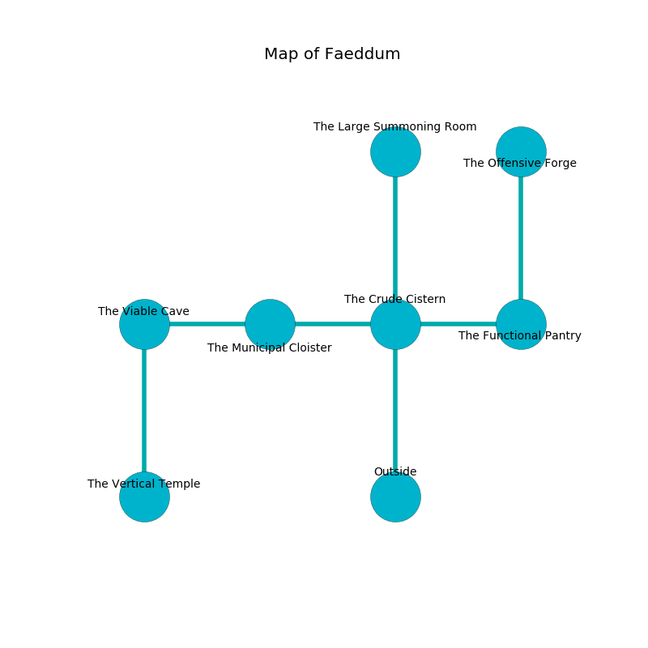

%Ruin Dogs

##Faeddum
###Overview
Faeddum is constructed on a poisoned tree. Some rooms of it are corrupted. A lunar eclipse is happening outside. It is occupied by Harpies. Noelle Lind The Foolish, a Hill Giant is here. The Harpies worship Noelle Lind The Foolish. She  is founding a new religion. 

###Artifact
####The Safe Sex

The Safe Sex looks like a broken monument. When smelled it burns the mind. 

###Locations

####the crude cistern
There is a trap here. When activated, a magical rune will close a portcullis. There are a Lizardfolk Shaman, a Warhorse Skeleton, and a Gibbering Mouther here. The floor is cluttered with debris. Blue ferns are growing from the ceiling. 

There is an engraving on a stone written in common. 

> I thought about running.
>

* There is a ring here.
* To the west a long gap opens to [the municipal cloister](#the-municipal-cloister).
* To the east a windy gap leads to [the functional pantry](#the-functional-pantry).
* To the north a narrow opening opens to [the large summoning room](#the-large-summoning-room).
* To the south is the entrance.

####the large summoning room
The floor is cluttered with shells. There is a trap here. When activated, a magical proximity detector will launch a hail of needles. The glass walls are scratched. The air tastes like licorice here. Yellow razorgrass is decaying in cracks in the floor. 

There is an engraving on a stone written in Harpies Script. 

> A bee is a metal
>
> brave and socialist
>
> always vague
>
> [The Safe Sex](#The-Safe-Sex)
>
> accurate and common
>
> constant, main, curious
>
> but solar
>
> All of us are envious
>
> but never secular
>
> A school is a referee
>
> considerable, alert, soft
>
> just, educational, genuine
>
> [The Safe Sex](#The-Safe-Sex)
>
> closed, unaware, small
>
> extinct, dry, human
>
> you are not returned
>

* To the south a narrow opening leads to [the crude cistern](#the-crude-cistern).

####the functional pantry
The mirrored walls are unsettled. 

* [Noelle Lind The Foolish](#Noelle-Lind-The-Foolish) is here.
* To the west a windy gap connects to [the crude cistern](#the-crude-cistern).
* To the north a narrow cave opens to [the offensive forge](#the-offensive-forge).

####the municipal cloister
Red ferns are decaying in broken urns. There are a Death Dog, a Duodrone, a Crocodile, a Shrieker, a Slaad Tadpole, a Giant Lizard, an Intellect Devourer, and a Vulture here. 

* To the west a long hallway connects to [the viable cave](#the-viable-cave).
* To the east a long gap connects to [the crude cistern](#the-crude-cistern).

####the offensive forge
There are four Harpies here. The floor is glossy. Blue mushrooms are swaying in a patch on the floor. If the Harpies notice the Ruin Dogs, one of them will retreat and alert [Noelle Lind](#Noelle-Lind). 

* There is a cup here.
* To the south a narrow cave leads to [the functional pantry](#the-functional-pantry).

####the viable cave
There are four Harpies here. The air tastes like guava here. The floor is sticky. The Harpies are caring for babies. 

There is an engraving on the floor written in Harpies Script. 

> I am afraid.
>

* There is a shirt here.
* [The Safe Sex](#The-Safe-Sex) is here.
* To the east a long hallway connects to [the municipal cloister](#the-municipal-cloister).
* To the south a long hallway opens to [the vertical temple](#the-vertical-temple).

####the vertical temple
White mushrooms are growing from the walls. The floor is cluttered with rocks. 

* To the north a long hallway connects to [the viable cave](#the-viable-cave).

