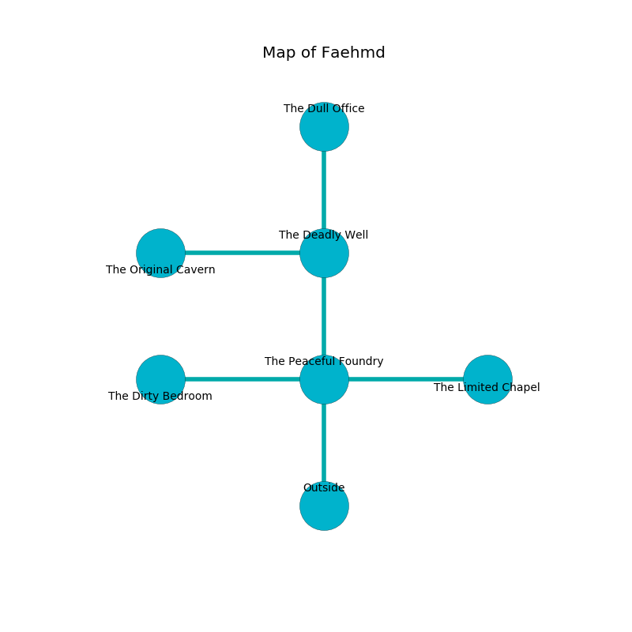

%Ruin Dogs

##Faehmd
###Overview
Faehmd is located on a ruined mountain. Some areas of it are somewhat hot. The ruin is larger on the inside than the outside. It is occupied by Demons. Elvira Quintero The Impolite, an Orc War Chief is here. The Demons are battling Elvira Quintero The Impolite. She  is founding a new religion. 

###Artifact
####The Pregnant Mushroom

The Pregnant Mushroom has the form of a mushy cube. Water glows towards it. It is a sickly yellow color. When cradled it illuminates its surroundings. 

###Locations

####the peaceful foundry
The mirrored walls are caving in. There is a trap here. When activated, a magical rune will fire a net. Yellow mushrooms are sprouting in cracks in the floor. 

There is an engraving on a monolith written in common. 

> I am lost in Faehmd.
>
> I tried giving up.
>

* There is a chain here.
* To the west a narrow cavern opens to [the dirty bedroom](#the-dirty-bedroom).
* To the east a hazy walkway leads to [the limited chapel](#the-limited-chapel).
* To the north a narrow gap opens to [the deadly well](#the-deadly-well).
* To the south is the entrance.

####the limited chapel
The floor is sticky. There are a Stirge, a Kuo-Toa Whip, a Pentadrone, and a White Dragon Wyrmling here. 

* There is an ant here.
* To the west a hazy walkway connects to [the peaceful foundry](#the-peaceful-foundry).

####the dirty bedroom
The air tastes like cherry here. There are a Pony, a Badger, a Sahuagin Priestess, a Bandit, and a Harpy here. 

* To the east a narrow cavern opens to [the peaceful foundry](#the-peaceful-foundry).

####the deadly well
The floor is sticky. There are an Axe Beak, a Phase Spider, and a Lion here. Yellow ferns are decaying in broken urns. 

* [The Pregnant Mushroom](#The-Pregnant-Mushroom) is here.
* To the west a flooded opening opens to [the original cavern](#the-original-cavern).
* To the north a hazy passageway connects to [the dull office](#the-dull-office).
* To the south a narrow gap opens to [the peaceful foundry](#the-peaceful-foundry).

####the dull office
The floor is bloodstained. White moss is decaying from the walls. The air smells like roasted chicken here. 

* There is a roof here.
* To the south a hazy passageway leads to [the deadly well](#the-deadly-well).

####the original cavern
Red ferns are decaying from the ceiling. The floor is smooth. 

* [Elvira Quintero The Impolite](#Elvira-Quintero-The-Impolite) is here.
* To the east a flooded opening connects to [the deadly well](#the-deadly-well).

