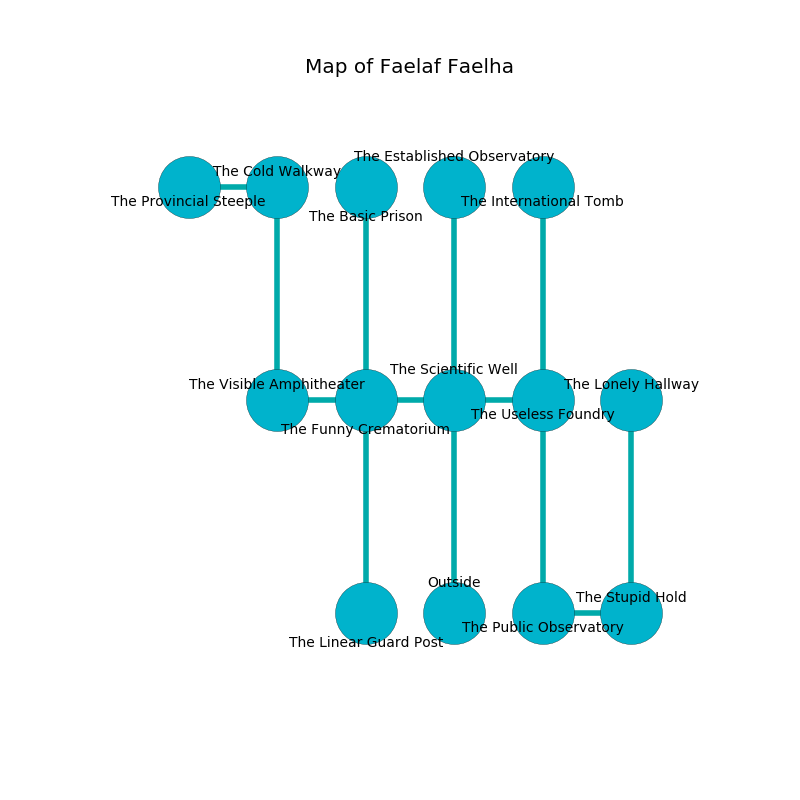

%Ruin Dogs

##Faelaf Faelha
###Overview
Faelaf Faelha is located under a cursed mountain. Regions of it are incredibly hot. A massive storm is happening outside. It is occupied by Ogres. Gudrun Holguin The Indiscreet, an Assassin is here. The Ogres have been charmed by Gudrun Holguin The Indiscreet. She  is trying to steal [The Strong Tendency](#The-Strong-Tendency). 

###Artifact
####The Strong Tendency

The Strong Tendency is a powerful artifact in the shape of a wet figurine. Magic shifts near it. It is a pale brown color. It smells like lavender. When carried it becomes a deadly projectile. 

###Locations

####the scientific well
The obsidion walls are bloodstained. 

* There is a coat here.
* To the west a windy corridor connects to [the funny crematorium](#the-funny-crematorium).
* To the east a dark gap connects to [the useless foundry](#the-useless-foundry).
* To the north a torchlit cavern opens to [the established observatory](#the-established-observatory).
* To the south is the entrance.

####the funny crematorium
The concrete walls are unsettled. The air smells like forest here. Yellow moss is growing from the walls. There are a Giant Wolf Spider, a Cult Fanatic, a Dust Mephit, an Ogre Zombie, a Tribal Warrior, a Giant Lizard, a Giant Elk, and a Mind Flayer Arcanist here. The floor is cluttered with rocks. 

There is an engraving on a tablet written in Ogres Script. 

> Oh my! weak we
>
> it is always independent
>
> it is never free
>
> nothing is dependent
>

* [The Strong Tendency](#The-Strong-Tendency) is here.
* To the west a flooded walkway opens to [the visible amphitheater](#the-visible-amphitheater).
* To the east a windy corridor opens to [the scientific well](#the-scientific-well).
* To the north a flooded passageway leads to [the basic prison](#the-basic-prison).
* To the south a dripping threshold leads to [the linear guard post](#the-linear-guard-post).

####the useless foundry
The floor is cluttered with ashes. The wooden walls are caving in. 

* To the west a dark gap opens to [the scientific well](#the-scientific-well).
* To the north a twisted gap leads to [the international tomb](#the-international-tomb).
* To the south a dark opening connects to [the public observatory](#the-public-observatory).

####the established observatory
The obsidion walls are ruined. The floor is sticky. Blue lichens are growing in broken urns. 

* To the south a torchlit cavern opens to [the scientific well](#the-scientific-well).

####the public observatory
There are four Half-Ogres and two Ogres here. One of the Ogres is on watch, the rest are sleeping. 

There is an engraving on the wall written in common. 

> I am lost in Faelaf Faelha.
>
> I could not try dying.
>

* [Gudrun Holguin The Indiscreet](#Gudrun-Holguin-The-Indiscreet) is here.
* To the east a twisted cave connects to [the stupid hold](#the-stupid-hold).
* To the north a dark opening leads to [the useless foundry](#the-useless-foundry).

####the stupid hold
The concrete walls are unsettled. There are six Half-Ogres and an Ogre here. The air smells like jam here. One of the Ogres is working a mechanism that can flood the room. 

* There is a casket here.
* To the west a twisted cave opens to [the public observatory](#the-public-observatory).
* To the north a hazy passageway leads to [the lonely hallway](#the-lonely-hallway).

####the lonely hallway
The floor is flooded with eight inch deep cool water. 

There is an engraving on a monolith written in common. 

> I could not try praying.
>

* To the south a hazy passageway leads to [the stupid hold](#the-stupid-hold).

####the visible amphitheater

* To the east a flooded walkway leads to [the funny crematorium](#the-funny-crematorium).
* To the north a narrow corridor leads to [the cold walkway](#the-cold-walkway).

####the cold walkway
The floor is glossy. The concrete walls are bloodstained. 

* There is a roof here.
* There is a cheese here.
* To the west a windy hallway opens to [the provincial steeple](#the-provincial-steeple).
* To the south a narrow corridor connects to [the visible amphitheater](#the-visible-amphitheater).

####the basic prison
The floor is bloodstained. There are a Giant Constrictor Snake and a Young White Dragon here. Yellow moss is growing in cracks in the floor. 

* There is a triptych here.
* There is a knot here.
* There is an eye here.
* To the south a flooded passageway connects to [the funny crematorium](#the-funny-crematorium).

####the provincial steeple
The floor is smooth. The air tastes like buttermilk here. 

* To the east a windy hallway leads to [the cold walkway](#the-cold-walkway).

####the international tomb
Red moss is swaying in a patch on the floor. The floor is glossy. 

There is an engraving on the wall written in common. 

> Run away.
>

* To the south a twisted gap opens to [the useless foundry](#the-useless-foundry).

####the linear guard post
The brick walls are caving in. There are a Chuul, a Shambling Mound, a Camel, and an Animated Armor here. 

* There is a screw here.
* To the north a dripping threshold leads to [the funny crematorium](#the-funny-crematorium).

