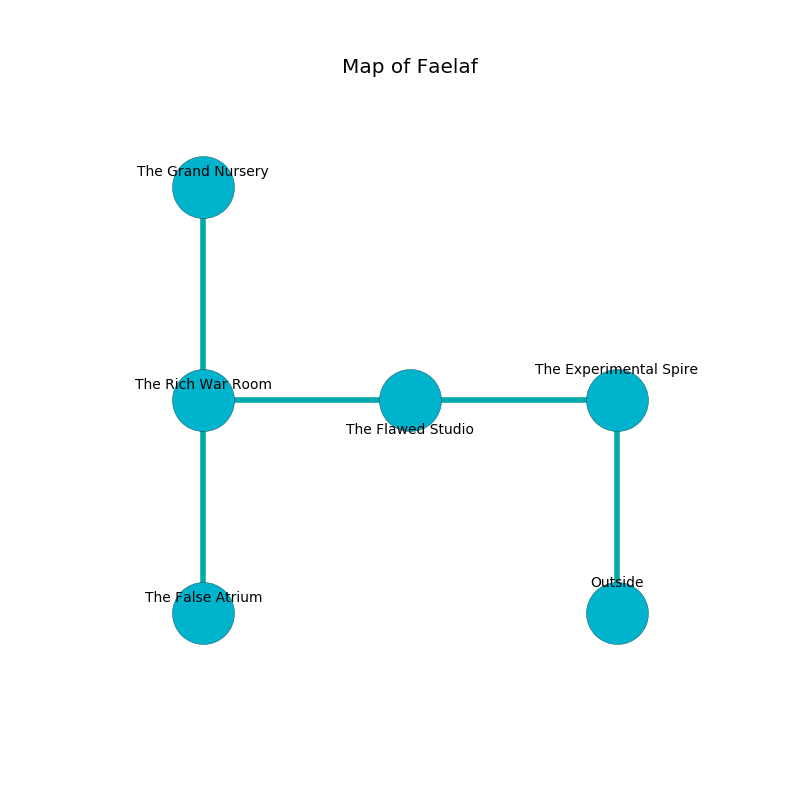

%Ruin Dogs

##Faelaf
###Overview
Faelaf is located under a haunted tree. Some rooms of Faelaf are flooded. A battle between raiders is happening outside. It is occupied by Kobolds. Numbers Heinz The Careless, a Quaggoth is here. The Kobolds worship Numbers Heinz The Careless. She  is trying to understand [The Competent Tribe](#The-Competent-Tribe). 

###Artifact
####The Competent Tribe

The Competent Tribe is a powerful artifact in the shape of a hard orb. When gazed upon it becomes lost. 

###Locations

####the experimental spire
The air smells like logenberry here. The floor is flooded with six inch deep hot water. The metallic walls are covered in mold. There are six Winged Kobolds and five Kobolds here. Green lichens are swaying in cracks in the floor. One of the Kobolds is on watch, the rest are drunk. 

* To the west a dark corridor leads to [the flawed studio](#the-flawed-studio).
* To the south is the entrance.

####the flawed studio
There are an Azer and a Deep Gnome here. The crystal walls are covered in mold. 

* To the west a narrow path connects to [the rich war Room](#the-rich-war-Room).
* To the east a dark corridor opens to [the experimental spire](#the-experimental-spire).

####the rich war Room
There are an Axe Beak, a Giant Badger, an Ettercap, and a Piercer here. The air smells like mint here. 

* [The Competent Tribe](#The-Competent-Tribe) is here.
* To the east a narrow path connects to [the flawed studio](#the-flawed-studio).
* To the north a twisted threshold leads to [the grand nursery](#the-grand-nursery).
* To the south a long hall leads to [the false atrium](#the-false-atrium).

####the grand nursery
There are a Duodrone and a Grick here. 

There is an engraving on a tablet written in common. 

> [The Competent Tribe](#The-Competent-Tribe)
>
> yet never decorative
>
> innocent, manual, comfortable
>
> A star is a club
>
> always part-time
>
> finished, wrong, mutual
>
> yet awkward
>
> [The Competent Tribe](#The-Competent-Tribe)
>
> surprising, direct, certain
>
> rural, insufficient, able
>
> economic, loud, stunning
>
> always rough
>
> [The Competent Tribe](#The-Competent-Tribe)
>
> chronic, public, economic
>
> democratic, national, vocational
>
> attractive and late
>

* To the south a twisted threshold connects to [the rich war Room](#the-rich-war-Room).

####the false atrium
The glass walls are covered in mold. The air tastes like acetone here. There is a Green Dragon Wyrmling here. The floor is smooth. Yellow lichens are swaying in cracks in the floor. 

There is an engraving on the ceiling written in Kobolds Script. 

> Oh my! meak god
>
> but never odd
>
> indirect and parallel
>
> hope is odd
>

* There is a screw here.
* [Numbers Heinz The Careless](#Numbers-Heinz-The-Careless) is here.
* To the north a long hall connects to [the rich war Room](#the-rich-war-Room).

