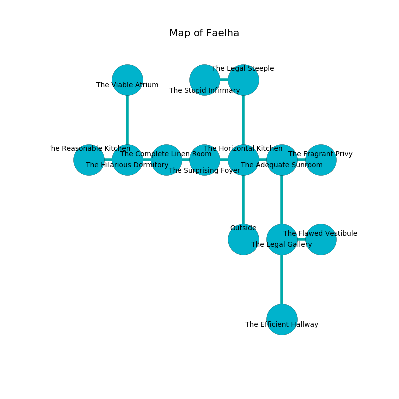

%Ruin Dogs

##Faelha
###Overview
Faelha is located on a spikey tree. Regions of Faelha are frozen. The ruin is larger on the inside than the outside. It is occupied by Sahuagins. Andy Dorn The Foolhardy, a Cloud Giant is here. The Sahuagins are the soldiers of Andy Dorn The Foolhardy. He  is trying to destroy [The Complex Use](#The-Complex-Use). 

###Artifact
####The Complex Use

The Complex Use is a powerful artifact in the shape of a wet doll. Gravity slides towards it. It smells like resin. When picked up it aids memory. 

###Locations

####the horizontal kitchen
There are a Stirge, a Blue Dragon Wyrmling, a Banshee, a Giant fire beetle, and a Yuan-Ti Abomination here. 

* To the west a small artery leads to [the surprising foyer](#the-surprising-foyer).
* To the east a narrow cavern leads to [the adequate sunroom](#the-adequate-sunroom).
* To the north a torchlit walkway connects to [the legal steeple](#the-legal-steeple).
* To the south is the entrance.

####the legal steeple
There are five Sahuagin Priestesses here. The air smells like lemon here. The stone walls are caving in. If the Sahuagins notice the Ruin Dogs, one of them will retreat and alert the others. 

* To the west a long corridor connects to [the stupid infirmary](#the-stupid-infirmary).
* To the south a torchlit walkway opens to [the horizontal kitchen](#the-horizontal-kitchen).

####the surprising foyer
The floor is flooded with nine inch deep scalding water. There are an Invisible Stalker, a Giant Wasp, a White Dragon Wyrmling, and a Giant Boar here. White ferns are growing from the ceiling. The air smells like lard here. 

* To the west a twisted gap leads to [the complete linen room](#the-complete-linen-room).
* To the east a small artery opens to [the horizontal kitchen](#the-horizontal-kitchen).

####the stupid infirmary
The mirrored walls are unsettled. The floor is bloodstained. There are five Sahuagin Priestesses here. Green mushrooms are sprouting from the walls. One of the Sahuagins is pointing a ballista at the entrance. 

* To the east a long corridor opens to [the legal steeple](#the-legal-steeple).

####the adequate sunroom
Gray mushrooms are decaying from the walls. The floor is glossy. 

* To the west a narrow cavern leads to [the horizontal kitchen](#the-horizontal-kitchen).
* To the east a twisted threshold leads to [the fragrant privy](#the-fragrant-privy).
* To the south a hazy threshold connects to [the legal gallery](#the-legal-gallery).

####the legal gallery
The crystal walls are pristine. There are a Mummy, a Hippogriff, a Worg, an Axe Beak, a Vine Blight, a Giant fire beetle, a Basilisk, and an Ogre here. 

* To the east a twisted path leads to [the flawed vestibule](#the-flawed-vestibule).
* To the north a hazy threshold connects to [the adequate sunroom](#the-adequate-sunroom).
* To the south a windy passageway connects to [the efficient hallway](#the-efficient-hallway).

####the complete linen room
There are a Blink Dog, a Medusa, an Oni, and an Old Faerie Dragon here. The air smells like verbena here. Yellow razorgrass is growing from the walls. 

There is an engraving on the wall written in common. 

> Dig here.
>

* To the west a hazy artery leads to [the hilarious dormitory](#the-hilarious-dormitory).
* To the east a twisted gap leads to [the surprising foyer](#the-surprising-foyer).

####the flawed vestibule
There are a Manes, a Commoner, an Elephant, and a Wyvern here. Gray lichens are swaying from the ceiling. The floor is smooth. The obsidion walls are scratched. 

* There is a brooch here.
* There is a cup here.
* To the west a twisted path leads to [the legal gallery](#the-legal-gallery).

####the fragrant privy
The crystal walls are caving in. 

* To the west a twisted threshold connects to [the adequate sunroom](#the-adequate-sunroom).

####the hilarious dormitory
The obsidion walls are pristine. The floor is sticky. The air smells like weed here. There are five Sahuagin Priestesses here. One of the Sahuagins is pointing a ballista at the entrance. 

* There is a dragon here.
* [The Complex Use](#The-Complex-Use) is here.
* To the west a dark corridor opens to [the reasonable kitchen](#the-reasonable-kitchen).
* To the east a hazy artery connects to [the complete linen room](#the-complete-linen-room).
* To the north a dripping corridor opens to [the viable atrium](#the-viable-atrium).

####the efficient hallway
The obsidion walls are scratched. The air tastes like metal here. Blue razorgrass is swaying in a patch on the floor. There are five Sahuagin Priestesses here. If the Sahuagins notice the Ruin Dogs, one of them will retreat and alert [Andy Dorn](#Andy-Dorn). 

There is an engraving on the ceiling written in Sahuagins Script. 

> All of us are free
>
> immune, corporate, secure
>
> yet meaningful
>

* There is a cart here.
* There is a salamander here.
* There is a net here.
* To the north a windy passageway connects to [the legal gallery](#the-legal-gallery).

####the reasonable kitchen
The air smells like fougere here. There are a Mud Mephit, a Death Slaad, a Minotaur Skeleton, a Barlgura, an Elk, and a Dire Wolf here. The floor is sticky. 

There is an engraving on the wall written in common. 

> O! sad you
>
> influential and due
>
> it is never dry
>
> everything is true
>

* To the east a dark corridor leads to [the hilarious dormitory](#the-hilarious-dormitory).

####the viable atrium
The air tastes like kumquat here. Blue mushrooms are growing in broken urns. The floor is smooth. 

There is an engraving on the wall written in Sahuagins Script. 

> I discovered [The Complex Use](#The-Complex-Use).
>

* [Andy Dorn The Foolhardy](#Andy-Dorn-The-Foolhardy) is here.
* To the south a dripping corridor connects to [the hilarious dormitory](#the-hilarious-dormitory).

