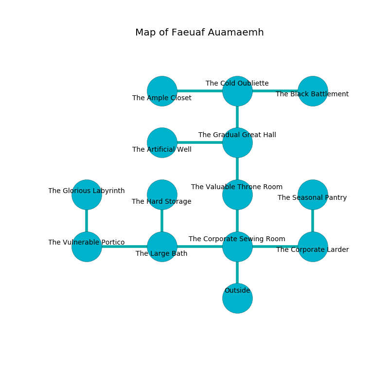

%Ruin Dogs

##Faeuaf Auamaemh
###Overview
Faeuaf Auamaemh is constructed on a poisoned mountain. Regions of Faeuaf Auamaemh are flooded. A solar eclipse is happening outside. It is occupied by Demons. Issac Angel The Belligerent, a Drow Priestess of Lolth is here. The Demons are the slaves of Issac Angel The Belligerent. He  is founding a new religion. 

###Artifact
####Daed Faeic

Daed Faeic looks like an opaque prism. It smells like mandarin. When picked up it grants psychic powers. 

###Locations

####the corporate sewing room
The air tastes like bay here. 

There is an engraving on a stone written in common. 

> Oh my! sad we
>
> surprising, spontaneous, free
>
> ever proud
>
> nothing is free
>

* To the west a small pathway connects to [the large bath](#the-large-bath).
* To the east a small cavern opens to [the corporate larder](#the-corporate-larder).
* To the north a twisted passageway connects to [the valuable throne room](#the-valuable-throne-room).
* To the south is the entrance.

####the large bath
The air smells like custard here. The brick walls are scratched. Green ferns are swaying from the walls. The floor is flooded with six inch deep lukewarm water. 

* To the west a dripping cave opens to [the vulnerable portico](#the-vulnerable-portico).
* To the east a small pathway opens to [the corporate sewing room](#the-corporate-sewing-room).
* To the north a narrow cave leads to [the hard storage](#the-hard-storage).

####the hard storage
The floor is glossy. The stone walls are covered in mold. There are a Barbed Devil and a Bulette here. If the Demons notice the Ruin Dogs, one of them will retreat and alert the others. 

* To the south a narrow cave opens to [the large bath](#the-large-bath).

####the corporate larder
There are an Incubus and two Spined Devils here. The stone walls are unsettled. Blue razorgrass is swaying in a patch on the floor. The Demons are willing to negotiate. 

There is an engraving on a stone written in Demons Script. 

> Hide here.
>

* There is a drake here.
* To the west a small cavern leads to [the corporate sewing room](#the-corporate-sewing-room).
* To the north a hazy hallway leads to [the seasonal pantry](#the-seasonal-pantry).

####the valuable throne room
There are a Spined Devil, a Succubus, and a Bearded Devil here. The air smells like chestnut here. The brick walls are caving in. Blue razorgrass is growing from the walls. If the Demons notice the Ruin Dogs, one of them will retreat and alert [Issac Angel](#Issac-Angel). 

* There is a picture here.
* To the north a long artery leads to [the gradual great hall](#the-gradual-great-hall).
* To the south a twisted passageway connects to [the corporate sewing room](#the-corporate-sewing-room).

####the seasonal pantry
Green moss is decaying in broken urns. The crystal walls are bloodstained. There are an Imp, a Spined Devil, a Succubus, and an Incubus here. The floor is sticky. One of the Demons is working a mechanism that can open a trapodoor in the floor. 

There is an engraving on the wall written in Demons Script. 

> Leave at once.
>

* To the south a hazy hallway connects to [the corporate larder](#the-corporate-larder).

####the gradual great hall
White lichens are growing in a patch on the floor. There are an Imp, a Spined Devil, a Bulette, and a Bearded Devil here. The Demons are caring for babies. 

* To the west a dripping hallway opens to [the artificial well](#the-artificial-well).
* To the north a small gap leads to [the cold oubliette](#the-cold-oubliette).
* To the south a long artery connects to [the valuable throne room](#the-valuable-throne-room).

####the vulnerable portico
The stone walls are ruined. The floor is flooded with two inch deep lukewarm water. 

There is an engraving on the ceiling written in Demons Script. 

> They are envious
>
> open, invisible, national
>
> you must never be consumed
>

* There is a shirt here.
* There is a finger here.
* To the east a dripping cave connects to [the large bath](#the-large-bath).
* To the north a hazy cavern connects to [the glorious labyrinth](#the-glorious-labyrinth).

####the cold oubliette
There are a Swarm of Ravens, a Deep Gnome, a Mage, and a Flesh Golem here. The floor is flooded with two inch deep cool water. Yellow moss is growing in cracks in the floor. 

* [Daed Faeic](#Daed-Faeic) is here.
* [Issac Angel The Belligerent](#Issac-Angel-The-Belligerent) is here.
* To the west a flooded gap leads to [the ample closet](#the-ample-closet).
* To the east a hazy opening opens to [the black battlement](#the-black-battlement).
* To the south a small gap connects to [the gradual great hall](#the-gradual-great-hall).

####the artificial well
Blue ferns are swaying in cracks in the floor. The wooden walls are unsettled. The floor is glossy. The air smells like seashore here. There are a Sahuagin Priestess and a Chimera here. 

* There is a hare here.
* To the east a dripping hallway opens to [the gradual great hall](#the-gradual-great-hall).

####the ample closet
Yellow lichens are swaying in broken urns. There are a Centaur, a Minotaur, and a Manticore here. 

There is an engraving on the ceiling written in Demons Script. 

> Hide here.
>

* There is an egg here.
* To the east a flooded gap opens to [the cold oubliette](#the-cold-oubliette).

####the glorious labyrinth
Blue mushrooms are growing in a patch on the floor. The metallic walls are unsettled. The floor is cluttered with debris. The air smells like lemon peel here. 

* To the south a hazy cavern leads to [the vulnerable portico](#the-vulnerable-portico).

####the black battlement
The air tastes like tarragon here. The glass walls are ruined. 

There is an engraving on a tablet written in common. 

> Hide here.
>

* To the west a hazy opening connects to [the cold oubliette](#the-cold-oubliette).

