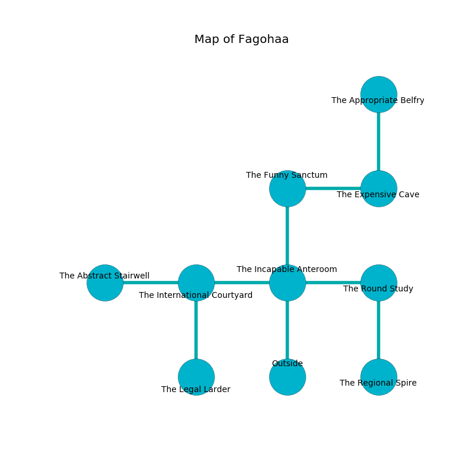

%Ruin Dogs

##Fagohaa
###Overview
Fagohaa is located under an obsidion city. Regions of it are inaccessible. A massive storm is happening outside. It is occupied by Satyrs. Kristi Ivy The Truculent, a Priest is here. The Satyrs are battling Kristi Ivy The Truculent. She  is trying to use [Cmemca Omcha](#Cmemca-Omcha). 

###Artifact
####Cmemca Omcha

Cmemca Omcha is a powerful artifact in the shape of a cold figurine. Air slips around it. When worn it becomes lost. 

###Locations

####the incapable anteroom
The metallic walls are pristine. The air tastes like spinach here. 

There is an engraving on a stone written in Satyrs Script. 

> Dear me! pitiful we
>
> flawed, modest, sick
>
> presidential, assertive, free
>
> death is thick
>

* [Kristi Ivy The Truculent](#Kristi-Ivy-The-Truculent) is here.
* To the west a dripping hallway leads to [the international courtyard](#the-international-courtyard).
* To the east a torchlit artery connects to [the round study](#the-round-study).
* To the north a flooded path connects to [the funny sanctum](#the-funny-sanctum).
* To the south is the entrance.

####the international courtyard
The wooden walls are covered in mold. 

* To the west a long hallway connects to [the abstract stairwell](#the-abstract-stairwell).
* To the east a dripping hallway connects to [the incapable anteroom](#the-incapable-anteroom).
* To the south a torchlit gap connects to [the legal larder](#the-legal-larder).

####the round study
There are a Poltergeist and a Satyr here. 

* There is a spade here.
* To the west a torchlit artery leads to [the incapable anteroom](#the-incapable-anteroom).
* To the south a long threshold connects to [the regional spire](#the-regional-spire).

####the funny sanctum
The floor is bloodstained. The metallic walls are pristine. There are an Ettercap, a Kobold, and a Vulture here. Green mushrooms are growing in cracks in the floor. The air tastes like onion here. 

* To the east a flooded threshold leads to [the expensive cave](#the-expensive-cave).
* To the south a flooded path leads to [the incapable anteroom](#the-incapable-anteroom).

####the expensive cave
The glass walls are scratched. There are four Satyrs here. One of the Satyrs is working a mechanism that can flood the room. 

* There is a horse here.
* [Cmemca Omcha](#Cmemca-Omcha) is here.
* To the west a flooded threshold opens to [the funny sanctum](#the-funny-sanctum).
* To the north a flooded gap connects to [the appropriate belfry](#the-appropriate-belfry).

####the legal larder
The brick walls are scratched. There are four Satyrs here. One of the Satyrs is on watch, the rest are feasting. 

* There is a diamond here.
* To the north a torchlit gap opens to [the international courtyard](#the-international-courtyard).

####the abstract stairwell
Gray ferns are swaying in cracks in the floor. The air smells like herbs here. There is a trap here. When activated, a magical rune will fire a scything blade. 

* To the east a long hallway opens to [the international courtyard](#the-international-courtyard).

####the regional spire
Green moss is growing in broken urns. There is a trap here. When activated, a pressure plate will extend a spring loaded spear. 

* There is a triptych here.
* To the north a long threshold connects to [the round study](#the-round-study).

####the appropriate belfry
Yellow moss is decaying in cracks in the floor. The air smells like ammonia here. 

* To the south a flooded gap leads to [the expensive cave](#the-expensive-cave).

