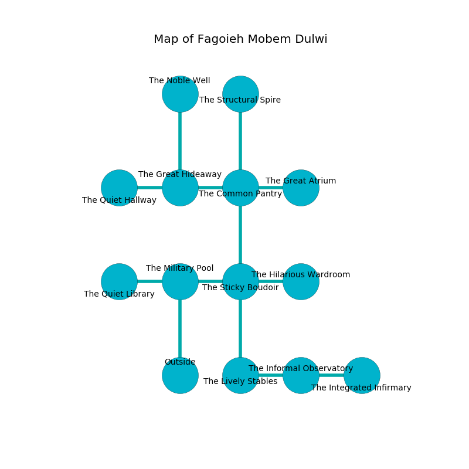

%Ruin Dogs

##Fagoieh Mobem Dulwi
###Overview
Fagoieh Mobem Dulwi is located in a flooded tree. Some rooms of it are foggy. The ruin is burning. It is occupied by Lizardfolk. Donte Roussel The Narrow-Minded, a Drow Mage is here. The Lizardfolk have been charmed by Donte Roussel The Narrow-Minded. He  is trying to discover [Cumdfecd Gefbaf](#Cumdfecd-Gefbaf). 

###Artifact
####Cumdfecd Gefbaf

Cumdfecd Gefbaf is a powerful artifact in the shape of a mushy blade. Light slips towards it. When touched it burns the mind. 

###Locations

####the military pool
The air tastes like the fresh outdoors here. The floor is smooth. There are an Aarakocra, a Veteran, a Wereboar, and a Green Dragon Wyrmling here. The concrete walls are unsettled. 

* To the west a dripping corridor connects to [the quiet library](#the-quiet-library).
* To the east a dark artery leads to [the sticky boudoir](#the-sticky-boudoir).
* To the south is the entrance.

####the sticky boudoir
The wooden walls are ruined. There are a Specter, a Dire Wolf, a Bugbear Chief, and an Owlbear here. 

There is an engraving on a tablet written in common. 

> Dig here.
>

* There is a comb here.
* To the west a dark artery opens to [the military pool](#the-military-pool).
* To the east a twisted gap connects to [the hilarious wardroom](#the-hilarious-wardroom).
* To the north a windy threshold connects to [the common pantry](#the-common-pantry).
* To the south a small artery connects to [the lively stables](#the-lively-stables).

####the hilarious wardroom
Green mushrooms are decaying in broken urns. There are four Lizardfolk Shamans here. The air tastes like coffee here. The concrete walls are ruined. The floor is flooded with eight inch deep lukewarm water. If the Lizardfolk notice the Ruin Dogs, one of them will retreat and alert [Donte Roussel](#Donte-Roussel). 

* To the west a twisted gap connects to [the sticky boudoir](#the-sticky-boudoir).

####the common pantry
The floor is cluttered with rocks. There are three Lizardfolk Shamans and four Lizardfolk here. The Lizardfolk are willing to fight to the death. 

* [Cumdfecd Gefbaf](#Cumdfecd-Gefbaf) is here.
* [Donte Roussel The Narrow-Minded](#Donte-Roussel-The-Narrow-Minded) is here.
* To the west a dark artery opens to [the great hideaway](#the-great-hideaway).
* To the east a long pathway leads to [the great atrium](#the-great-atrium).
* To the north a twisted hallway connects to [the structural spire](#the-structural-spire).
* To the south a windy threshold opens to [the sticky boudoir](#the-sticky-boudoir).

####the great hideaway
There are an Ochre Jelly, a Hyena, an Orc Eye of Gruumsh, an Acolyte, a Githzerai Zerth, and a Deer here. 

There is an engraving on the wall written in Lizardfolk Script. 

> You are envious
>
> lively and unanimous
>
> annual and outside
>
> You are envious
>

* To the west a twisted hallway opens to [the quiet hallway](#the-quiet-hallway).
* To the east a dark artery connects to [the common pantry](#the-common-pantry).
* To the north a dark gap leads to [the noble well](#the-noble-well).

####the lively stables
There are two Lizardfolk Shamans and six Lizardfolk here. The concrete walls are pristine. The floor is flooded with eight inch deep scalding water. The air tastes like ocean here. The Lizardfolk are performing a ritual. If not interrupted, the ruin dogs will be weakened. 

* To the east a dripping corridor opens to [the informal observatory](#the-informal-observatory).
* To the north a small artery connects to [the sticky boudoir](#the-sticky-boudoir).

####the informal observatory
The floor is sticky. The air tastes like nut here. 

* There is a face here.
* To the west a dripping corridor opens to [the lively stables](#the-lively-stables).
* To the east a dripping cavern opens to [the integrated infirmary](#the-integrated-infirmary).

####the quiet library
The floor is cluttered with shells. 

* To the east a dripping corridor leads to [the military pool](#the-military-pool).

####the noble well
The metallic walls are covered in mold. 

There is an engraving on a tablet written in Lizardfolk Script. 

> Oh cruel fate
>
> ever agricultural
>
> but great
>
> sadness is cultural
>

* To the south a dark gap leads to [the great hideaway](#the-great-hideaway).

####the integrated infirmary
The floor is cluttered with rocks. There are four Lizardfolk Shamans and a Lizardfolk here. The mirrored walls are pristine. The air tastes like plastic here. If the Lizardfolk notice the Ruin Dogs, one of them will retreat and alert [Donte Roussel](#Donte-Roussel). 

* To the west a dripping cavern opens to [the informal observatory](#the-informal-observatory).

####the quiet hallway
Yellow lichens are decaying in a patch on the floor. The air tastes like oats here. 

* To the east a twisted hallway leads to [the great hideaway](#the-great-hideaway).

####the structural spire
The floor is smooth. There are a Flameskull, a Helmed Horror, and a Spider here. The air tastes like cloth here. 

There is an engraving on a tablet written in Lizardfolk Script. 

> They are damned
>
> joint and inner
>
> healthy and dark
>
> related and complete
>

* To the south a twisted hallway connects to [the common pantry](#the-common-pantry).

####the great atrium
There are a Mind Flayer, a Tridrone, an Elephant, and a Rust Monster here. The air tastes like elderflower here. The floor is smooth. 

* To the west a long pathway connects to [the common pantry](#the-common-pantry).

