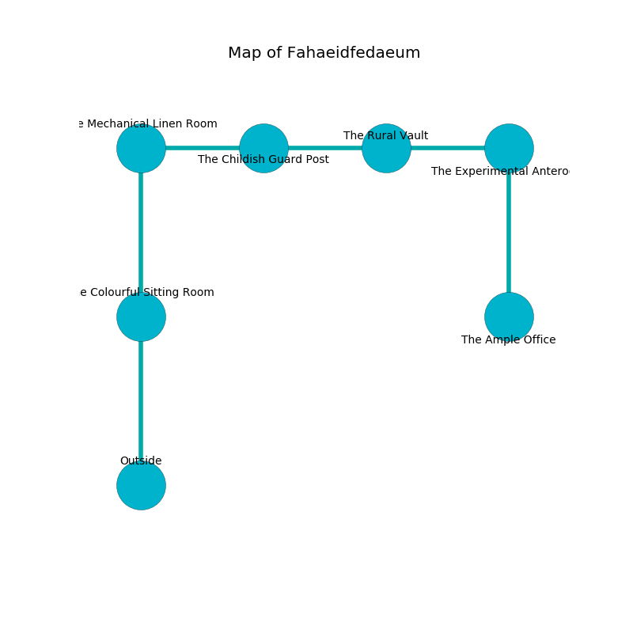

%Ruin Dogs

##Fahaeidfedaeum
###Overview
Fahaeidfedaeum is located under a ruined city. Some rooms of it are somewhat hot. The ruin is flooding. It is occupied by Orcs. Alene Kessler The Impolite, a Knight is here. The Orcs are the minions of Alene Kessler The Impolite. She  is founding a new religion. 

###Artifact
####Lemhaf

Lemhaf has the form of a wet crystal. Light slips away from it. When rubbed it destroys others. 

###Locations

####the colourful sitting Room
There are an Orc War Chief and an Orc Eye of Gruumsh here. The air tastes like vegetables here. Gray moss is swaying in a patch on the floor. The Orcs are performing a ritual. If not interrupted, a powerful monster will be summoned. 

* To the north a dripping gap leads to [the mechanical linen room](#the-mechanical-linen-room).
* To the south is the entrance.

####the mechanical linen room
The floor is sticky. There are two Orc Eyes of Gruumsh here. The air tastes like acacia here. Gray razorgrass is growing in a patch on the floor. The metallic walls are pristine. One of the Orcs is working a mechanism that can launch acid at the Ruin Dogs. 

* There is a brake here.
* To the east a dark passageway opens to [the childish guard post](#the-childish-guard-post).
* To the south a dripping gap opens to [the colourful sitting Room](#the-colourful-sitting-Room).

####the childish guard post
Green ferns are sprouting from the ceiling. The floor is bloodstained. The air smells like hyssop here. There are a Displacer Beast, an Imp, a Merfolk, an Ogre Zombie, a Blood Hawk, a Violet Fungus, and a Vulture here. 

There is an engraving on a monolith written in Orcs Script. 

> A trap ahead.
>

* There is a shirt here.
* To the west a dark passageway opens to [the mechanical linen room](#the-mechanical-linen-room).
* To the east a long pathway leads to [the rural vault](#the-rural-vault).

####the rural vault
There are a Magma Mephit and an Ettin here. The air smells like fudge here. The floor is glossy. The brick walls are covered in mold. Green lichens are sprouting from the walls. 

There is an engraving on a stone written in common. 

> O life is poor
>
> inadequate and systematic
>
> yet secure
>
> the world is diplomatic
>

* There is a sceptre here.
* To the west a long pathway opens to [the childish guard post](#the-childish-guard-post).
* To the east a flooded path opens to [the experimental anteroom](#the-experimental-anteroom).

####the experimental anteroom
The floor is smooth. The wooden walls are pristine. 

* [Lemhaf](#Lemhaf) is here.
* To the west a flooded path opens to [the rural vault](#the-rural-vault).
* To the south a twisted artery leads to [the ample office](#the-ample-office).

####the ample office
The wooden walls are covered in mold. Red moss is swaying from the ceiling. 

* [Alene Kessler The Impolite](#Alene-Kessler-The-Impolite) is here.
* To the north a twisted artery leads to [the experimental anteroom](#the-experimental-anteroom).

