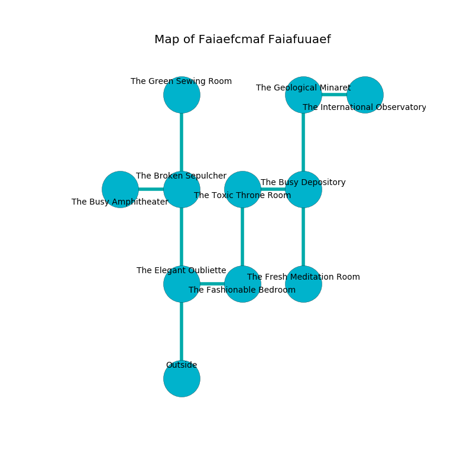

%Ruin Dogs

##Faiaefcmaf Faiafuuaef
###Overview
Faiaefcmaf Faiafuuaef is located on a spikey tree. Some areas of it are foggy. A massive flood is happening outside. It is occupied by Humans. Dana Page The Overemotional, a Quaggoth Thonot is here. The Humans are the minions of Dana Page The Overemotional. He  is trying to exploit [The Limited Alcohol](#The-Limited-Alcohol). 

###Artifact
####The Limited Alcohol

The Limited Alcohol looks like a broken meteorite. It smells like malt. It is a shifting gray color. When gazed upon it becomes lost. 

###Locations

####the elegant oubliette
Gray razorgrass is growing in broken urns. The floor is sticky. The metallic walls are covered in mold. 

* To the east a narrow path leads to [the fashionable bedroom](#the-fashionable-bedroom).
* To the north a hazy walkway opens to [the broken sepulcher](#the-broken-sepulcher).
* To the south is the entrance.

####the fashionable bedroom
There is a Priest here. The Priest is willing to negotiate. 

There is an engraving on the wall written in common. 

> Poor me! the world is inhumane
>
> it is always vain
>
> but bold
>
> fate is old
>

* To the west a narrow path connects to [the elegant oubliette](#the-elegant-oubliette).
* To the north a dark walkway opens to [the toxic throne room](#the-toxic-throne-room).

####the toxic throne room
The floor is glossy. There is a Berserker here. The stone walls are pristine. If the Berserker notice the Ruin Dogs, one of them will retreat and alert the others. 

There is an engraving on a monolith written in Humans Script. 

> I thought about praying.
>

* There is a heart here.
* To the east a dripping opening connects to [the busy depository](#the-busy-depository).
* To the south a dark walkway leads to [the fashionable bedroom](#the-fashionable-bedroom).

####the busy depository
White razorgrass is growing from the walls. The brick walls are unsettled. There is a trap here. When activated, a magical rune will launch an arrow. 

* To the west a dripping opening leads to [the toxic throne room](#the-toxic-throne-room).
* To the north a dark corridor leads to [the geological minaret](#the-geological-minaret).
* To the south a torchlit path leads to [the fresh meditation room](#the-fresh-meditation-room).

####the broken sepulcher
There are a Giant Rat, a Gnoll Pack Lord, and a Worg here. The floor is flooded with two inch deep cool water. The air tastes like red apple here. The metallic walls are scratched. 

* [The Limited Alcohol](#The-Limited-Alcohol) is here.
* To the west a hazy opening leads to [the busy amphitheater](#the-busy-amphitheater).
* To the north a twisted gap opens to [the green sewing room](#the-green-sewing-room).
* To the south a hazy walkway connects to [the elegant oubliette](#the-elegant-oubliette).

####the geological minaret

* There is an imp here.
* To the east a twisted opening opens to [the international observatory](#the-international-observatory).
* To the south a dark corridor leads to [the busy depository](#the-busy-depository).

####the international observatory
The obsidion walls are pristine. The air smells like rose tea here. 

There is an engraving on a monolith written in common. 

> [The Limited Alcohol](#The-Limited-Alcohol)
>
> ever usual
>

* To the west a twisted opening opens to [the geological minaret](#the-geological-minaret).

####the fresh meditation room
There is a Will-O’-Wisp here. The air smells like cheese here. Gray ferns are sprouting in a patch on the floor. 

There is an engraving on the floor written in Humans Script. 

> I am lost in Faiaefcmaf Faiafuuaef.
>
> Try praying.
>

* To the north a torchlit path leads to [the busy depository](#the-busy-depository).

####the green sewing room
The floor is sticky. The air smells like apricot here. There is an Ochre Jelly here. The crystal walls are unsettled. 

* To the south a twisted gap leads to [the broken sepulcher](#the-broken-sepulcher).

####the busy amphitheater
The floor is cluttered with ashes. The obsidion walls are covered in mold. There are a Guard and a Cult Fanatic here. The air smells like lemongrass here. One of the Humans is working a mechanism that can engulf the room in a fiery blaze. 

* [Dana Page The Overemotional](#Dana-Page-The-Overemotional) is here.
* To the east a hazy opening connects to [the broken sepulcher](#the-broken-sepulcher).

