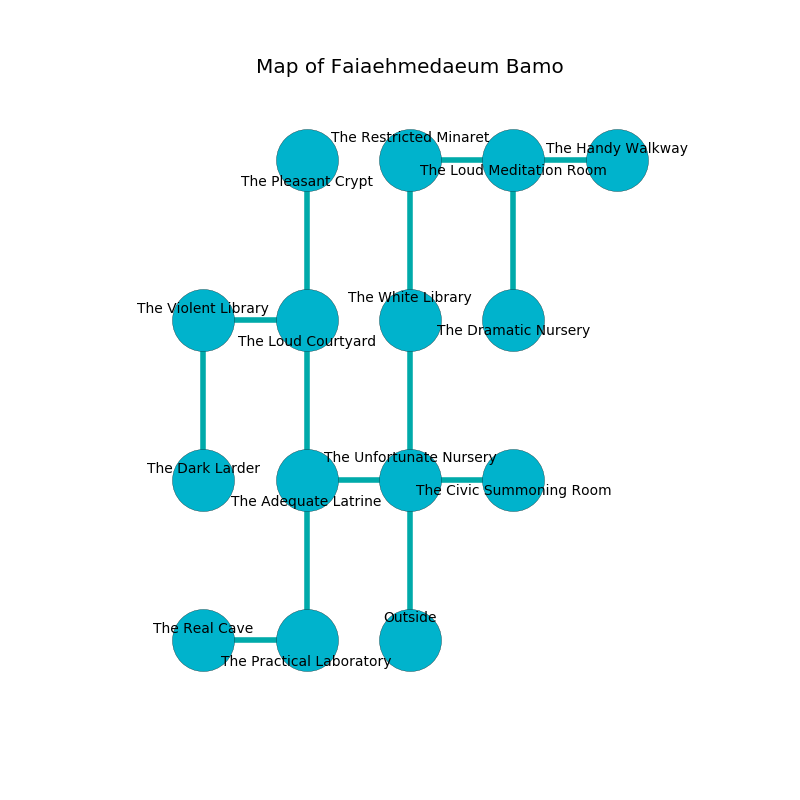

%Ruin Dogs

##Faiaehmedaeum Bamo
###Overview
Faiaehmedaeum Bamo is located on a flooded city. Some rooms of it are foggy. A massive storm is happening outside. It is occupied by Mind Flayers. Miguel Ashton The Thoughtless, a Cloud Giant is here. The Mind Flayers are the soldiers of Miguel Ashton The Thoughtless. He  is founding a new religion. 

###Artifact
####Defhaeebamd

Defhaeebamd looks like a soft figurine. It smells like ozone. Power incinerates near it. When eaten it becomes a deadly projectile. 

###Locations

####the unfortunate nursery
The air tastes like tea here. The concrete walls are ruined. The floor is flooded with three inch deep cold water. 

* To the west a long passageway opens to [the adequate latrine](#the-adequate-latrine).
* To the east a dripping cave leads to [the civic summoning room](#the-civic-summoning-room).
* To the north a dark threshold leads to [the white library](#the-white-library).
* To the south is the entrance.

####the civic summoning room
The floor is flooded with eight inch deep scalding water. There are a Ghost, a Steam Mephit, a Sea Horse, a Rug of Smothering, a Basilisk, and a Violet Fungus here. The brick walls are caving in. The air tastes like soup here. 

There is an engraving on a monolith written in common. 

> O! terrible we
>
> practical and free
>
> but never distant
>
> nothing is free
>

* To the west a dripping cave leads to [the unfortunate nursery](#the-unfortunate-nursery).

####the adequate latrine
The air smells like acacia here. The concrete walls are unsettled. The floor is sticky. Green moss is swaying in broken urns. 

* There is a knife here.
* There is a basin here.
* [Miguel Ashton The Thoughtless](#Miguel-Ashton-The-Thoughtless) is here.
* To the east a long passageway connects to [the unfortunate nursery](#the-unfortunate-nursery).
* To the north a twisted pathway leads to [the loud courtyard](#the-loud-courtyard).
* To the south a twisted corridor opens to [the practical laboratory](#the-practical-laboratory).

####the white library
There is a trap here. When activated, a magical proximity detector will fire a net. The air smells like starfruit here. There are a Mind Flayer Arcanist and a Mind Flayer here. One of the Mind Flayers is on watch, the rest are caring for babies. 

* To the north a twisted cave connects to [the restricted minaret](#the-restricted-minaret).
* To the south a dark threshold leads to [the unfortunate nursery](#the-unfortunate-nursery).

####the loud courtyard
The floor is cluttered with bones. Yellow mushrooms are decaying in cracks in the floor. The air smells like oakmoss here. 

* There is a salamander here.
* There is a girl here.
* There is a crossbow here.
* To the west a small hallway leads to [the violent library](#the-violent-library).
* To the north a twisted threshold opens to [the pleasant crypt](#the-pleasant-crypt).
* To the south a twisted pathway opens to [the adequate latrine](#the-adequate-latrine).

####the restricted minaret
The air tastes like umami here. The floor is smooth. Green moss is sprouting in broken urns. There are a Young Silver Dragon and a Revenant here. The brick walls are caving in. 

* There is an icon here.
* To the east a torchlit gap connects to [the loud meditation room](#the-loud-meditation-room).
* To the south a twisted cave connects to [the white library](#the-white-library).

####the practical laboratory
There are a Sahuagin, a Mummy, a Giant Scorpion, and a Giant Shark here. 

* To the west a dripping cave leads to [the real cave](#the-real-cave).
* To the north a twisted corridor opens to [the adequate latrine](#the-adequate-latrine).

####the violent library
Green ferns are sprouting in cracks in the floor. The wooden walls are caving in. The floor is smooth. 

* To the east a small hallway opens to [the loud courtyard](#the-loud-courtyard).
* To the south a dark hallway leads to [the dark larder](#the-dark-larder).

####the dark larder
The metallic walls are ruined. The floor is smooth. The air smells like egg yolk here. There are a Mind Flayer Arcanist and a Mind Flayer here. One of the Mind Flayers is working a mechanism that can engulf the room in a fiery blaze. 

* To the north a dark hallway opens to [the violent library](#the-violent-library).

####the pleasant crypt
The brick walls are unsettled. The floor is cluttered with bones. The air tastes like pork here. 

* To the south a twisted threshold opens to [the loud courtyard](#the-loud-courtyard).

####the real cave
Gray lichens are sprouting from the walls. The brick walls are caving in. 

* To the east a dripping cave connects to [the practical laboratory](#the-practical-laboratory).

####the loud meditation room
The glass walls are scratched. Gray lichens are growing from the ceiling. There are a Mind Flayer Arcanist, a Flumph, a Satyr, a Blood Hawk, a Dretch, a Sahuagin, a Giant Crocodile, a Violet Fungus, and a Pseudodragon here. 

* There is a cord here.
* [Defhaeebamd](#Defhaeebamd) is here.
* To the west a torchlit gap connects to [the restricted minaret](#the-restricted-minaret).
* To the east a twisted cavern connects to [the handy walkway](#the-handy-walkway).
* To the south a flooded corridor connects to [the dramatic nursery](#the-dramatic-nursery).

####the dramatic nursery

* There is a ghost here.
* To the north a flooded corridor connects to [the loud meditation room](#the-loud-meditation-room).

####the handy walkway
There is a trap here. When activated, a magical rune will launch a poison dart. Blue razorgrass is growing from the walls. The floor is smooth. There are a Troglodyte, a Giant Constrictor Snake, a Ghoul, a Draft Horse, a Grick, a Worg, a Kenku, a Twig Blight, a Half-Ogre, a Giant Octopus, a Goblin, a Slaad Tadpole, and a Duodrone here. The obsidion walls are unsettled. 

* There is a wight here.
* To the west a twisted cavern opens to [the loud meditation room](#the-loud-meditation-room).

