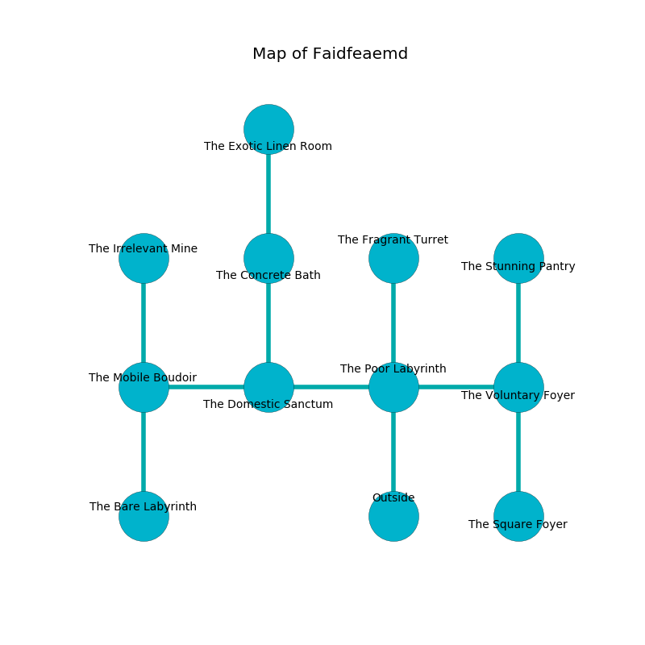

%Ruin Dogs

##Faidfeaemd
###Overview
Faidfeaemd is constructed on a broken mountain. Some areas of it are flooded. The ruin is larger on the inside than the outside. It is occupied by Duergars. Austin Hightower The Materialistic, a Cloud Giant is here. The Duergars worship Austin Hightower The Materialistic. He  is trying to recover [Duhhodaeum Hucc](#Duhhodaeum-Hucc). 

###Artifact
####Duhhodaeum Hucc

Duhhodaeum Hucc looks like a smooth prism. It is a dark purple color. When gazed upon it tunnels into the earth. 

###Locations

####the poor labyrinth
The air tastes like pear here. The stone walls are covered in mold. There are ten Duergars here. Red moss is decaying from the ceiling. The Duergars are defending this room from intruders. 

* There is a pendant here.
* To the west a hazy gap opens to [the domestic sanctum](#the-domestic-sanctum).
* To the east a narrow passageway leads to [the voluntary foyer](#the-voluntary-foyer).
* To the north a flooded cave opens to [the fragrant turret](#the-fragrant-turret).
* To the south is the entrance.

####the voluntary foyer
There are ten Duergars here. The air smells like maple here. The obsidion walls are ruined. The Duergars are willing to negotiate. 

* There is a wight here.
* To the west a narrow passageway leads to [the poor labyrinth](#the-poor-labyrinth).
* To the north a torchlit path leads to [the stunning pantry](#the-stunning-pantry).
* To the south a windy hall connects to [the square foyer](#the-square-foyer).

####the fragrant turret
The floor is smooth. The glass walls are covered in mold. 

There is an engraving on a tablet written in Duergars Script. 

> They are frozen
>
> standard and sour
>
> romantic, offensive, continental
>
> They are frozen
>

* To the south a flooded cave leads to [the poor labyrinth](#the-poor-labyrinth).

####the domestic sanctum
Yellow ferns are swaying from the walls. There are a Hunter Shark, a Darkmantle, a Roper, a Hippogriff, and a Pegasus here. The air tastes like liver here. There is a trap here. When activated, a magical rune will launch a rolling boulder. 

There is an engraving on a tablet written in common. 

> Oh sad fate
>
> it is always kind
>
> yet never late
>
> the world is blind
>

* To the west a long cave connects to [the mobile boudoir](#the-mobile-boudoir).
* To the east a hazy gap leads to [the poor labyrinth](#the-poor-labyrinth).
* To the north a dripping walkway opens to [the concrete bath](#the-concrete-bath).

####the mobile boudoir
There are ten Duergars here. The floor is cluttered with shells. The glass walls are caving in. Gray ferns are sprouting from the walls. The Duergars are meditating. 

* There is a drawer here.
* [Austin Hightower The Materialistic](#Austin-Hightower-The-Materialistic) is here.
* To the east a long cave connects to [the domestic sanctum](#the-domestic-sanctum).
* To the north a narrow artery leads to [the irrelevant mine](#the-irrelevant-mine).
* To the south a windy hall connects to [the bare labyrinth](#the-bare-labyrinth).

####the concrete bath
There are ten Duergars here. The Duergars are willing to negotiate. 

* [Duhhodaeum Hucc](#Duhhodaeum-Hucc) is here.
* To the north a narrow hallway opens to [the exotic linen room](#the-exotic-linen-room).
* To the south a dripping walkway opens to [the domestic sanctum](#the-domestic-sanctum).

####the bare labyrinth
The floor is sticky. The air tastes like toasted grain here. Yellow razorgrass is swaying in cracks in the floor. 

* To the north a windy hall opens to [the mobile boudoir](#the-mobile-boudoir).

####the stunning pantry
The obsidion walls are unsettled. 

* To the south a torchlit path leads to [the voluntary foyer](#the-voluntary-foyer).

####the irrelevant mine
There are a Giant Octopus and an Abominable Yeti here. Green moss is growing from the ceiling. The air tastes like ginseng here. 

There is an engraving on the wall written in Duergars Script. 

> [Duhhodaeum Hucc](#Duhhodaeum-Hucc)
>
> but never attractive
>
> cheap, senior, talkative
>
> All of us are damned
>
> transparent and spatial
>
> bold, general, cheerful
>
> you must be captured
>

* To the south a narrow artery leads to [the mobile boudoir](#the-mobile-boudoir).

####the square foyer
White mushrooms are decaying from the ceiling. The glass walls are covered in mold. 

* To the north a windy hall leads to [the voluntary foyer](#the-voluntary-foyer).

####the exotic linen room
There are a Hydra and a Green Hag here. The air tastes like urine here. Red lichens are growing in a patch on the floor. 

* To the south a narrow hallway opens to [the concrete bath](#the-concrete-bath).

