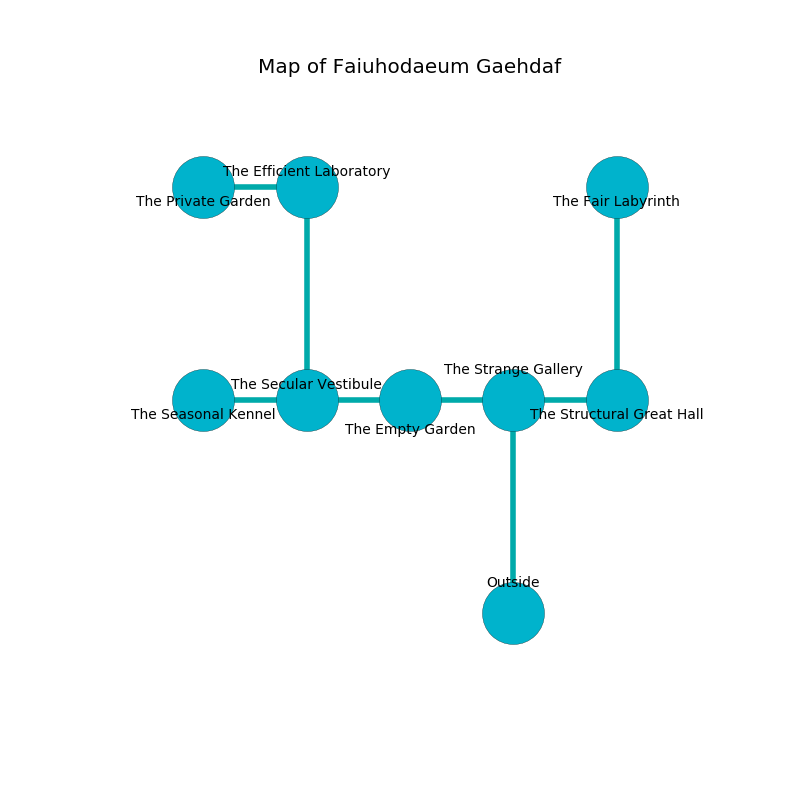

%Ruin Dogs

##Faiuhodaeum Gaehdaf
###Overview
Faiuhodaeum Gaehdaf is constructed on a cursed city. Regions of it are frozen. A windstorm is happening outside. It is occupied by Kobolds. Savannah Galvez The Vengeful, a Kuo-Toa Monitor is here. The Kobolds are the minions of Savannah Galvez The Vengeful. She  is trying to discover [The Aggressive Merchant](#The-Aggressive-Merchant). 

###Artifact
####The Aggressive Merchant

The Aggressive Merchant looks like a hard monument. It smells like lobster. When touched it frightens children. 

###Locations

####the strange gallery
The floor is sticky. 

* [Savannah Galvez The Vengeful](#Savannah-Galvez-The-Vengeful) is here.
* To the west a dripping threshold opens to [the empty garden](#the-empty-garden).
* To the east a windy cavern leads to [the structural great hall](#the-structural-great-hall).
* To the south is the entrance.

####the structural great hall
The floor is smooth. White mushrooms are sprouting from the ceiling. 

* To the west a windy cavern connects to [the strange gallery](#the-strange-gallery).
* To the north a long threshold leads to [the fair labyrinth](#the-fair-labyrinth).

####the empty garden
There are nine Winged Kobolds and seven Kobolds here. The stone walls are covered in mold. The Kobolds are willing to negotiate. 

* There is a cup here.
* To the west a windy artery leads to [the secular vestibule](#the-secular-vestibule).
* To the east a dripping threshold opens to [the strange gallery](#the-strange-gallery).

####the secular vestibule
The floor is cluttered with shells. There are seven Winged Kobolds and ten Kobolds here. The Kobolds are willing to negotiate. 

* [The Aggressive Merchant](#The-Aggressive-Merchant) is here.
* To the west a small corridor leads to [the seasonal kennel](#the-seasonal-kennel).
* To the east a windy artery leads to [the empty garden](#the-empty-garden).
* To the north a small hallway opens to [the efficient laboratory](#the-efficient-laboratory).

####the efficient laboratory

* To the west a windy opening opens to [the private garden](#the-private-garden).
* To the south a small hallway leads to [the secular vestibule](#the-secular-vestibule).

####the private garden
Green razorgrass is growing in broken urns. There is a trap here. When activated, a magical sound detector will launch a blade. 

There is an engraving on the wall written in Kobolds Script. 

> Treasure here.
>

* To the east a windy opening connects to [the efficient laboratory](#the-efficient-laboratory).

####the fair labyrinth
Green razorgrass is swaying in broken urns. 

There is an engraving on a stone written in common. 

> O! death is inhumane
>
> yet never frank
>
> it is never plain
>
> everything is blank
>

* To the south a long threshold leads to [the structural great hall](#the-structural-great-hall).

####the seasonal kennel
The glass walls are covered in mold. There is a trap here. When activated, a pressure plate will flood the room with water. There are eight Winged Kobolds and eight Kobolds here. The floor is glossy. The Kobolds are feasting. 

* To the east a small corridor leads to [the secular vestibule](#the-secular-vestibule).

