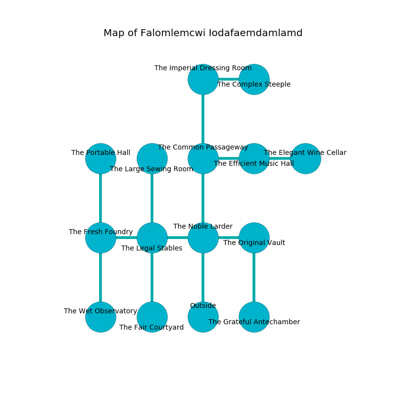

%Ruin Dogs

##Falomlemcwi Iodafaemdamlamd
###Overview
Falomlemcwi Iodafaemdamlamd is located under a crystal mountain. Regions of Falomlemcwi Iodafaemdamlamd are frozen. The ruin is burning. It is occupied by Goblins. Vernon Grider The Changeable, a Kuo-Toa Monitor is here. The Goblins are battling Vernon Grider The Changeable. He  is trying to steal [The Absent Drain](#The-Absent-Drain). 

###Artifact
####The Absent Drain

The Absent Drain looks like a hard amulet. It smells like coriander. When cradled it aids memory. 

###Locations

####the noble larder
The mirrored walls are ruined. 

* To the west a dripping hallway connects to [the legal stables](#the-legal-stables).
* To the east a twisted walkway connects to [the original vault](#the-original-vault).
* To the north a flooded walkway opens to [the common passageway](#the-common-passageway).
* To the south is the entrance.

####the common passageway
Yellow moss is growing from the walls. There are five Goblins and two Hobgoblins here. The air smells like humus here. One of the Goblins is pointing a ballista at the entrance. 

There is an engraving on the floor written in Goblins Script. 

> A trap ahead.
>

* To the east a narrow artery leads to [the efficient music hall](#the-efficient-music-hall).
* To the north a hazy pathway opens to [the imperial dressing room](#the-imperial-dressing-room).
* To the south a flooded walkway leads to [the noble larder](#the-noble-larder).

####the original vault
There are three Goblins and three Hobgoblins here. One of the Goblins is working a mechanism that can engulf the room in a fiery blaze. 

There is an engraving on a monolith written in Goblins Script. 

> All of us are damned
>
> sad, curious, definite
>
> but passive
>
> We are corrupted
>
> possible and beautiful
>

* There is a wall here.
* To the west a twisted walkway opens to [the noble larder](#the-noble-larder).
* To the south a narrow path opens to [the grateful antechamber](#the-grateful-antechamber).

####the legal stables
Green moss is growing in a patch on the floor. The air tastes like grilling here. 

* To the west a torchlit hallway leads to [the fresh foundry](#the-fresh-foundry).
* To the east a dripping hallway connects to [the noble larder](#the-noble-larder).
* To the north a torchlit threshold leads to [the large sewing room](#the-large-sewing-room).
* To the south a twisted opening opens to [the fair courtyard](#the-fair-courtyard).

####the large sewing room
There are a Guard, an Aarakocra, a Will-O’-Wisp, a Winged Kobold, and a Scorpion here. 

There is an engraving on a stone written in common. 

> Leave now.
>

* To the south a torchlit threshold leads to [the legal stables](#the-legal-stables).

####the efficient music hall
The floor is cluttered with shells. Gray lichens are decaying in broken urns. The air tastes like gas here. 

* There is a spirit here.
* To the west a narrow artery leads to [the common passageway](#the-common-passageway).
* To the east a windy opening connects to [the elegant wine cellar](#the-elegant-wine-cellar).

####the elegant wine cellar
The air smells like ylang here. There are a Frog, a Bugbear, a Black Bear, and an Ice Mephit here. The brick walls are bloodstained. 

* There is a basket here.
* To the west a windy opening opens to [the efficient music hall](#the-efficient-music-hall).

####the fresh foundry
There are a Rhinoceros, a Zombie, a Smoke Mephit, and a Piercer here. The floor is glossy. 

* [The Absent Drain](#The-Absent-Drain) is here.
* To the east a torchlit hallway connects to [the legal stables](#the-legal-stables).
* To the north a twisted threshold opens to [the portable hall](#the-portable-hall).
* To the south a long pathway connects to [the wet observatory](#the-wet-observatory).

####the portable hall
The concrete walls are bloodstained. There are four Goblins and two Hobgoblins here. The floor is sticky. The Goblins are performing a ritual. If not interrupted, the Goblins will become more powerful. 

* There is a stamp here.
* To the south a twisted threshold opens to [the fresh foundry](#the-fresh-foundry).

####the imperial dressing room
Red ferns are swaying in cracks in the floor. The floor is sticky. There are four Hobgoblins here. The air tastes like roasted almond here. The Goblins are willing to negotiate. 

* [Vernon Grider The Changeable](#Vernon-Grider-The-Changeable) is here.
* To the east a long threshold leads to [the complex steeple](#the-complex-steeple).
* To the south a hazy pathway leads to [the common passageway](#the-common-passageway).

####the complex steeple
The air tastes like ginseng here. 

* There is a dagger here.
* To the west a long threshold leads to [the imperial dressing room](#the-imperial-dressing-room).

####the grateful antechamber
The floor is bloodstained. The air smells like mahogany here. There are three Goblins and three Hobgoblins here. The Goblins are willing to fight to the death. 

* To the north a narrow path connects to [the original vault](#the-original-vault).

####the fair courtyard
The air tastes like spice here. Yellow razorgrass is decaying in broken urns. 

* To the north a twisted opening leads to [the legal stables](#the-legal-stables).

####the wet observatory
There are a Goblin and four Hobgoblins here. There is a trap here. When activated, a magical rune will launch a ceiling pendulum. The mirrored walls are covered in mold. The air tastes like buttermilk here. Red mushrooms are sprouting in cracks in the floor. If the Goblins notice the Ruin Dogs, one of them will retreat and alert [Vernon Grider](#Vernon-Grider). 

* To the north a long pathway opens to [the fresh foundry](#the-fresh-foundry).

