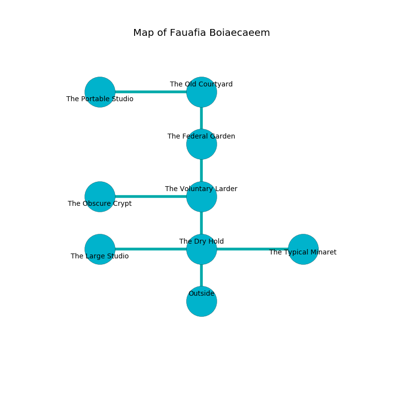

%Ruin Dogs

##Fauafia Boiaecaeem
###Overview
Fauafia Boiaecaeem is constructed on a broken mountain. Some areas of Fauafia Boiaecaeem are flooded. The ruin is larger on the inside than the outside. It is occupied by Githzerai. Matt Halcomb The Harsh, a Stone Giant is here. The Githzerai are the minions of Matt Halcomb The Harsh. He  is trying to discover [Caehhaf](#Caehhaf). 

###Artifact
####Caehhaf

Caehhaf looks like a smooth amulet. It smells like sap. Cacophony glows around it. When rubbed it levitates those nearby. 

###Locations

####the dry hold
The air smells like styrene here. The floor is smooth. There is a trap here. When activated, a magical proximity detector will launch a rolling boulder. 

* [Caehhaf](#Caehhaf) is here.
* To the west a torchlit threshold opens to [the large studio](#the-large-studio).
* To the east a windy pathway opens to [the typical minaret](#the-typical-minaret).
* To the north a torchlit opening opens to [the voluntary larder](#the-voluntary-larder).
* To the south is the entrance.

####the voluntary larder
The floor is bloodstained. White moss is growing in cracks in the floor. There are four Githzerai Monks here. The Githzerai are willing to negotiate. 

* There is a bridge here.
* To the west a flooded walkway opens to [the obscure crypt](#the-obscure-crypt).
* To the north a flooded passageway leads to [the federal garden](#the-federal-garden).
* To the south a torchlit opening leads to [the dry hold](#the-dry-hold).

####the obscure crypt
The stone walls are scratched. 

There is an engraving on the floor written in Githzerai Script. 

> I am lost in Fauafia Boiaecaeem.
>

* To the east a flooded walkway connects to [the voluntary larder](#the-voluntary-larder).

####the typical minaret
There are a Shield Guardian and an Assassin here. White ferns are decaying in broken urns. 

* To the west a windy pathway connects to [the dry hold](#the-dry-hold).

####the federal garden
The crystal walls are unsettled. Yellow ferns are swaying from the ceiling. There are a Plesiosaurus, an Aarakocra, and a Mage here. 

* To the north a small cavern leads to [the old courtyard](#the-old-courtyard).
* To the south a flooded passageway opens to [the voluntary larder](#the-voluntary-larder).

####the old courtyard
The concrete walls are unsettled. There are a Vrock and an Orc War Chief here. 

There is an engraving on the ceiling written in Githzerai Script. 

> I am lovely.
>

* There is a blade here.
* There is a key here.
* There is a tome here.
* To the west a flooded path connects to [the portable studio](#the-portable-studio).
* To the south a small cavern opens to [the federal garden](#the-federal-garden).

####the portable studio
There is a trap here. When activated, a magical proximity detector will close a portcullis. The obsidion walls are unsettled. There are four Githzerai Monks here. The air tastes like shellfish here. The Githzerai are performing a ritual. If not interrupted, a powerful monster will be summoned. 

There is an engraving on the ceiling written in Githzerai Script. 

> I thought about cowering.
>

* [Matt Halcomb The Harsh](#Matt-Halcomb-The-Harsh) is here.
* To the east a flooded path connects to [the old courtyard](#the-old-courtyard).

####the large studio
Gray mushrooms are sprouting in a patch on the floor. The air tastes like honey here. There are a Mezzoloth, a Magma Mephit, a Twig Blight, a Gray Ooze, an Ankylosaurus, and an Animated Armor here. 

* To the east a torchlit threshold connects to [the dry hold](#the-dry-hold).

