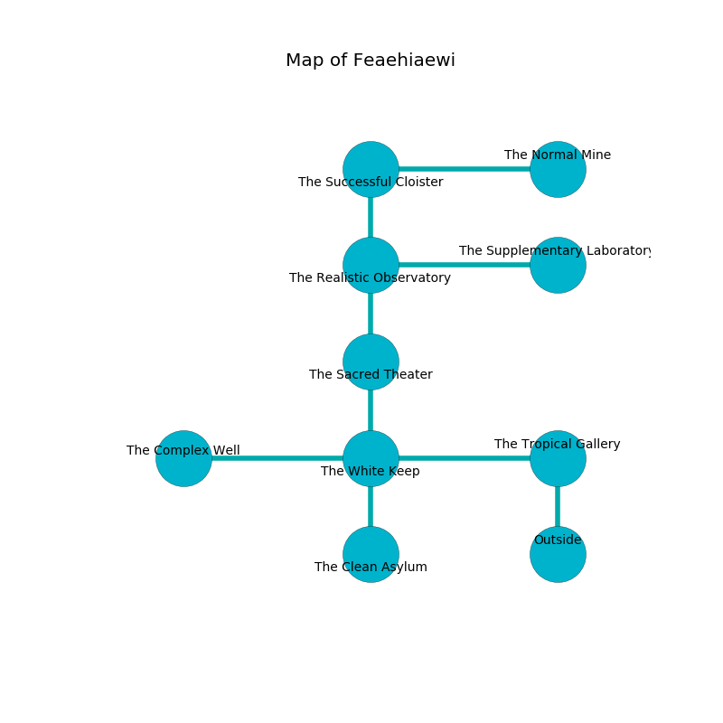

%Ruin Dogs

##Feaehiaewi
###Overview
Feaehiaewi is located in a poisoned plain. Some rooms of it are corrupted. The ruin is larger on the inside than the outside. It is occupied by Orc. Kristyn Hanna The Foolhardy, a Duergar is here. The Orc are ruled by Kristyn Hanna The Foolhardy. She  is founding a new religion. 

###Artifact
####The Fashionable Redundancy

The Fashionable Redundancy has the form of a cold cube. It is a shifting pink color. Air glows away from it. When smelled it dissappears. 

###Locations

####the tropical gallery
The mirrored walls are covered in mold. The air tastes like liver here. The floor is smooth. Blue mushrooms are sprouting in cracks in the floor. 

* To the west a dripping cavern leads to [the white keep](#the-white-keep).
* To the south is the entrance.

####the white keep
The air tastes like sausage here. The concrete walls are caving in. 

* [The Fashionable Redundancy](#The-Fashionable-Redundancy) is here.
* To the west a hazy pathway opens to [the complex well](#the-complex-well).
* To the east a dripping cavern connects to [the tropical gallery](#the-tropical-gallery).
* To the north a windy opening opens to [the sacred theater](#the-sacred-theater).
* To the south a hazy hallway leads to [the clean asylum](#the-clean-asylum).

####the sacred theater
Green lichens are sprouting in cracks in the floor. The floor is bloodstained. The air tastes like magnolia here. 

* To the north a windy walkway leads to [the realistic observatory](#the-realistic-observatory).
* To the south a windy opening opens to [the white keep](#the-white-keep).

####the realistic observatory
Green lichens are growing in broken urns. The floor is glossy. 

* There is a hook here.
* There is a potato here.
* There is a card here.
* To the east a twisted artery leads to [the supplementary laboratory](#the-supplementary-laboratory).
* To the north a dripping cave leads to [the successful cloister](#the-successful-cloister).
* To the south a windy walkway connects to [the sacred theater](#the-sacred-theater).

####the successful cloister
There are a Quasit and a Giant Toad here. 

* To the east a windy artery connects to [the normal mine](#the-normal-mine).
* To the south a dripping cave leads to [the realistic observatory](#the-realistic-observatory).

####the supplementary laboratory
The wooden walls are covered in mold. 

* To the west a twisted artery leads to [the realistic observatory](#the-realistic-observatory).

####the normal mine
Yellow lichens are growing from the walls. The metallic walls are ruined. The floor is bloodstained. There is a Spined Devil here. The air tastes like roasted almond here. 

* There is a belt here.
* [Kristyn Hanna The Foolhardy](#Kristyn-Hanna-The-Foolhardy) is here.
* To the west a windy artery connects to [the successful cloister](#the-successful-cloister).

####the clean asylum
The wooden walls are covered in mold. There are four Orcs here. The air smells like spice here. There is a trap here. When activated, a pressure plate will launch a poison needle. The Orc are caring for babies. 

There is an engraving on a stone written in Orc Script. 

> I could not try praying.
>

* To the north a hazy hallway opens to [the white keep](#the-white-keep).

####the complex well
The air tastes like bay here. There are four Orcs here. The Orc are performing a ritual. If not interrupted, a powerful monster will be summoned. 

* To the east a hazy pathway opens to [the white keep](#the-white-keep).

