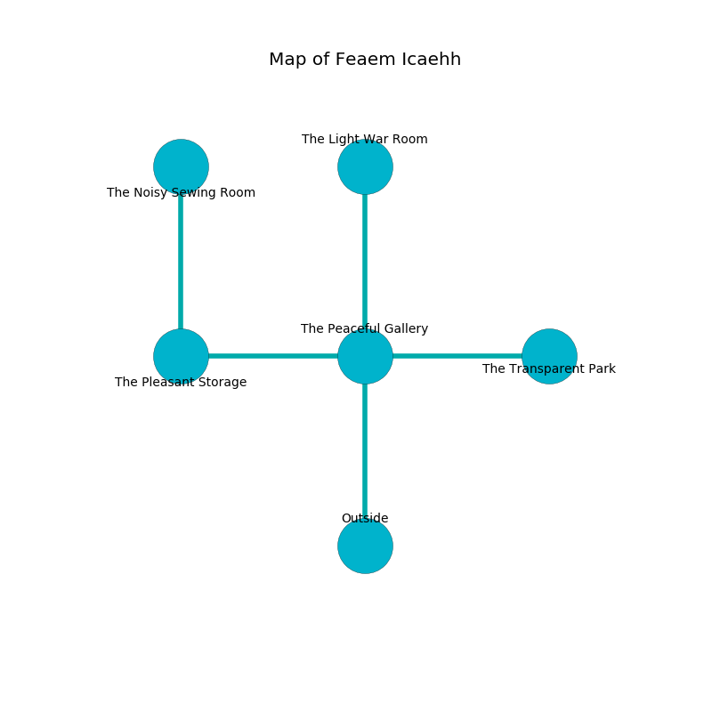

%Ruin Dogs

##Feaem Icaehh
###Overview
Feaem Icaehh is located on a spikey city. Parts of it are frozen. The ruin is flooding. It is occupied by Troglodytes. Renaldo Saldivar The Indiscreet, a Fire Giant is here. The Troglodytes are the slaves of Renaldo Saldivar The Indiscreet. He  is founding a new religion. 

###Artifact
####Maed

Maed looks like a broken doll. Air shifts away from it. It is a dark orange color. When touched it changes the past. 

###Locations

####the peaceful gallery
The crystal walls are pristine. There are forty Troglodytes here. The floor is flooded with nine inch deep lukewarm water. Green mushrooms are growing from the ceiling. The Troglodytes are meditating. 

There is an engraving on a monolith written in Troglodytes Script. 

> You are lost
>
> but unfair
>
> pleasant, prolonged, ambiguous
>
> smooth and random
>
> present, immune, representative
>
> yet never secure
>
> you must never be punished
>

* There is a ghost here.
* [Renaldo Saldivar The Indiscreet](#Renaldo-Saldivar-The-Indiscreet) is here.
* To the west a torchlit hallway leads to [the pleasant storage](#the-pleasant-storage).
* To the east a hazy artery leads to [the transparent park](#the-transparent-park).
* To the north a twisted path opens to [the light war Room](#the-light-war-Room).
* To the south is the entrance.

####the light war Room
Green mushrooms are swaying from the ceiling. The floor is glossy. The air tastes like nut here. The brick walls are scratched. There are a Bugbear, a Mind Flayer Arcanist, a Green Hag, and a Vulture here. 

* To the south a twisted path leads to [the peaceful gallery](#the-peaceful-gallery).

####the transparent park
The air tastes like saffron here. The floor is glossy. Gray mushrooms are swaying from the ceiling. 

There is an engraving on a monolith written in common. 

> Go away.
>

* To the west a hazy artery opens to [the peaceful gallery](#the-peaceful-gallery).

####the pleasant storage

* There is a fowl here.
* There is a fowl here.
* There is a ghost here.
* [Maed](#Maed) is here.
* To the east a torchlit hallway leads to [the peaceful gallery](#the-peaceful-gallery).
* To the north a dripping threshold connects to [the noisy sewing room](#the-noisy-sewing-room).

####the noisy sewing room
The floor is sticky. There are forty Troglodytes here. The air smells like flowers here. The obsidion walls are unsettled. The Troglodytes are berserk with rage. 

* There is a fork here.
* To the south a dripping threshold opens to [the pleasant storage](#the-pleasant-storage).

