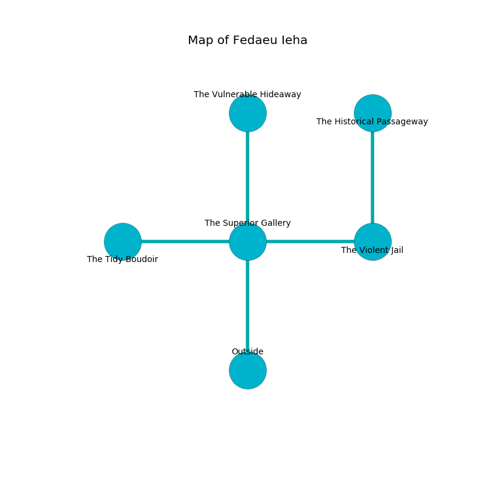

%Ruin Dogs

##Fedaeu Ieha
###Overview
Fedaeu Ieha is constructed on an alien plain. Some rooms of Fedaeu Ieha are flooded. The ruin is flooding. It is occupied by Sahuagin. Renata Kraus The Inconsiderate, an Incubus is here. The Sahuagin are battling Renata Kraus The Inconsiderate. She  is founding a new religion. 

###Artifact
####The Glorious Bill

The Glorious Bill is a powerful artifact in the shape of a soft spear. It is a dark blue color. It smells like brandy. When touched it destroys others. 

###Locations

####the superior gallery
There are a Grell, a Bandit, and an Elephant here. Green moss is decaying from the walls. 

There is an engraving on the floor written in common. 

> Oh sad you
>
> pure and critical
>
> dynamic, obscure, new
>
> the world is political
>

* To the west a small passageway connects to [the tidy boudoir](#the-tidy-boudoir).
* To the east a windy cave opens to [the violent jail](#the-violent-jail).
* To the north a long path leads to [the vulnerable hideaway](#the-vulnerable-hideaway).
* To the south is the entrance.

####the tidy boudoir
Yellow moss is swaying from the ceiling. There is a Sahuagin Baron here. The floor is sticky. One of the Sahuagin Baron is working a mechanism that can pour hornets from the ceiling. 

* To the east a small passageway leads to [the superior gallery](#the-superior-gallery).

####the vulnerable hideaway
Green mushrooms are swaying from the ceiling. There are a Gnoll, a Flameskull, and a Gold Dragon Wyrmling here. The air smells like unripe banana here. The floor is flooded with four inch deep scalding water. 

* There is a knot here.
* To the south a long path leads to [the superior gallery](#the-superior-gallery).

####the violent jail
The floor is sticky. Yellow ferns are sprouting in a patch on the floor. 

* [The Glorious Bill](#The-Glorious-Bill) is here.
* [Renata Kraus The Inconsiderate](#Renata-Kraus-The-Inconsiderate) is here.
* To the west a windy cave connects to [the superior gallery](#the-superior-gallery).
* To the north a small passageway connects to [the historical passageway](#the-historical-passageway).

####the historical passageway
The glass walls are covered in mold. The floor is smooth. Gray lichens are swaying from the ceiling. 

* There is a snake here.
* To the south a small passageway connects to [the violent jail](#the-violent-jail).

