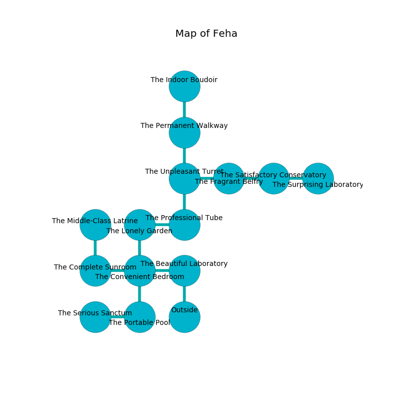

%Ruin Dogs

##Feha
###Overview
Feha is located on a haunted city. Some areas of it are flooded. The ruin is flooding. It is occupied by Yuan-Ti. Gaynelle Greenfield The Quarrelsome, a Lizardfolk Shaman is here. The Yuan-Ti are the slaves of Gaynelle Greenfield The Quarrelsome. She  is founding a new religion. 

###Artifact
####The Lost Texture

The Lost Texture looks like a broken orb. It smells like mutton. It is a dark green color. When held it projects energy. 

###Locations

####the beautiful laboratory
The air tastes like nasturtium here. The wooden walls are unsettled. There are a Drow, a Thug, and a Grell here. 

* [Gaynelle Greenfield The Quarrelsome](#Gaynelle-Greenfield-The-Quarrelsome) is here.
* To the west a hazy hall opens to [the convenient bedroom](#the-convenient-bedroom).
* To the south is the entrance.

####the convenient bedroom
There are a Mud Mephit, a Silver Dragon Wyrmling, and a Dire Wolf here. The mirrored walls are covered in mold. The air smells like toast here. The floor is glossy. 

There is an engraving on a monolith written in common. 

> All of us are envious
>
> military, feminine, tired
>
> predictable, dynamic, monstrous
>
> profound and violent
>

* To the west a torchlit hall leads to [the complete sunroom](#the-complete-sunroom).
* To the east a hazy hall connects to [the beautiful laboratory](#the-beautiful-laboratory).
* To the north a torchlit cavern opens to [the lonely garden](#the-lonely-garden).
* To the south a torchlit opening connects to [the portable pool](#the-portable-pool).

####the portable pool
The metallic walls are covered in mold. 

* [The Lost Texture](#The-Lost-Texture) is here.
* To the west a windy pathway connects to [the serious sanctum](#the-serious-sanctum).
* To the north a torchlit opening connects to [the convenient bedroom](#the-convenient-bedroom).

####the lonely garden
The air smells like turni here. 

There is an engraving on the wall written in Yuan-Ti Script. 

> Leave now.
>

* There is a dragon here.
* There is a diamond here.
* To the east a long pathway connects to [the professional tube](#the-professional-tube).
* To the south a torchlit cavern connects to [the convenient bedroom](#the-convenient-bedroom).

####the professional tube
The air smells like marzipan here. Green moss is decaying from the ceiling. 

There is an engraving on a stone written in common. 

> All of us are damned
>
> brown and central
>
> yet never feminine
>
> ever supplementary
>
> All of us are damned
>

* To the west a long pathway leads to [the lonely garden](#the-lonely-garden).
* To the north a long cave connects to [the unpleasant turret](#the-unpleasant-turret).

####the complete sunroom
The air smells like cassia here. The obsidion walls are unsettled. 

* There is a monkey here.
* To the east a torchlit hall opens to [the convenient bedroom](#the-convenient-bedroom).
* To the north a flooded pathway leads to [the middle-class latrine](#the-middle-class-latrine).

####the unpleasant turret
The concrete walls are unsettled. 

* To the east a torchlit hall connects to [the fragrant belfry](#the-fragrant-belfry).
* To the north a narrow cavern connects to [the permanent walkway](#the-permanent-walkway).
* To the south a long cave leads to [the professional tube](#the-professional-tube).

####the permanent walkway
The stone walls are bloodstained. The floor is sticky. There are a Merrow, a Swarm of Poisonous Snakes, and a Mule here. 

There is an engraving on a monolith written in Yuan-Ti Script. 

> Poor me! dire we
>
> continental, abundant, free
>
> it is never compatible
>
> death is free
>

* To the north a dripping gap opens to [the indoor boudoir](#the-indoor-boudoir).
* To the south a narrow cavern connects to [the unpleasant turret](#the-unpleasant-turret).

####the indoor boudoir
The air tastes like mold here. 

* To the south a dripping gap leads to [the permanent walkway](#the-permanent-walkway).

####the fragrant belfry
White lichens are growing in broken urns. 

* There is a dragon here.
* To the west a torchlit hall leads to [the unpleasant turret](#the-unpleasant-turret).
* To the east a long cavern opens to [the satisfactory conservatory](#the-satisfactory-conservatory).

####the middle-class latrine
The stone walls are caving in. Blue ferns are swaying in a patch on the floor. The air smells like blueberry here. There are three Yuan-Ti Purebloods here. The floor is smooth. One of the Yuan-Ti is pointing a ballista at the entrance. 

* To the south a flooded pathway connects to [the complete sunroom](#the-complete-sunroom).

####the satisfactory conservatory
There are a Gnoll Pack Lord, a Scout, a Duergar, and a Vulture here. The air tastes like tuberose here. 

* To the west a long cavern opens to [the fragrant belfry](#the-fragrant-belfry).
* To the east a dripping path leads to [the surprising laboratory](#the-surprising-laboratory).

####the surprising laboratory
Gray ferns are swaying from the ceiling. There are a Cat, a Brass Dragon Wyrmling, a Bat, and a White Dragon Wyrmling here. 

* To the west a dripping path leads to [the satisfactory conservatory](#the-satisfactory-conservatory).

####the serious sanctum
There is a trap here. When activated, a magical proximity detector will launch a fireball. There is a Yuan-Ti Malison here. Red razorgrass is sprouting from the walls. The crystal walls are ruined. One of the Yuan-Ti Malison is working a mechanism that can launch acid at the Ruin Dogs. 

There is an engraving on a stone written in Yuan-Ti Script. 

> I am fleeing Feha.
>

* To the east a windy pathway opens to [the portable pool](#the-portable-pool).

