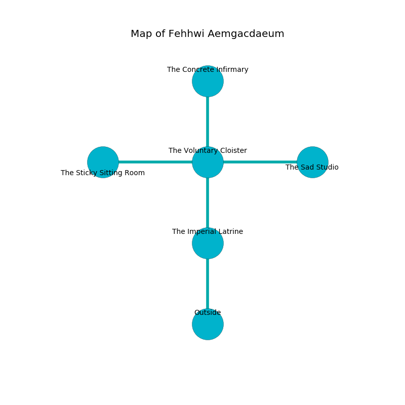

%Ruin Dogs

##Fehhwi Aemgacdaeum
###Overview
Fehhwi Aemgacdaeum is constructed on a spikey tree. Some areas of it are flooded. The ruin is sinking into the earth. It is occupied by Cyclopses. Lonnie Desantis The Obsessive, a Hobgoblin Warlord is here. The Cyclopses are ruled by Lonnie Desantis The Obsessive. He  is founding a new religion. 

###Artifact
####The Difficult Deprivation

The Difficult Deprivation has the form of a transparent prism. It smells like molasses. Gravity slips towards it. It is a sickly blue color. When carried it changes the past. 

###Locations

####the imperial latrine
The floor is bloodstained. The air tastes like dried apple here. 

* To the north a flooded gap connects to [the voluntary cloister](#the-voluntary-cloister).
* To the south is the entrance.

####the voluntary cloister
There are a Pony, an Aarakocra, a Quaggoth, and a Cyclops here. Green mushrooms are decaying in broken urns. The air tastes like ripe banana here. The brick walls are scratched. 

* [The Difficult Deprivation](#The-Difficult-Deprivation) is here.
* [Lonnie Desantis The Obsessive](#Lonnie-Desantis-The-Obsessive) is here.
* To the west a torchlit path opens to [the sticky sitting Room](#the-sticky-sitting-Room).
* To the east a long cave connects to [the sad studio](#the-sad-studio).
* To the north a torchlit hallway opens to [the concrete infirmary](#the-concrete-infirmary).
* To the south a flooded gap connects to [the imperial latrine](#the-imperial-latrine).

####the sticky sitting Room
The concrete walls are scratched. There are two Cyclopses here. The floor is flooded with seven inch deep hot water. One of the Cyclopses is on watch, the rest are feasting. 

* There is a cart here.
* To the east a torchlit path connects to [the voluntary cloister](#the-voluntary-cloister).

####the sad studio
Gray razorgrass is swaying in cracks in the floor. The air tastes like broccoli here. There is an Oni here. 

* To the west a long cave opens to [the voluntary cloister](#the-voluntary-cloister).

####the concrete infirmary
The floor is sticky. There are a Winged Kobold, a Kuo-Toa Archpriest, and a Dire Wolf here. Green razorgrass is sprouting in a patch on the floor. 

* To the south a torchlit hallway opens to [the voluntary cloister](#the-voluntary-cloister).

