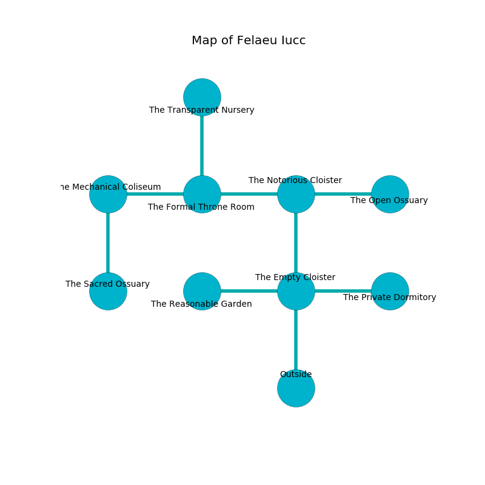

%Ruin Dogs

##Felaeu Iucc
###Overview
Felaeu Iucc is located on an obsidion city. Some areas of it are frozen. A windstorm is happening outside. It is occupied by Pixies. Jetta Tuck The Dogmatic, a Stone Giant is here. The Pixies are the soldiers of Jetta Tuck The Dogmatic. She  is trying to destroy [Faiaefl](#Faiaefl). 

###Artifact
####Faiaefl

Faiaefl is a powerful artifact in the shape of a soft amulet. It is a medium brown color. When thrown it curses all nearby. 

###Locations

####the empty cloister

* There is a book here.
* There is a heart here.
* To the west a dripping artery leads to [the reasonable garden](#the-reasonable-garden).
* To the east a long artery leads to [the private dormitory](#the-private-dormitory).
* To the north a small gap opens to [the notorious cloister](#the-notorious-cloister).
* To the south is the entrance.

####the reasonable garden
The floor is sticky. The stone walls are scratched. There are a Kuo-Toa Whip, a Quaggoth, and a Bronze Dragon Wyrmling here. 

* There is a sword here.
* To the east a dripping artery opens to [the empty cloister](#the-empty-cloister).

####the notorious cloister
The floor is flooded with four inch deep cold water. The air smells like orchid here. Yellow ferns are decaying in broken urns. There are twenty four Pixies here. One of the Pixies is on watch, the rest are drunk. 

There is an engraving on a monolith written in common. 

> I am old.
>

* [Jetta Tuck The Dogmatic](#Jetta-Tuck-The-Dogmatic) is here.
* To the west a windy hall opens to [the formal throne room](#the-formal-throne-room).
* To the east a flooded path connects to [the open ossuary](#the-open-ossuary).
* To the south a small gap connects to [the empty cloister](#the-empty-cloister).

####the formal throne room
There are a Myconid Sovereign and a Bulette here. The floor is cluttered with bones. Green razorgrass is growing from the walls. The brick walls are bloodstained. The air tastes like horhound here. 

* To the west a hazy passageway leads to [the mechanical coliseum](#the-mechanical-coliseum).
* To the east a windy hall connects to [the notorious cloister](#the-notorious-cloister).
* To the north a torchlit cavern connects to [the transparent nursery](#the-transparent-nursery).

####the transparent nursery
There are twenty four Pixies here. Green mushrooms are sprouting in broken urns. The mirrored walls are bloodstained. One of the Pixies is on watch, the rest are celebrating. 

There is an engraving on a tablet written in common. 

> I hid something in Felaeu Iucc.
>
> Treasure here.
>

* To the south a torchlit cavern connects to [the formal throne room](#the-formal-throne-room).

####the private dormitory
The crystal walls are ruined. White razorgrass is swaying in a patch on the floor. There are twenty four Pixies here. The Pixies are willing to negotiate. 

* To the west a long artery opens to [the empty cloister](#the-empty-cloister).

####the open ossuary
There is a trap here. When activated, a magical sound detector will open a large pit in the floor. The floor is glossy. The air tastes like fermentation here. 

* There is a screw here.
* To the west a flooded path connects to [the notorious cloister](#the-notorious-cloister).

####the mechanical coliseum
There are twenty four Pixies here. The air tastes like soap here. The stone walls are covered in mold. The Pixies are feasting. 

* [Faiaefl](#Faiaefl) is here.
* To the east a hazy passageway opens to [the formal throne room](#the-formal-throne-room).
* To the south a windy corridor connects to [the sacred ossuary](#the-sacred-ossuary).

####the sacred ossuary
The metallic walls are ruined. 

* To the north a windy corridor opens to [the mechanical coliseum](#the-mechanical-coliseum).

