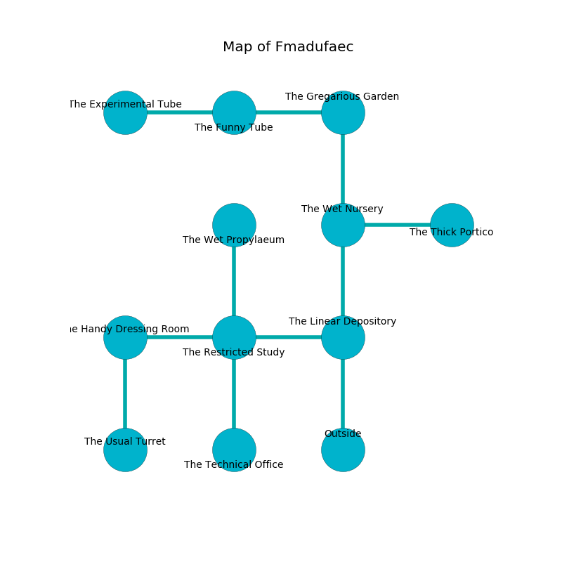

%Ruin Dogs

##Fmadufaec
###Overview
Fmadufaec is located on a cursed tree. Some rooms of Fmadufaec are inaccessible. A windstorm is happening outside. It is occupied by Kenku. Jacqui Delacruz The Dogmatic, a Mage is here. The Kenku worship Jacqui Delacruz The Dogmatic. She  is trying to understand [Daehhuia Bumeidafwi](#Daehhuia-Bumeidafwi). 

###Artifact
####Daehhuia Bumeidafwi

Daehhuia Bumeidafwi looks like a transparent sphere. It is a medium orange color. When touched it burns the mind. 

###Locations

####the linear depository
White lichens are swaying in cracks in the floor. The air smells like dates here. 

* There is an orange here.
* To the west a hazy cave leads to [the restricted study](#the-restricted-study).
* To the north a dark walkway opens to [the wet nursery](#the-wet-nursery).
* To the south is the entrance.

####the restricted study
The crystal walls are ruined. Yellow lichens are decaying from the ceiling. There are twenty Kenkus here. The Kenku are fighting amongst themselves. 

* There is a rat here.
* To the west a dripping gap opens to [the handy dressing room](#the-handy-dressing-room).
* To the east a hazy cave connects to [the linear depository](#the-linear-depository).
* To the north a small artery opens to [the wet propylaeum](#the-wet-propylaeum).
* To the south a torchlit path opens to [the technical office](#the-technical-office).

####the wet nursery
The crystal walls are ruined. The floor is glossy. 

* To the east a flooded pathway leads to [the thick portico](#the-thick-portico).
* To the north a narrow cavern opens to [the gregarious garden](#the-gregarious-garden).
* To the south a dark walkway leads to [the linear depository](#the-linear-depository).

####the technical office
The air tastes like berry here. There are twenty Kenkus here. Yellow lichens are growing from the walls. The floor is sticky. If the Kenku notice the Ruin Dogs, one of them will retreat and alert the others. 

* To the north a torchlit path connects to [the restricted study](#the-restricted-study).

####the thick portico
The floor is sticky. 

* To the west a flooded pathway connects to [the wet nursery](#the-wet-nursery).

####the handy dressing room
White lichens are sprouting in broken urns. The floor is cluttered with shells. There are twenty Kenkus here. The brick walls are unsettled. The Kenku are feasting. 

There is an engraving on a monolith written in Kenku Script. 

> You are hidden
>
> always peaceful
>
> You are hidden
>

* To the east a dripping gap connects to [the restricted study](#the-restricted-study).
* To the south a hazy pathway connects to [the usual turret](#the-usual-turret).

####the gregarious garden
There are a Copper Dragon Wyrmling and a Beholder Zombie here. The air tastes like lobster here. The brick walls are covered in mold. 

* [Jacqui Delacruz The Dogmatic](#Jacqui-Delacruz-The-Dogmatic) is here.
* To the west a torchlit hall connects to [the funny tube](#the-funny-tube).
* To the south a narrow cavern leads to [the wet nursery](#the-wet-nursery).

####the usual turret
The air tastes like weed here. The floor is glossy. 

* There is a spade here.
* There is a rowboat here.
* To the north a hazy pathway leads to [the handy dressing room](#the-handy-dressing-room).

####the wet propylaeum
The air tastes like fennel here. The mirrored walls are scratched. 

* To the south a small artery opens to [the restricted study](#the-restricted-study).

####the funny tube

* [Daehhuia Bumeidafwi](#Daehhuia-Bumeidafwi) is here.
* To the west a torchlit hallway leads to [the experimental tube](#the-experimental-tube).
* To the east a torchlit hall opens to [the gregarious garden](#the-gregarious-garden).

####the experimental tube
There are twenty Kenkus here. The air tastes like lychee here. The crystal walls are scratched. The Kenku are celebrating. 

* There is a chainmail here.
* To the east a torchlit hallway opens to [the funny tube](#the-funny-tube).

