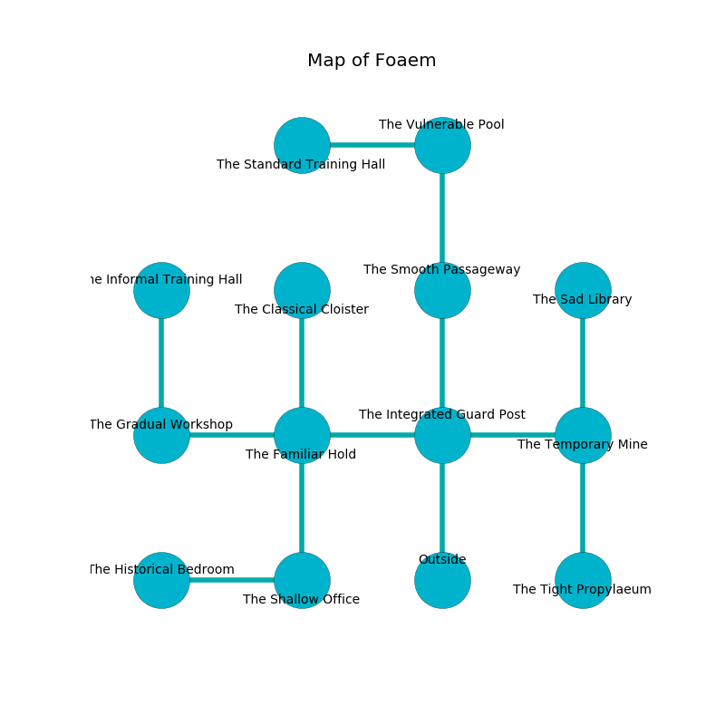

%Ruin Dogs

##Foaem
###Overview
Foaem is located in an alien city. Some rooms of it are cursed. The ruin is burning. It is occupied by Deep Gnomes. Shyla Haskins The Stupid, a Vampire Spawn is here. The Deep Gnomes have been charmed by Shyla Haskins The Stupid. She  is founding a new religion. 

###Artifact
####The Constitutional Will

The Constitutional Will has the form of a broken sphere. Light flows near it. It is a sickly white color. It smells like potato chip. When carried it levitates surrounding objects. 

###Locations

####the integrated guard post
There is a trap here. When activated, a tripwire will blast flames. Red lichens are growing in broken urns. 

There is an engraving on the floor written in Deep Gnomes Script. 

> We are cursed
>
> seasonal, premature, petty
>

* To the west a flooded hall leads to [the familiar hold](#the-familiar-hold).
* To the east a flooded cavern opens to [the temporary mine](#the-temporary-mine).
* To the north a narrow hallway connects to [the smooth passageway](#the-smooth-passageway).
* To the south is the entrance.

####the familiar hold
Blue ferns are growing from the ceiling. The mirrored walls are caving in. 

There is an engraving on a tablet written in Deep Gnomes Script. 

> Poor me! the world is sadistic
>
> it is always artistic
>
> loose, single, alive
>
> nothing is artistic
>

* [Shyla Haskins The Stupid](#Shyla-Haskins-The-Stupid) is here.
* To the west a twisted threshold connects to [the gradual workshop](#the-gradual-workshop).
* To the east a flooded hall opens to [the integrated guard post](#the-integrated-guard-post).
* To the north a windy pathway connects to [the classical cloister](#the-classical-cloister).
* To the south a torchlit gap leads to [the shallow office](#the-shallow-office).

####the temporary mine
The floor is bloodstained. The crystal walls are scratched. There are a Knight, a Tridrone, a Manes, a Giant Toad, a Gnoll, a Mule, and a Pixie here. 

* There is a trousers here.
* To the west a flooded cavern connects to [the integrated guard post](#the-integrated-guard-post).
* To the north a narrow hallway connects to [the sad library](#the-sad-library).
* To the south a dripping hallway connects to [the tight propylaeum](#the-tight-propylaeum).

####the smooth passageway
There are ten Deep Gnomes here. The floor is cluttered with ashes. If the Deep Gnomes notice the Ruin Dogs, one of them will retreat and alert the others. 

* To the north a torchlit path connects to [the vulnerable pool](#the-vulnerable-pool).
* To the south a narrow hallway leads to [the integrated guard post](#the-integrated-guard-post).

####the classical cloister
The floor is glossy. Green razorgrass is decaying from the ceiling. 

* To the south a windy pathway opens to [the familiar hold](#the-familiar-hold).

####the tight propylaeum
There are ten Deep Gnomes here. One of the Deep Gnomes is on watch, the rest are fighting amongst themselves. 

* To the north a dripping hallway opens to [the temporary mine](#the-temporary-mine).

####the sad library
Red ferns are sprouting in broken urns. The air smells like clove here. The floor is smooth. 

* To the south a narrow hallway connects to [the temporary mine](#the-temporary-mine).

####the shallow office
There are a Darkmantle, a Yeti, a Hyena, an Orc Eye of Gruumsh, a Myconid Adult, a Goblin, a Sea Horse, a Camel, and a Crocodile here. The metallic walls are caving in. 

* [The Constitutional Will](#The-Constitutional-Will) is here.
* To the west a narrow cavern leads to [the historical bedroom](#the-historical-bedroom).
* To the north a torchlit gap leads to [the familiar hold](#the-familiar-hold).

####the vulnerable pool
The air tastes like privet blossom here. The floor is sticky. 

There is an engraving on a monolith written in common. 

> A needle is a bail
>
> controversial and reliable
>
> long and fine
>
> [The Constitutional Will](#The-Constitutional-Will)
>
> discreet and varied
>
> unaware, qualified, modern
>
> A nail is a heart
>
> applied and steady
>
> holy and profound
>
> [The Constitutional Will](#The-Constitutional-Will)
>
> delicate and round
>
> astonishing, plain, sexual
>
> thick, dry, healthy
>
> but never tight
>
> you will be returned
>

* To the west a dark pathway opens to [the standard training hall](#the-standard-training-hall).
* To the south a torchlit path opens to [the smooth passageway](#the-smooth-passageway).

####the standard training hall
The floor is flooded with five inch deep cold water. The glass walls are caving in. Gray ferns are swaying from the ceiling. There are ten Deep Gnomes here. The air smells like raspberry here. The Deep Gnomes are performing a ritual. If not interrupted, the ruin dogs will be weakened. 

* To the east a dark pathway connects to [the vulnerable pool](#the-vulnerable-pool).

####the gradual workshop

* There is a femur here.
* There is an orb here.
* To the east a twisted threshold connects to [the familiar hold](#the-familiar-hold).
* To the north a dripping artery leads to [the informal training hall](#the-informal-training-hall).

####the informal training hall
There are ten Deep Gnomes here. Blue ferns are decaying from the walls. The air smells like turmeric here. The Deep Gnomes are willing to negotiate. 

There is an engraving on a stone written in common. 

> I am lost in Foaem.
>

* To the south a dripping artery opens to [the gradual workshop](#the-gradual-workshop).

####the historical bedroom
The floor is bloodstained. The stone walls are covered in mold. Gray ferns are sprouting from the ceiling. The air tastes like baked potato here. There are a Frog, a Giant Bat, a Satyr, a Hawk, and a Revenant here. 

There is an engraving on the wall written in common. 

> [The Constitutional Will](#The-Constitutional-Will)
>
> diplomatic and unlike
>
> close and welcome
>
> but never shy
>
> [The Constitutional Will](#The-Constitutional-Will)
>
> but welcome
>
> [The Constitutional Will](#The-Constitutional-Will)
>

* To the east a narrow cavern connects to [the shallow office](#the-shallow-office).

