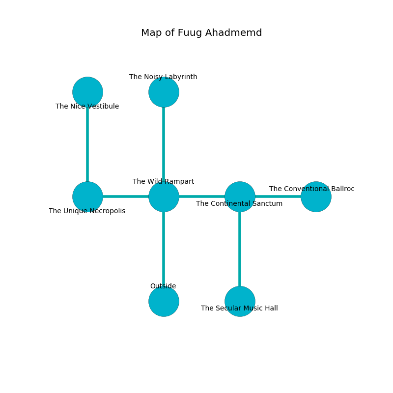

%Ruin Dogs

##Fuug Ahadmemd
###Overview
Fuug Ahadmemd is located in a crystal city. Parts of it are unbearably hot. The ruin is coming to life. It is occupied by Troglodytes. Aron Hyde The Materialistic, a Githyanki Warrior is here. The Troglodytes worship Aron Hyde The Materialistic. He  is founding a new religion. 

###Artifact
####Iacduf Budaeg

Iacduf Budaeg is a powerful artifact in the shape of a wet orb. It smells like pistachio. When worshipped it levitates surrounding objects. 

###Locations

####the wild rampart
Red lichens are sprouting in a patch on the floor. The air tastes like rhubarb here. The obsidion walls are pristine. 

There is an engraving on the floor written in common. 

> Dig here.
>

* There is a salamander here.
* There is a sword here.
* To the west a dark passageway opens to [the unique necropolis](#the-unique-necropolis).
* To the east a dripping cavern opens to [the continental sanctum](#the-continental-sanctum).
* To the north a long passageway leads to [the noisy labyrinth](#the-noisy-labyrinth).
* To the south is the entrance.

####the continental sanctum
There are sixteen Troglodytes here. The Troglodytes are willing to fight to the death. 

* [Iacduf Budaeg](#Iacduf-Budaeg) is here.
* [Aron Hyde The Materialistic](#Aron-Hyde-The-Materialistic) is here.
* To the west a dripping cavern connects to [the wild rampart](#the-wild-rampart).
* To the east a long pathway connects to [the conventional ballroom](#the-conventional-ballroom).
* To the south a hazy passageway leads to [the secular music hall](#the-secular-music-hall).

####the unique necropolis
There are a Swarm of Rats, a Yeti, a Spider, and a Swarm of Poisonous Snakes here. The floor is flooded with six inch deep scalding water. 

* To the east a dark passageway connects to [the wild rampart](#the-wild-rampart).
* To the north a flooded cave leads to [the nice vestibule](#the-nice-vestibule).

####the conventional ballroom
White moss is decaying in broken urns. The air smells like nut flesh here. The floor is cluttered with debris. 

* There is a stick here.
* To the west a long pathway connects to [the continental sanctum](#the-continental-sanctum).

####the noisy labyrinth
The floor is sticky. The glass walls are bloodstained. Yellow ferns are swaying in broken urns. 

* To the south a long passageway leads to [the wild rampart](#the-wild-rampart).

####the nice vestibule
The metallic walls are unsettled. The floor is flooded with three inch deep lukewarm water. There are a Dryad, a Peryton, a Baboon, a Giant Spider, and a Vulture here. 

There is an engraving on a monolith written in Troglodytes Script. 

> [Iacduf Budaeg](#Iacduf-Budaeg)
>
> yet industrial
>

* To the south a flooded cave connects to [the unique necropolis](#the-unique-necropolis).

####the secular music hall
The floor is glossy. Blue mushrooms are decaying in a patch on the floor. There are sixteen Troglodytes here. The crystal walls are scratched. The Troglodytes are defending this room from intruders. 

There is an engraving on the ceiling written in Troglodytes Script. 

> I am hiding in Fuug Ahadmemd.
>

* There is a chain here.
* There is an ant here.
* To the north a hazy passageway leads to [the continental sanctum](#the-continental-sanctum).

