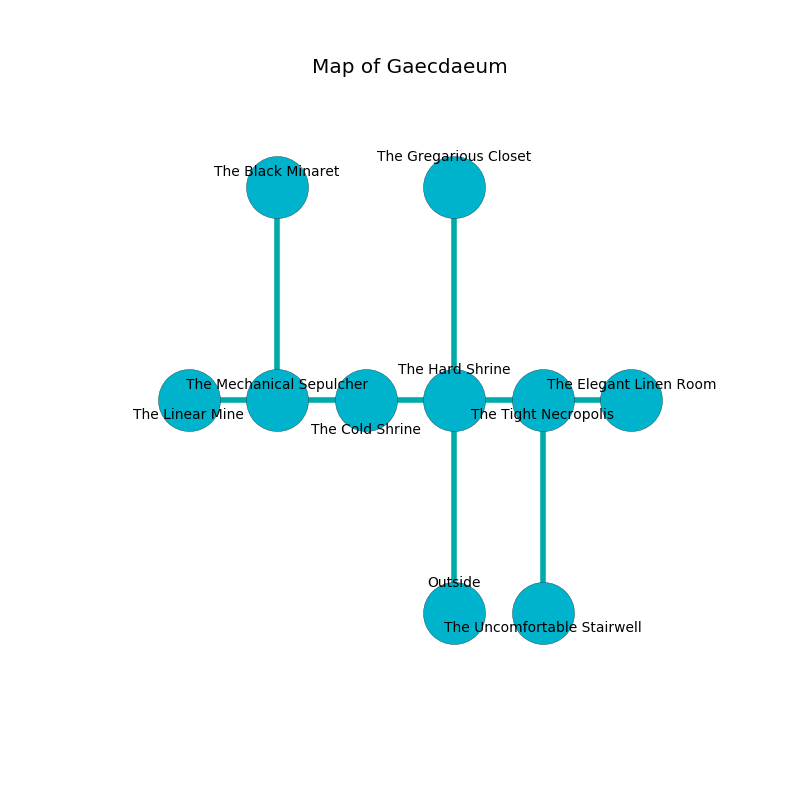

%Ruin Dogs

##Gaecdaeum
###Overview
Gaecdaeum is located on a cursed city. Some rooms of it are frozen. The ruin is larger on the inside than the outside. It is occupied by Sahuagin. Lucie Staley The Gullible, a Mind Flayer Arcanist is here. The Sahuagin are battling Lucie Staley The Gullible. She  is trying to find [Ubaeiiaeum Guuddehh](#Ubaeiiaeum-Guuddehh). 

###Artifact
####Ubaeiiaeum Guuddehh

Ubaeiiaeum Guuddehh looks like a hard doll. Water incinerates away from it. It smells like green onion. When touched it glows with an eerie light. 

###Locations

####the hard shrine
Green ferns are swaying in broken urns. The air smells like grain here. There are two Sahuagin and two Sahuagin Barons here. The floor is cluttered with bones. If the Sahuagin notice the Ruin Dogs, one of them will retreat and alert the others. 

There is an engraving on a stone written in Sahuagin Script. 

> Do not try cowering.
>

* There is a bell here.
* To the west a windy opening leads to [the cold shrine](#the-cold-shrine).
* To the east a small path opens to [the tight necropolis](#the-tight-necropolis).
* To the north a narrow threshold connects to [the gregarious closet](#the-gregarious-closet).
* To the south is the entrance.

####the cold shrine
The crystal walls are ruined. The floor is bloodstained. There are a Hippogriff and a Spirit Naga here. 

* There is a bird here.
* To the west a narrow artery connects to [the mechanical sepulcher](#the-mechanical-sepulcher).
* To the east a windy opening leads to [the hard shrine](#the-hard-shrine).

####the mechanical sepulcher
The wooden walls are caving in. The floor is cluttered with broken glass. The air tastes like chicken here. Blue mushrooms are swaying in a patch on the floor. There are a Wight, a Dryad, a Beholder Zombie, and an Old Faerie Dragon here. 

There is an engraving on the wall written in common. 

> All of us are corrupted
>
> but never eternal
>
> All of us are corrupted
>

* To the west a dripping hallway connects to [the linear mine](#the-linear-mine).
* To the east a narrow artery leads to [the cold shrine](#the-cold-shrine).
* To the north a torchlit hall opens to [the black minaret](#the-black-minaret).

####the tight necropolis
Red ferns are swaying from the walls. There are a Cult Fanatic, a Galeb Duhr, and an Orc Eye of Gruumsh here. The floor is glossy. The air tastes like seashore here. 

* [Ubaeiiaeum Guuddehh](#Ubaeiiaeum-Guuddehh) is here.
* [Lucie Staley The Gullible](#Lucie-Staley-The-Gullible) is here.
* To the west a small path opens to [the hard shrine](#the-hard-shrine).
* To the east a hazy opening opens to [the elegant linen room](#the-elegant-linen-room).
* To the south a dark pathway opens to [the uncomfortable stairwell](#the-uncomfortable-stairwell).

####the linear mine
The brick walls are caving in. Blue moss is growing in cracks in the floor. The air smells like corn here. 

There is an engraving on a tablet written in common. 

> [Ubaeiiaeum Guuddehh](#Ubaeiiaeum-Guuddehh)
>
> due and obvious
>

* There is a heart here.
* To the east a dripping hallway connects to [the mechanical sepulcher](#the-mechanical-sepulcher).

####the elegant linen room
The floor is glossy. The glass walls are pristine. 

* To the west a hazy opening leads to [the tight necropolis](#the-tight-necropolis).

####the gregarious closet
The floor is bloodstained. The metallic walls are bloodstained. The air tastes like orchid here. 

* There is a cup here.
* To the south a narrow threshold opens to [the hard shrine](#the-hard-shrine).

####the black minaret
The floor is cluttered with ashes. The mirrored walls are scratched. Blue razorgrass is sprouting in a patch on the floor. 

There is an engraving on a monolith written in common. 

> I hid something in Gaecdaeum.
>

* To the south a torchlit hall leads to [the mechanical sepulcher](#the-mechanical-sepulcher).

####the uncomfortable stairwell
The obsidion walls are scratched. The air tastes like castoreum here. 

* To the north a dark pathway leads to [the tight necropolis](#the-tight-necropolis).

