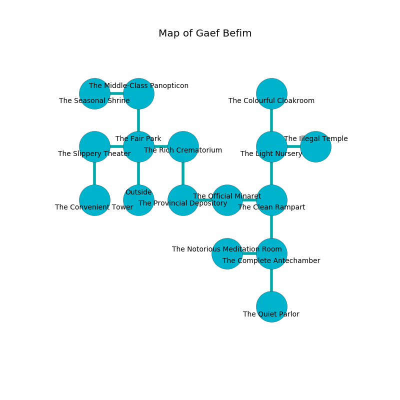

%Ruin Dogs

##Gaef Befim
###Overview
Gaef Befim is located under a broken city. Some rooms of Gaef Befim are frozen. The ruin is flooding. It is occupied by Dryads. Heidy Villegas The Foolish, a Quaggoth is here. The Dryads are the minions of Heidy Villegas The Foolish. She  is founding a new religion. 

###Artifact
####Helwi Defhaeebamd

Helwi Defhaeebamd looks like a smooth spear. It is a bright white color. Cacophony pours from it. When gazed upon it ignites its surrroundings. 

###Locations

####the fair park
There are two Dryads here. The Dryads are performing a ritual. If not interrupted, [Heidy Villegas](#Heidy-Villegas) will be magically alarmed. 

* There is a whip here.
* To the west a narrow hall connects to [the slippery theater](#the-slippery-theater).
* To the east a dark cave leads to [the rich crematorium](#the-rich-crematorium).
* To the north a long hall opens to [the middle-class panopticon](#the-middle-class-panopticon).
* To the south is the entrance.

####the middle-class panopticon
The floor is sticky. There is a trap here. When activated, a pressure plate will make the ceiling slowly lower. Blue ferns are growing from the ceiling. The brick walls are pristine. 

* To the west a windy cavern opens to [the seasonal shrine](#the-seasonal-shrine).
* To the south a long hall connects to [the fair park](#the-fair-park).

####the rich crematorium
The floor is glossy. There are two Dryads here. Green razorgrass is swaying in a patch on the floor. One of the Dryads is on watch, the rest are feasting. 

* There is a wall here.
* To the west a dark cave opens to [the fair park](#the-fair-park).
* To the south a flooded cave leads to [the provincial depository](#the-provincial-depository).

####the seasonal shrine
There are two Dryads here. The air tastes like privet blossom here. One of the Dryads is pointing a ballista at the entrance. 

* To the east a windy cavern opens to [the middle-class panopticon](#the-middle-class-panopticon).

####the provincial depository
The mirrored walls are caving in. The floor is bloodstained. The air tastes like potato chip here. Blue moss is decaying from the walls. 

* To the east a twisted opening leads to [the official minaret](#the-official-minaret).
* To the north a flooded cave opens to [the rich crematorium](#the-rich-crematorium).

####the official minaret
There are two Dryads here. The mirrored walls are pristine. Gray moss is decaying in a patch on the floor. One of the Dryads is on watch, the rest are meditating. 

* To the west a twisted opening opens to [the provincial depository](#the-provincial-depository).
* To the east a narrow corridor opens to [the clean rampart](#the-clean-rampart).

####the clean rampart
The floor is bloodstained. Gray lichens are sprouting from the ceiling. 

There is an engraving on the floor written in common. 

> Oh my! cruel god
>
> flat and cultural
>
> yet odd
>
> hope is agricultural
>

* There is a crossbow here.
* To the west a narrow corridor connects to [the official minaret](#the-official-minaret).
* To the north a hazy pathway connects to [the light nursery](#the-light-nursery).
* To the south a hazy walkway leads to [the complete antechamber](#the-complete-antechamber).

####the slippery theater
The floor is bloodstained. The metallic walls are pristine. The air smells like cloth here. 

* [Helwi Defhaeebamd](#Helwi-Defhaeebamd) is here.
* To the east a narrow hall opens to [the fair park](#the-fair-park).
* To the south a long path leads to [the convenient tower](#the-convenient-tower).

####the light nursery
There are a Mimic and a Quadrone here. The mirrored walls are covered in mold. Yellow ferns are growing from the walls. 

* To the east a torchlit hall connects to [the illegal temple](#the-illegal-temple).
* To the north a hazy pathway leads to [the colourful cloakroom](#the-colourful-cloakroom).
* To the south a hazy pathway leads to [the clean rampart](#the-clean-rampart).

####the complete antechamber
Red razorgrass is growing in a patch on the floor. There are an Imp, a Cat, a Swarm of Quippers, a Steam Mephit, and a Pixie here. The floor is smooth. The mirrored walls are bloodstained. 

* To the west a narrow hall connects to [the notorious meditation room](#the-notorious-meditation-room).
* To the north a hazy walkway opens to [the clean rampart](#the-clean-rampart).
* To the south a windy cavern leads to [the quiet parlor](#the-quiet-parlor).

####the quiet parlor
White ferns are sprouting in cracks in the floor. There are a Warhorse, an Ice Mephit, a Scout, a Kuo-Toa, and a Swarm of Rats here. 

* To the north a windy cavern connects to [the complete antechamber](#the-complete-antechamber).

####the colourful cloakroom
There are a Troglodyte, a Cult Fanatic, a Giant Centipede, and an Animated Armor here. White lichens are decaying from the ceiling. The floor is cluttered with rocks. The stone walls are pristine. The air smells like chemicals here. 

There is an engraving on a tablet written in Dryads Script. 

> I hid something in Gaef Befim.
>

* There is a boot here.
* To the south a hazy pathway opens to [the light nursery](#the-light-nursery).

####the notorious meditation room
The glass walls are covered in mold. The air tastes like cilantro here. 

* There is a breastplate here.
* To the east a narrow hall connects to [the complete antechamber](#the-complete-antechamber).

####the illegal temple
There are a Wolf, a Blood Hawk, a Scout, a Magma Mephit, a Reef Shark, and a Jackalwere here. The floor is bloodstained. Yellow lichens are swaying in cracks in the floor. The air smells like chicken here. 

There is an engraving on a stone written in common. 

> I am lost in Gaef Befim.
>
> I tried cowering.
>

* There is a picture here.
* There is a finger here.
* To the west a torchlit hall leads to [the light nursery](#the-light-nursery).

####the convenient tower
The air smells like peanut here. There are a Fire Snake and a Yuan-Ti Pureblood here. 

* [Heidy Villegas The Foolish](#Heidy-Villegas-The-Foolish) is here.
* To the north a long path connects to [the slippery theater](#the-slippery-theater).

