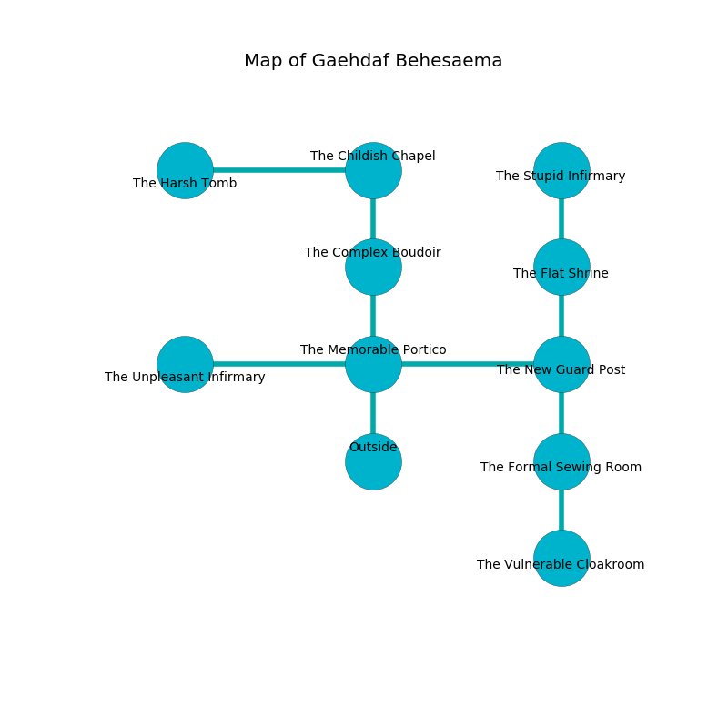

%Ruin Dogs

##Gaehdaf Behesaema
###Overview
Gaehdaf Behesaema is located under a crystal rift. Parts of it are cursed. The ruin is collapsing slowly. It is occupied by Cyclopses. Erminia Luther The Compulsive, a Cloud Giant is here. The Cyclopses are the soldiers of Erminia Luther The Compulsive. She  is founding a new religion. 

###Artifact
####Icfaia

Icfaia looks like a warm figurine. When worshipped it shows an image of the future. 

###Locations

####the memorable portico
The stone walls are covered in mold. The floor is sticky. There are two Cyclopses here. Gray mushrooms are swaying from the ceiling. The Cyclopses are defending this room from intruders. 

* To the west a windy hall opens to [the unpleasant infirmary](#the-unpleasant-infirmary).
* To the east a twisted corridor leads to [the new guard post](#the-new-guard-post).
* To the north a narrow walkway leads to [the complex boudoir](#the-complex-boudoir).
* To the south is the entrance.

####the new guard post
There are two Cyclopses here. The air smells like humus here. The Cyclopses are performing a ritual. If not interrupted, the Cyclopses will become more powerful. 

* There is a rowboat here.
* There is an egg here.
* To the west a twisted corridor leads to [the memorable portico](#the-memorable-portico).
* To the north a twisted threshold leads to [the flat shrine](#the-flat-shrine).
* To the south a narrow path opens to [the formal sewing room](#the-formal-sewing-room).

####the complex boudoir
White moss is sprouting in a patch on the floor. The air tastes like radish here. There are a Rat, a Jackal, two Myconid Sovereigns, a Mezzoloth, an Orc, and  here. 

There is an engraving on the ceiling written in common. 

> I hid something in Gaehdaf Behesaema.
>
> Leave at once.
>

* There is an amulet here.
* There is a fork here.
* To the north a torchlit hall opens to [the childish chapel](#the-childish-chapel).
* To the south a narrow walkway connects to [the memorable portico](#the-memorable-portico).

####the flat shrine
The wooden walls are bloodstained. 

There is an engraving on the ceiling written in common. 

> We are joyful
>
> perfect, adequate, solar
>
> modern and ignorant
>

* There is a hoard here.
* [Erminia Luther The Compulsive](#Erminia-Luther-The-Compulsive) is here.
* To the north a windy passageway leads to [the stupid infirmary](#the-stupid-infirmary).
* To the south a twisted threshold leads to [the new guard post](#the-new-guard-post).

####the formal sewing room
The air tastes like chocolate here. The wooden walls are scratched. The floor is cluttered with rocks. There are two Cyclopses here. One of the Cyclopses is on watch, the rest are drunk. 

* There is a door here.
* To the north a narrow path opens to [the new guard post](#the-new-guard-post).
* To the south a hazy cave opens to [the vulnerable cloakroom](#the-vulnerable-cloakroom).

####the vulnerable cloakroom
The air tastes like apricot here. There are a Pony, an Ankheg, a Lizardfolk, a Couatl, a Cultist, a Hobgoblin, a Phase Spider, and a Hawk here. The floor is flooded with two inch deep scalding water. 

There is an engraving on a tablet written in common. 

> Try fighting.
>

* To the north a hazy cave opens to [the formal sewing room](#the-formal-sewing-room).

####the childish chapel
Blue lichens are growing in broken urns. There are two Cyclopses here. The floor is cluttered with shells. The crystal walls are ruined. The air tastes like foliage here. The Cyclopses are willing to negotiate. 

* [Icfaia](#Icfaia) is here.
* To the west a small cavern leads to [the harsh tomb](#the-harsh-tomb).
* To the south a torchlit hall connects to [the complex boudoir](#the-complex-boudoir).

####the unpleasant infirmary
The floor is flooded with seven inch deep hot water. White mushrooms are sprouting in a patch on the floor. 

* There is a hat here.
* There is a whip here.
* There is a cup here.
* To the east a windy hall connects to [the memorable portico](#the-memorable-portico).

####the stupid infirmary
The air smells like parsley here. 

There is an engraving on the wall written in Cyclopses Script. 

> I am fleeing this place.
>

* To the south a windy passageway leads to [the flat shrine](#the-flat-shrine).

####the harsh tomb
Blue ferns are sprouting from the walls. 

* There is a bottle here.
* To the east a small cavern opens to [the childish chapel](#the-childish-chapel).

