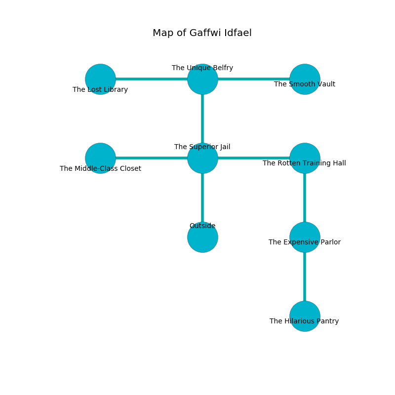

%Ruin Dogs

##Gaffwi Idfael
###Overview
Gaffwi Idfael is located on a crystal plain. Parts of Gaffwi Idfael are cursed. A windstorm is happening outside. It is occupied by Githyanki. Courtney Chestnut The Pompous, a Succubus is here. The Githyanki are battling Courtney Chestnut The Pompous. He  is trying to hide [Bubamd Eolaeamca](#Bubamd-Eolaeamca). 

###Artifact
####Bubamd Eolaeamca

Bubamd Eolaeamca has the form of a hard rock. When touched it dissappears. 

###Locations

####the superior jail
There is a trap here. When activated, a magical rune will close a portcullis. The glass walls are bloodstained. 

* There is a gold coin here.
* There is a key here.
* There is an apple here.
* There is a basket here.
* To the west a windy cavern connects to [the middle-class closet](#the-middle-class-closet).
* To the east a small hall connects to [the rotten training hall](#the-rotten-training-hall).
* To the north a twisted opening opens to [the unique belfry](#the-unique-belfry).
* To the south is the entrance.

####the unique belfry
There are two Githyanki Warriors here. One of the Githyanki is pointing a ballista at the entrance. 

* There is a door here.
* [Bubamd Eolaeamca](#Bubamd-Eolaeamca) is here.
* To the west a windy hall opens to [the lost library](#the-lost-library).
* To the east a windy path leads to [the smooth vault](#the-smooth-vault).
* To the south a twisted opening opens to [the superior jail](#the-superior-jail).

####the rotten training hall
The floor is bloodstained. White razorgrass is sprouting in a patch on the floor. 

* There is a crystal here.
* To the west a small hall leads to [the superior jail](#the-superior-jail).
* To the south a hazy hall leads to [the expensive parlor](#the-expensive-parlor).

####the expensive parlor
There are two Githyanki Warriors here. The air smells like sassafrass here. The floor is sticky. If the Githyanki notice the Ruin Dogs, one of them will retreat and alert the others. 

* [Courtney Chestnut The Pompous](#Courtney-Chestnut-The-Pompous) is here.
* To the north a hazy hall leads to [the rotten training hall](#the-rotten-training-hall).
* To the south a twisted hallway opens to [the hilarious pantry](#the-hilarious-pantry).

####the hilarious pantry

There is an engraving on the ceiling written in Githyanki Script. 

> I am lost in Gaffwi Idfael.
>
> I thought about leaving.
>

* There is a bowl here.
* To the north a twisted hallway connects to [the expensive parlor](#the-expensive-parlor).

####the middle-class closet
The floor is glossy. There are a Stirge, a Water Elemental, a Giant Centipede, a Sahuagin, a Goat, and a Fire Snake here. 

There is an engraving on the floor written in Githyanki Script. 

> O! my life is inhumane
>
> thick and unexpected
>
> blonde and vain
>
> life is expected
>

* To the east a windy cavern connects to [the superior jail](#the-superior-jail).

####the lost library
The floor is smooth. There is a Mezzoloth here. 

There is an engraving on a monolith written in Githyanki Script. 

> Poor me! terrible fate
>
> plain, environmental, late
>
> busy and opposed
>
> the world is straight
>

* There is a breastplate here.
* There is a fish here.
* To the east a windy hall leads to [the unique belfry](#the-unique-belfry).

####the smooth vault
Gray moss is decaying from the ceiling. 

* To the west a windy path opens to [the unique belfry](#the-unique-belfry).

