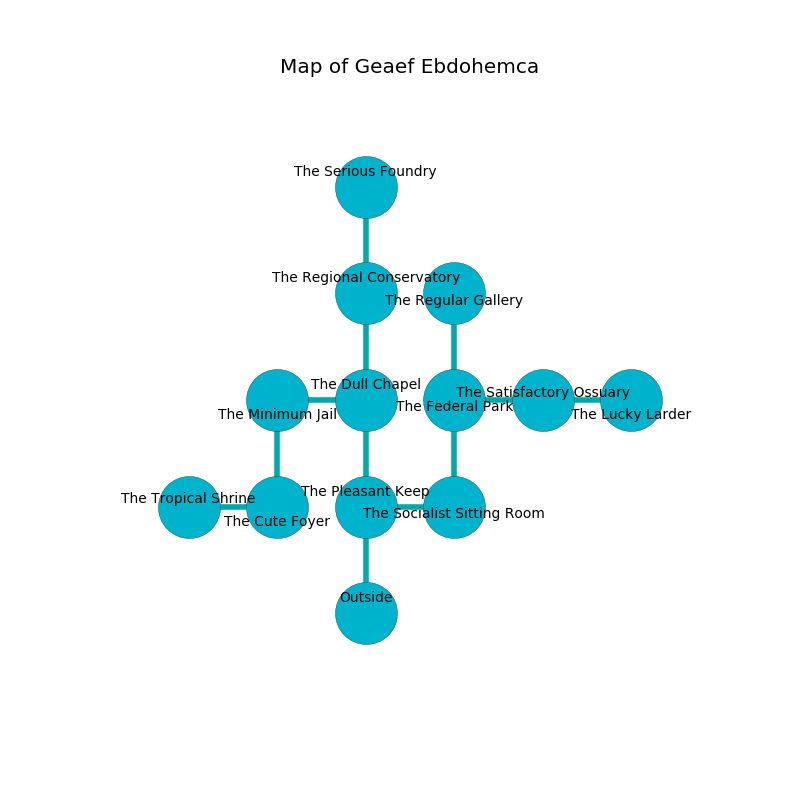

%Ruin Dogs

##Geaef Ebdohemca
###Overview
Geaef Ebdohemca is located in a flooded city. Some areas of it are somewhat hot. The ruin is coming to life. It is occupied by Pixies. Jerold Snider The Cunning, a Spined Devil is here. The Pixies worship Jerold Snider The Cunning. He  is trying to hide [The Rare Return](#The-Rare-Return). 

###Artifact
####The Rare Return

The Rare Return has the form of a wet meteorite. It smells like tuberose. It is a medium green color. Power slides towards it. When cradled it ignites its surrroundings. 

###Locations

####the pleasant keep
Yellow ferns are sprouting from the walls. 

There is an engraving on a monolith written in Pixies Script. 

> [The Rare Return](#The-Rare-Return)
>
> but moving
>
> religious and visible
>
> [The Rare Return](#The-Rare-Return)
>
> but never dry
>
> A curtain is a basis
>
> enthusiastic, statistical, sticky
>
> occupational, temporary, obscure
>
> established and privileged
>
> childish and genuine
>
> [The Rare Return](#The-Rare-Return)
>

* To the east a torchlit cave opens to [the socialist sitting Room](#the-socialist-sitting-Room).
* To the north a narrow hallway connects to [the dull chapel](#the-dull-chapel).
* To the south is the entrance.

####the socialist sitting Room
The air smells like peony here. The floor is smooth. Gray ferns are sprouting from the walls. 

* To the west a torchlit cave opens to [the pleasant keep](#the-pleasant-keep).
* To the north a long hall connects to [the federal park](#the-federal-park).

####the dull chapel
Green razorgrass is growing from the walls. The air tastes like sarsaparilla here. The floor is smooth. There are twelve Pixies here. The Pixies are crazy with bloodlust. 

* There is a spring here.
* To the west a windy gap leads to [the minimum jail](#the-minimum-jail).
* To the north a hazy hallway connects to [the regional conservatory](#the-regional-conservatory).
* To the south a narrow hallway connects to [the pleasant keep](#the-pleasant-keep).

####the minimum jail
Green ferns are growing from the walls. There are twelve Pixies here. The floor is cluttered with broken glass. The air smells like carrot seed here. One of the Pixies is on watch, the rest are meditating. 

* There is a comb here.
* To the east a windy gap leads to [the dull chapel](#the-dull-chapel).
* To the south a windy corridor connects to [the cute foyer](#the-cute-foyer).

####the federal park
The glass walls are bloodstained. The floor is bloodstained. 

* To the east a long path connects to [the satisfactory ossuary](#the-satisfactory-ossuary).
* To the north a dripping opening connects to [the regular gallery](#the-regular-gallery).
* To the south a long hall connects to [the socialist sitting Room](#the-socialist-sitting-Room).

####the satisfactory ossuary
The metallic walls are covered in mold. The floor is smooth. The air tastes like lilac here. 

* There is a match here.
* To the west a long path connects to [the federal park](#the-federal-park).
* To the east a flooded corridor leads to [the lucky larder](#the-lucky-larder).

####the cute foyer
The air smells like fougere here. The floor is bloodstained. There are twelve Pixies here. The Pixies are willing to negotiate. 

* To the west a narrow gap opens to [the tropical shrine](#the-tropical-shrine).
* To the north a windy corridor connects to [the minimum jail](#the-minimum-jail).

####the regular gallery
There are a Lizardfolk Shaman, a Warhorse Skeleton, a Draft Horse, and a Reef Shark here. Green lichens are swaying in a patch on the floor. The air tastes like forest here. 

* [Jerold Snider The Cunning](#Jerold-Snider-The-Cunning) is here.
* To the south a dripping opening opens to [the federal park](#the-federal-park).

####the regional conservatory
The air tastes like pumpkin here. The floor is sticky. There are an Imp and an Ogre here. 

There is an engraving on the wall written in Pixies Script. 

> Dear me! meak soul
>
> relative and whole
>
> ever political
>
> hope is critical
>

* There is a shirt here.
* There is a chain here.
* There is a match here.
* [The Rare Return](#The-Rare-Return) is here.
* To the north a dark threshold leads to [the serious foundry](#the-serious-foundry).
* To the south a hazy hallway opens to [the dull chapel](#the-dull-chapel).

####the tropical shrine
Red moss is decaying in cracks in the floor. The crystal walls are caving in. 

* To the east a narrow gap connects to [the cute foyer](#the-cute-foyer).

####the lucky larder
There are twelve Pixies here. Yellow mushrooms are growing in cracks in the floor. The floor is smooth. One of the Pixies is working a mechanism that can pour liquid flames from the ceiling. 

* To the west a flooded corridor opens to [the satisfactory ossuary](#the-satisfactory-ossuary).

####the serious foundry
There are twelve Pixies here. The wooden walls are scratched. The air tastes like buttermilk here. One of the Pixies is on watch, the rest are drunk. 

* There is a crystal here.
* To the south a dark threshold connects to [the regional conservatory](#the-regional-conservatory).

