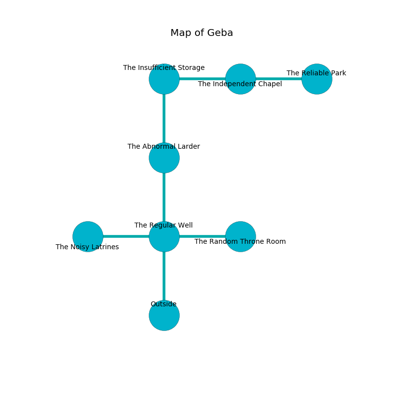

%Ruin Dogs

##Geba
###Overview
Geba is located under an obsidion plain. Regions of Geba are flooded. A battle between raiders is happening outside. It is occupied by Dryads. Israel Grove The Cantankerous, a Bearded Devil is here. The Dryads are ruled by Israel Grove The Cantankerous. He  is founding a new religion. 

###Artifact
####Daeicoaed

Daeicoaed is a powerful artifact in the shape of a sharp cube. Light slides near it. When worn it shows an image of the future. 

###Locations

####the regular well
The floor is sticky. Green mushrooms are swaying in broken urns. The concrete walls are ruined. The air tastes like salt here. 

* To the west a dark path opens to [the noisy latrines](#the-noisy-latrines).
* To the east a flooded passageway opens to [the random throne room](#the-random-throne-room).
* To the north a flooded walkway opens to [the abnormal larder](#the-abnormal-larder).
* To the south is the entrance.

####the noisy latrines
Red moss is sprouting in cracks in the floor. There are an Orog and a Poltergeist here. The glass walls are unsettled. The air smells like kiwi here. The floor is bloodstained. 

* To the east a dark path connects to [the regular well](#the-regular-well).

####the random throne room
There are four Dryads here. The air smells like wasabi here. If the Dryads notice the Ruin Dogs, one of them will retreat and alert the others. 

* [Israel Grove The Cantankerous](#Israel-Grove-The-Cantankerous) is here.
* To the west a flooded passageway connects to [the regular well](#the-regular-well).

####the abnormal larder
The floor is sticky. The air smells like orange here. 

* To the north a small pathway opens to [the insufficient storage](#the-insufficient-storage).
* To the south a flooded walkway connects to [the regular well](#the-regular-well).

####the insufficient storage
The floor is cluttered with broken glass. The air smells like milk here. 

* To the east a torchlit hallway connects to [the independent chapel](#the-independent-chapel).
* To the south a small pathway opens to [the abnormal larder](#the-abnormal-larder).

####the independent chapel
The air smells like bouillon here. The crystal walls are covered in mold. 

* [Daeicoaed](#Daeicoaed) is here.
* To the west a torchlit hallway leads to [the insufficient storage](#the-insufficient-storage).
* To the east a dark opening connects to [the reliable park](#the-reliable-park).

####the reliable park
The obsidion walls are pristine. The floor is smooth. 

There is an engraving on a stone written in Dryads Script. 

> [Daeicoaed](#Daeicoaed)
>
> stubborn, different, portable
>
> careful and content
>

* There is a fish here.
* To the west a dark opening leads to [the independent chapel](#the-independent-chapel).

