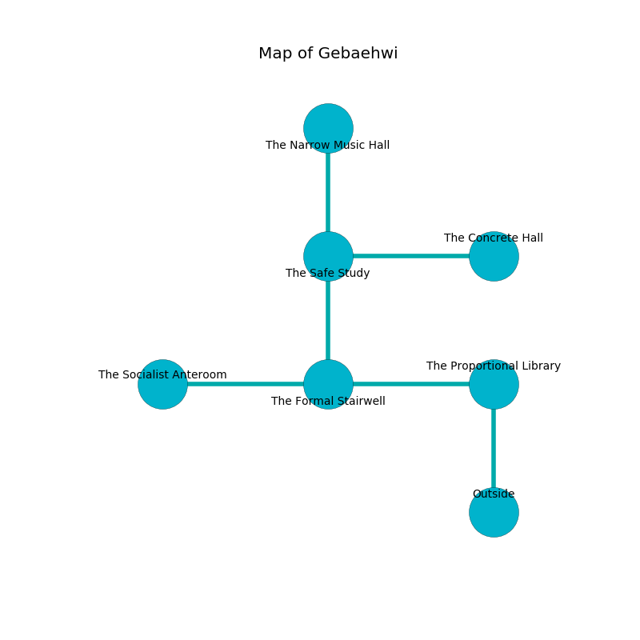

%Ruin Dogs

##Gebaehwi
###Overview
Gebaehwi is located in a haunted rift. Some rooms of it are corrupted. The ruin is flooding. It is occupied by Demons. Letitia Gipson The Impolite, a Bearded Devil is here. The Demons have been charmed by Letitia Gipson The Impolite. She  is trying to use [The Classical Licence](#The-Classical-Licence). 

###Artifact
####The Classical Licence

The Classical Licence looks like a smooth prism. Air pours near it. It is a sickly green color. When eaten it changes probabilities. 

###Locations

####the proportional library
Green mushrooms are sprouting in cracks in the floor. The floor is cluttered with shells. The air smells like forest here. 

There is an engraving on the floor written in Demons Script. 

> I worship [The Classical Licence](#The-Classical-Licence).
>
> Leave at once.
>

* To the west a twisted cavern leads to [the formal stairwell](#the-formal-stairwell).
* To the south is the entrance.

####the formal stairwell
The concrete walls are bloodstained. White razorgrass is sprouting from the walls. The air smells like lamb here. 

* To the west a dripping artery connects to [the socialist anteroom](#the-socialist-anteroom).
* To the east a twisted cavern leads to [the proportional library](#the-proportional-library).
* To the north a long opening opens to [the safe study](#the-safe-study).

####the socialist anteroom
Green ferns are swaying in cracks in the floor. The air tastes like candy here. There are an Imp and a Spined Devil here. If the Demons notice the Ruin Dogs, one of them will retreat and alert [Letitia Gipson](#Letitia-Gipson). 

* [Letitia Gipson The Impolite](#Letitia-Gipson-The-Impolite) is here.
* To the east a dripping artery opens to [the formal stairwell](#the-formal-stairwell).

####the safe study
There are an Imp and a Spined Devil here. Gray moss is growing in cracks in the floor. The Demons are performing a ritual. If not interrupted, the Demons will become more powerful. 

* [The Classical Licence](#The-Classical-Licence) is here.
* To the east a narrow walkway connects to [the concrete hall](#the-concrete-hall).
* To the north a dark gap opens to [the narrow music hall](#the-narrow-music-hall).
* To the south a long opening connects to [the formal stairwell](#the-formal-stairwell).

####the concrete hall
The stone walls are scratched. The air tastes like flesh here. Gray ferns are growing in cracks in the floor. 

* To the west a narrow walkway opens to [the safe study](#the-safe-study).

####the narrow music hall
There are a Grick and an Ettercap here. Yellow ferns are decaying in cracks in the floor. The air smells like clam here. 

* To the south a dark gap leads to [the safe study](#the-safe-study).

