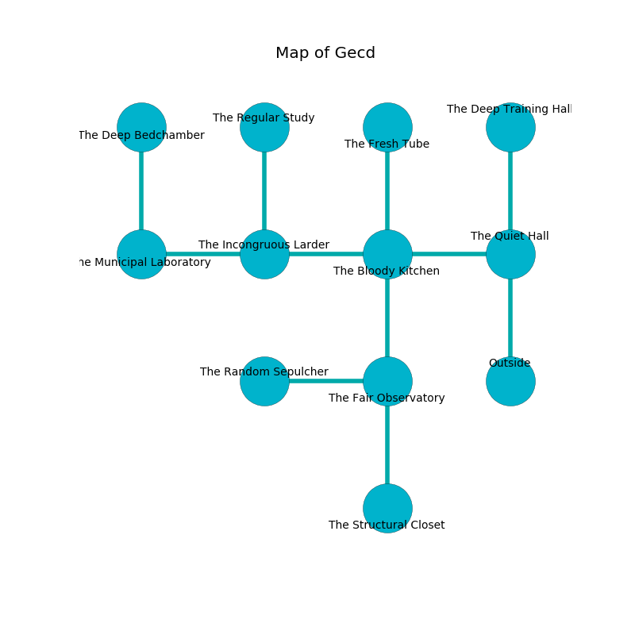

%Ruin Dogs

##Gecd
###Overview
Gecd is located under a broken city. Some rooms of Gecd are flooded. The ruin is coming to life. It is occupied by Deep Gnomes. Cory Hargrove The Materialistic, a Yuan-Ti Abomination is here. The Deep Gnomes are the minions of Cory Hargrove The Materialistic. He  is trying to use [The Dangerous Patrol](#The-Dangerous-Patrol). 

###Artifact
####The Dangerous Patrol

The Dangerous Patrol looks like a wet spear. It is a medium orange color. Power pours near it. It smells like chicken coup. When rubbed it emits dust. 

###Locations

####the quiet hall
There is a trap here. When activated, a magical proximity detector will collapse a column. There are fourteen Deep Gnomes here. The floor is smooth. The air tastes like peanut here. Gray ferns are sprouting from the ceiling. One of the Deep Gnomes is on watch, the rest are fighting amongst themselves. 

There is an engraving on the floor written in Deep Gnomes Script. 

> Oh my! my fate is poor
>
> it is never operational
>
> constitutional and pure
>
> all is occupational
>

* To the west a windy walkway connects to [the bloody kitchen](#the-bloody-kitchen).
* To the north a long cave leads to [the deep training hall](#the-deep-training-hall).
* To the south is the entrance.

####the bloody kitchen
Blue razorgrass is sprouting from the ceiling. There are fourteen Deep Gnomes here. The floor is cluttered with shells. The Deep Gnomes are willing to negotiate. 

* To the west a torchlit threshold opens to [the incongruous larder](#the-incongruous-larder).
* To the east a windy walkway leads to [the quiet hall](#the-quiet-hall).
* To the north a dripping opening opens to [the fresh tube](#the-fresh-tube).
* To the south a narrow hall leads to [the fair observatory](#the-fair-observatory).

####the fresh tube
There are fourteen Deep Gnomes here. The floor is flooded with five inch deep scalding water. The Deep Gnomes are defending this room from intruders. 

* There is a seed here.
* To the south a dripping opening leads to [the bloody kitchen](#the-bloody-kitchen).

####the deep training hall
The glass walls are covered in mold. There are a Giant Toad and a Mage here. 

* [Cory Hargrove The Materialistic](#Cory-Hargrove-The-Materialistic) is here.
* To the south a long cave connects to [the quiet hall](#the-quiet-hall).

####the fair observatory
There are a Gnoll Fang of Yeenoghu, a Lion, a Cockatrice, and a Black Dragon Wyrmling here. The air smells like candy here. 

* To the west a flooded hallway leads to [the random sepulcher](#the-random-sepulcher).
* To the north a narrow hall opens to [the bloody kitchen](#the-bloody-kitchen).
* To the south a long cavern connects to [the structural closet](#the-structural-closet).

####the structural closet
The floor is flooded with one inch deep hot water. There are a Githzerai Zerth, an Eagle, and a Griffon here. The wooden walls are ruined. 

* To the north a long cavern leads to [the fair observatory](#the-fair-observatory).

####the incongruous larder
There are a Wererat, a Peryton, a Giant Crab, a Giant Spider, a Reef Shark, and a Rug of Smothering here. The air tastes like horhound here. The concrete walls are pristine. 

* To the west a long corridor connects to [the municipal laboratory](#the-municipal-laboratory).
* To the east a torchlit threshold opens to [the bloody kitchen](#the-bloody-kitchen).
* To the north a long corridor connects to [the regular study](#the-regular-study).

####the regular study
The obsidion walls are ruined. Blue razorgrass is decaying in broken urns. 

There is an engraving on a stone written in Deep Gnomes Script. 

> I am alone.
>

* To the south a long corridor opens to [the incongruous larder](#the-incongruous-larder).

####the random sepulcher
The floor is cluttered with bones. The air smells like smoked sausage here. The stone walls are ruined. 

There is an engraving on a tablet written in Deep Gnomes Script. 

> I am lost in Gecd.
>

* To the east a flooded hallway connects to [the fair observatory](#the-fair-observatory).

####the municipal laboratory
Yellow lichens are sprouting in cracks in the floor. There are fourteen Deep Gnomes here. The air smells like elderberry here. The Deep Gnomes are performing a ritual. If not interrupted, the Deep Gnomes will become more powerful. 

* [The Dangerous Patrol](#The-Dangerous-Patrol) is here.
* To the east a long corridor connects to [the incongruous larder](#the-incongruous-larder).
* To the north a torchlit cavern leads to [the deep bedchamber](#the-deep-bedchamber).

####the deep bedchamber
The floor is glossy. The crystal walls are unsettled. White mushrooms are swaying in broken urns. 

There is an engraving on the floor written in Deep Gnomes Script. 

> O! death is sadistic
>
> yet light
>
> it is never realistic
>
> death is right
>

* To the south a torchlit cavern connects to [the municipal laboratory](#the-municipal-laboratory).

