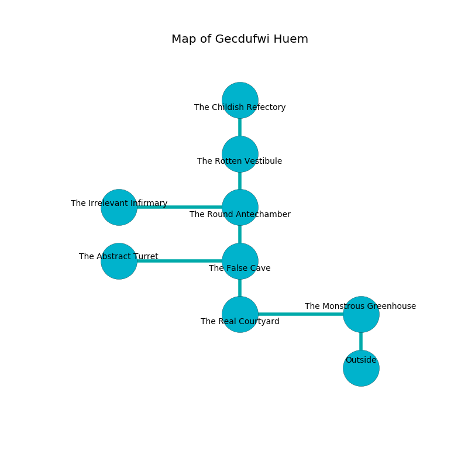

%Ruin Dogs

##Gecdufwi Huem
###Overview
Gecdufwi Huem is located in a ruined mountain. Some rooms of it are flooded. The ruin is larger on the inside than the outside. It is occupied by Centaurs. Robbie Goss The Naughty, an Assassin is here. The Centaurs are ruled by Robbie Goss The Naughty. He  is trying to steal [Awiadfuia Choidaf](#Awiadfuia-Choidaf). 

###Artifact
####Awiadfuia Choidaf

Awiadfuia Choidaf has the form of a mushy crystal. It is a sickly purple color. When cradled it frightens children. 

###Locations

####the monstrous greenhouse
The floor is sticky. There are four Centaurs here. The Centaurs are performing a ritual. If not interrupted, [Robbie Goss](#Robbie-Goss) will be magically alarmed. 

* To the west a flooded cavern opens to [the real courtyard](#the-real-courtyard).
* To the south is the entrance.

####the real courtyard
The floor is sticky. There are four Centaurs here. The crystal walls are pristine. The Centaurs are willing to fight to the death. 

* [Robbie Goss The Naughty](#Robbie-Goss-The-Naughty) is here.
* To the east a flooded cavern connects to [the monstrous greenhouse](#the-monstrous-greenhouse).
* To the north a flooded cave leads to [the false cave](#the-false-cave).

####the false cave
The floor is smooth. The air tastes like pecan here. Gray mushrooms are sprouting from the walls. 

There is an engraving on a monolith written in common. 

> Dig here.
>

* To the west a hazy opening leads to [the abstract turret](#the-abstract-turret).
* To the north a dark cave connects to [the round antechamber](#the-round-antechamber).
* To the south a flooded cave leads to [the real courtyard](#the-real-courtyard).

####the round antechamber
There are four Centaurs here. Yellow ferns are growing in a patch on the floor. The Centaurs are defending this room from intruders. 

* To the west a torchlit pathway leads to [the irrelevant infirmary](#the-irrelevant-infirmary).
* To the north a narrow corridor connects to [the rotten vestibule](#the-rotten-vestibule).
* To the south a dark cave connects to [the false cave](#the-false-cave).

####the abstract turret

* To the east a hazy opening connects to [the false cave](#the-false-cave).

####the irrelevant infirmary
Red ferns are sprouting in a patch on the floor. 

* To the east a torchlit pathway connects to [the round antechamber](#the-round-antechamber).

####the rotten vestibule
The brick walls are pristine. There is a trap here. When activated, a magical sound detector will make the walls close in. 

There is an engraving on the wall written in common. 

> A match is a wire
>
> yet quiet
>
> A match is a wire
>

* [Awiadfuia Choidaf](#Awiadfuia-Choidaf) is here.
* To the north a flooded corridor leads to [the childish refectory](#the-childish-refectory).
* To the south a narrow corridor opens to [the round antechamber](#the-round-antechamber).

####the childish refectory
There are four Centaurs here. Yellow mushrooms are swaying in cracks in the floor. There is a trap here. When activated, a magical sound detector will blast flames. The Centaurs are crazy with bloodlust. 

There is an engraving on a stone written in common. 

> Oh my life is inhumane
>
> it is never low
>
> but vain
>
> cruelty is slow
>

* To the south a flooded corridor connects to [the rotten vestibule](#the-rotten-vestibule).

