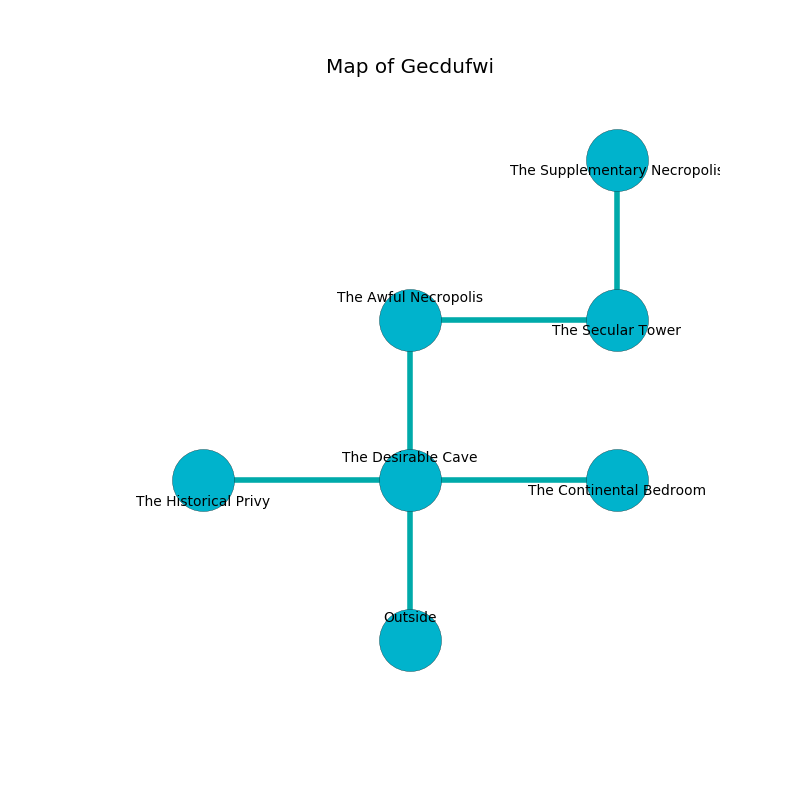

%Ruin Dogs

##Gecdufwi
###Overview
Gecdufwi is located in a haunted plain. Some areas of Gecdufwi are flooded. The ruin is burning. It is occupied by Kuo-Toa. Marcelo Sutherland The Patronizing, a Knight is here. The Kuo-Toa are battling Marcelo Sutherland The Patronizing. He  is founding a new religion. 

###Artifact
####Geohd

Geohd looks like a hard amulet. Light flows towards it. It is a dark purple color. When held it changes the past. 

###Locations

####the desirable cave
White ferns are sprouting from the walls. There are a Kuo-Toa Whip, a Kuo-Toa Monitor, two Kuo-Toa, and  here. If the Kuo-Toa notice the Ruin Dogs, one of them will retreat and alert [Marcelo Sutherland](#Marcelo-Sutherland). 

* There is a tree here.
* [Geohd](#Geohd) is here.
* To the west a narrow cavern opens to [the historical privy](#the-historical-privy).
* To the east a flooded artery connects to [the continental bedroom](#the-continental-bedroom).
* To the north a dark hallway connects to [the awful necropolis](#the-awful-necropolis).
* To the south is the entrance.

####the awful necropolis
Green mushrooms are growing in a patch on the floor. The wooden walls are pristine. The air smells like melon here. 

* There is a wight here.
* To the east a flooded pathway leads to [the secular tower](#the-secular-tower).
* To the south a dark hallway opens to [the desirable cave](#the-desirable-cave).

####the secular tower
There are a Kuo-Toa Monitor and a Kuo-Toa Whip here. Red moss is decaying in a patch on the floor. The air smells like neroli here. The Kuo-Toa are performing a ritual. If not interrupted, the Kuo-Toa will become more powerful. 

* To the west a flooded pathway leads to [the awful necropolis](#the-awful-necropolis).
* To the north a hazy path connects to [the supplementary necropolis](#the-supplementary-necropolis).

####the continental bedroom
There is a trap here. When activated, a magical sound detector will shoot a lightning bolt. The wooden walls are bloodstained. The air tastes like dates here. Yellow lichens are sprouting in broken urns. There are a Gargoyle, a Swarm of Insects, a Dire Wolf, a Giant Badger, and a Pixie here. The floor is bloodstained. 

There is an engraving on a monolith written in common. 

> I am looting this place.
>

* There is a coat here.
* To the west a flooded artery leads to [the desirable cave](#the-desirable-cave).

####the supplementary necropolis
The glass walls are scratched. The air smells like absinthe here. There are a Kuo-Toa Monitor, a Kuo-Toa Whip, three Kuo-Toa,  here. The Kuo-Toa are willing to negotiate. 

* [Marcelo Sutherland The Patronizing](#Marcelo-Sutherland-The-Patronizing) is here.
* To the south a hazy path leads to [the secular tower](#the-secular-tower).

####the historical privy
There are a Giant Toad, a Copper Dragon Wyrmling, a Draft Horse, a Bat, and a Priest here. The air smells like fudge here. Gray mushrooms are sprouting from the walls. The mirrored walls are scratched. 

* To the east a narrow cavern opens to [the desirable cave](#the-desirable-cave).

