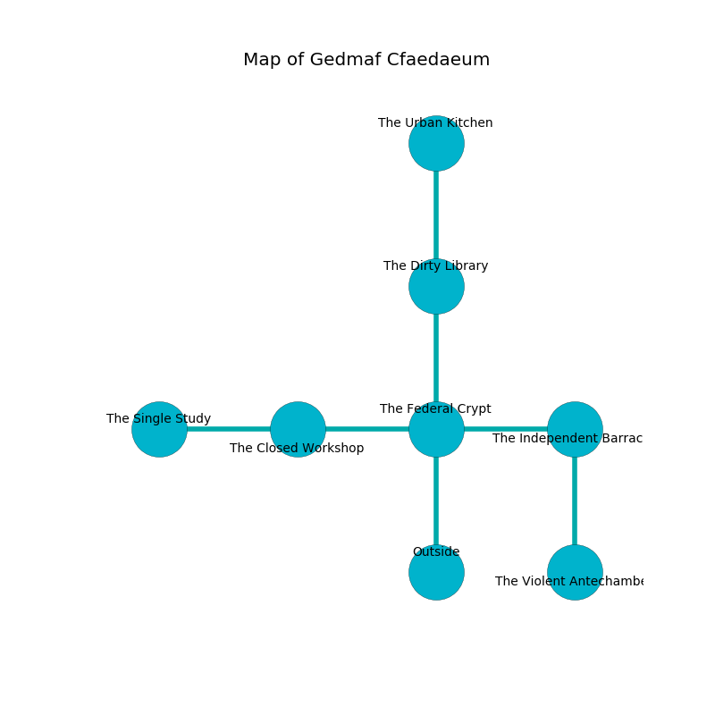

%Ruin Dogs

##Gedmaf Cfaedaeum
###Overview
Gedmaf Cfaedaeum is located on a ruined tree. Regions of it are inaccessible. The ruin is sinking into the earth. It is occupied by Humans. Retha Buffington The Untidy, a Cloud Giant is here. The Humans have been charmed by Retha Buffington The Untidy. She  is founding a new religion. 

###Artifact
####Laic Iaef

Laic Iaef looks like an opaque monument. When picked up it repels insects. 

###Locations

####the federal crypt
There are an Umber Hulk and an Orc War Chief here. Red mushrooms are decaying from the walls. 

* There is a stamp here.
* To the west a torchlit artery leads to [the closed workshop](#the-closed-workshop).
* To the east a windy opening opens to [the independent barracks](#the-independent-barracks).
* To the north a small corridor opens to [the dirty library](#the-dirty-library).
* To the south is the entrance.

####the dirty library
There are a Slaad Tadpole, an Allosaurus, a Hell Hound, a Harpy, a Quasit, and a Hobgoblin Warlord here. The crystal walls are unsettled. 

* [Laic Iaef](#Laic-Iaef) is here.
* To the north a small gap leads to [the urban kitchen](#the-urban-kitchen).
* To the south a small corridor opens to [the federal crypt](#the-federal-crypt).

####the independent barracks
Gray moss is sprouting in a patch on the floor. There are an Assassin, a Cultist, and a Mage here. The Humans are willing to negotiate. 

* There is a cart here.
* To the west a windy opening opens to [the federal crypt](#the-federal-crypt).
* To the south a long pathway connects to [the violent antechamber](#the-violent-antechamber).

####the closed workshop
The floor is bloodstained. There are a Minotaur, a Worg, and a Young Remorhaz here. Red mushrooms are growing in cracks in the floor. 

* To the west a long cavern leads to [the single study](#the-single-study).
* To the east a torchlit artery connects to [the federal crypt](#the-federal-crypt).

####the single study
The concrete walls are pristine. The air tastes like huckleberry here. Blue lichens are swaying in a patch on the floor. 

* There is a shoe here.
* To the east a long cavern connects to [the closed workshop](#the-closed-workshop).

####the violent antechamber
The floor is glossy. The crystal walls are covered in mold. The air smells like labdanum here. 

* [Retha Buffington The Untidy](#Retha-Buffington-The-Untidy) is here.
* To the north a long pathway opens to [the independent barracks](#the-independent-barracks).

####the urban kitchen
The floor is cluttered with rocks. White ferns are growing from the ceiling. There are a Frog and a Nycaloth here. 

* To the south a small gap connects to [the dirty library](#the-dirty-library).

