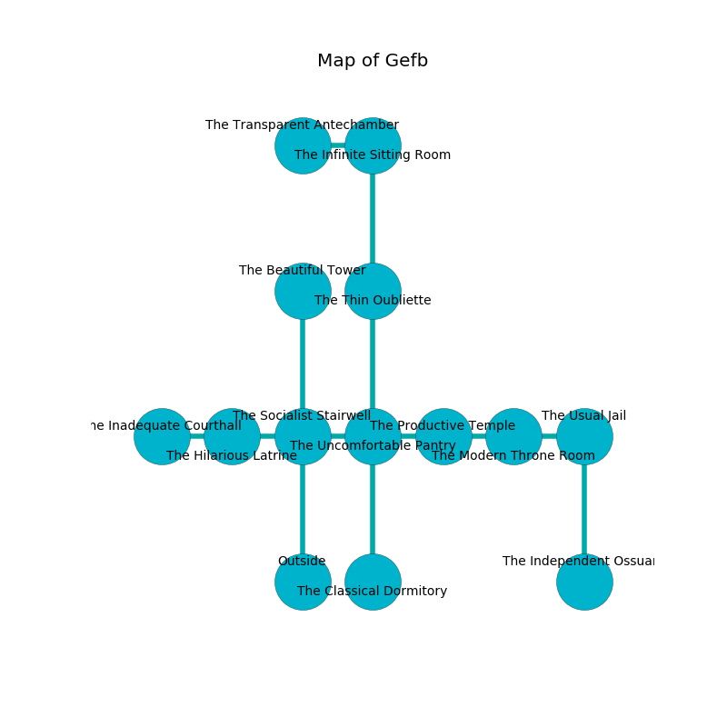

%Ruin Dogs

##Gefb
###Overview
Gefb is located under a flooded city. Some rooms of it are incredibly cold. The ruin is collapsing slowly. It is occupied by Goblins. Aileen Noonan The Dishonest, a Cloud Giant is here. The Goblins are the soldiers of Aileen Noonan The Dishonest. She  is founding a new religion. 

###Artifact
####Udidecha Dahadmuma

Udidecha Dahadmuma has the form of a broken gem. Gravity slides from it. It is a pale red color. When worshipped it turns surrounding objects to ashes. 

###Locations

####the socialist stairwell
The floor is bloodstained. The concrete walls are scratched. The air tastes like huckleberry here. 

* There is a key here.
* To the west a flooded corridor connects to [the hilarious latrine](#the-hilarious-latrine).
* To the east a hazy path connects to [the uncomfortable pantry](#the-uncomfortable-pantry).
* To the north a dark corridor opens to [the beautiful tower](#the-beautiful-tower).
* To the south is the entrance.

####the beautiful tower
Blue ferns are sprouting in cracks in the floor. The concrete walls are ruined. There are a Badger, a Vampire Spawn, and a Chimera here. 

* To the south a dark corridor opens to [the socialist stairwell](#the-socialist-stairwell).

####the uncomfortable pantry
There are two Hobgoblin Warlords here. The air smells like tomato leaf here. The stone walls are ruined. One of the Goblins is on watch, the rest are sleeping. 

* [Aileen Noonan The Dishonest](#Aileen-Noonan-The-Dishonest) is here.
* To the west a hazy path connects to [the socialist stairwell](#the-socialist-stairwell).
* To the east a small path connects to [the productive temple](#the-productive-temple).
* To the north a narrow cave leads to [the thin oubliette](#the-thin-oubliette).
* To the south a twisted hall opens to [the classical dormitory](#the-classical-dormitory).

####the productive temple
The air smells like orangeflower here. There are a Swarm of Bats, an Eagle, a Spectator, a Giant Crab, a Phase Spider, and an Ankheg here. There is a trap here. When activated, a tripwire will open a large pit in the floor. 

* To the west a small path connects to [the uncomfortable pantry](#the-uncomfortable-pantry).
* To the east a torchlit cavern opens to [the modern throne room](#the-modern-throne-room).

####the modern throne room
The wooden walls are covered in mold. The floor is sticky. Gray lichens are sprouting from the walls. 

* To the west a torchlit cavern opens to [the productive temple](#the-productive-temple).
* To the east a dripping hallway leads to [the usual jail](#the-usual-jail).

####the hilarious latrine
The floor is smooth. There are a Quaggoth Thonot, a Giant Poisonous Snake, a Boar, a Chasme, a Goblin, a Deep Gnome, and a Half-Ogre here. Green razorgrass is growing in a patch on the floor. The metallic walls are covered in mold. 

* To the west a dark hall leads to [the inadequate courthall](#the-inadequate-courthall).
* To the east a flooded corridor opens to [the socialist stairwell](#the-socialist-stairwell).

####the classical dormitory
The floor is sticky. The air smells like hops here. 

There is an engraving on the wall written in Goblins Script. 

> Leave at once.
>

* To the north a twisted hall leads to [the uncomfortable pantry](#the-uncomfortable-pantry).

####the inadequate courthall
White mushrooms are growing from the walls. 

* To the east a dark hall connects to [the hilarious latrine](#the-hilarious-latrine).

####the thin oubliette
Gray moss is swaying in broken urns. The wooden walls are ruined. 

* To the north a flooded hallway connects to [the infinite sitting Room](#the-infinite-sitting-Room).
* To the south a narrow cave opens to [the uncomfortable pantry](#the-uncomfortable-pantry).

####the usual jail
The mirrored walls are ruined. There are an Ettin, an Animated Armor, a Flameskull, a Winged Kobold, and a Polar Bear here. The floor is flooded with one inch deep scalding water. 

There is an engraving on a monolith written in common. 

> I tried swimming.
>

* To the west a dripping hallway connects to [the modern throne room](#the-modern-throne-room).
* To the south a long opening leads to [the independent ossuary](#the-independent-ossuary).

####the infinite sitting Room
The concrete walls are pristine. The floor is glossy. Blue razorgrass is decaying in cracks in the floor. 

* [Udidecha Dahadmuma](#Udidecha-Dahadmuma) is here.
* To the west a torchlit corridor leads to [the transparent antechamber](#the-transparent-antechamber).
* To the south a flooded hallway connects to [the thin oubliette](#the-thin-oubliette).

####the independent ossuary
Green lichens are swaying from the walls. The air smells like licorice here. 

* There is a kettle here.
* To the north a long opening leads to [the usual jail](#the-usual-jail).

####the transparent antechamber
There is a trap here. When activated, a magical proximity detector will fire a net. The stone walls are covered in mold. Green ferns are growing in a patch on the floor. 

* To the east a torchlit corridor leads to [the infinite sitting Room](#the-infinite-sitting-Room).

