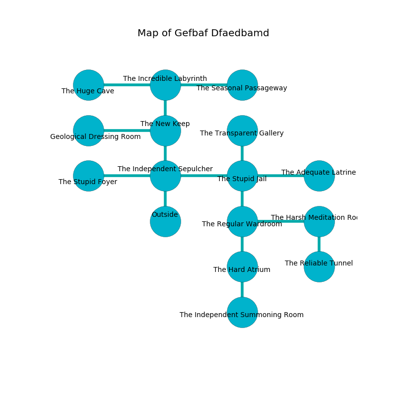

%Ruin Dogs

##Gefbaf Dfaedbamd
###Overview
Gefbaf Dfaedbamd is located under a broken rift. Some areas of Gefbaf Dfaedbamd are foggy. A lunar eclipse is happening outside. It is occupied by Kenku. Hassan Lang The Dishonest, a Sahuagin Baron is here. The Kenku have been charmed by Hassan Lang The Dishonest. He  is founding a new religion. 

###Artifact
####The Intermediate Knee

The Intermediate Knee is a powerful artifact in the shape of a cold spear. It is a bright brown color. It smells like green onion. When thrown it tunnels into the earth. 

###Locations

####the independent sepulcher
The floor is sticky. The air tastes like gasoline here. The stone walls are pristine. 

* To the west a torchlit passageway connects to [the stupid foyer](#the-stupid-foyer).
* To the east a torchlit cave opens to [the stupid jail](#the-stupid-jail).
* To the north a twisted cave connects to [the new keep](#the-new-keep).
* To the south is the entrance.

####the stupid jail
Yellow lichens are swaying from the ceiling. The air smells like tansy here. 

* [Hassan Lang The Dishonest](#Hassan-Lang-The-Dishonest) is here.
* To the west a torchlit cave leads to [the independent sepulcher](#the-independent-sepulcher).
* To the east a long opening leads to [the adequate latrine](#the-adequate-latrine).
* To the north a narrow cavern leads to [the transparent gallery](#the-transparent-gallery).
* To the south a dark threshold opens to [the regular wardroom](#the-regular-wardroom).

####the regular wardroom
The air tastes like unripe banana here. The floor is flooded with five inch deep lukewarm water. 

There is an engraving on a monolith written in common. 

> Go away.
>

* To the east a small cave connects to [the harsh meditation room](#the-harsh-meditation-room).
* To the north a dark threshold connects to [the stupid jail](#the-stupid-jail).
* To the south a torchlit artery connects to [the hard atrium](#the-hard-atrium).

####the transparent gallery
Green razorgrass is sprouting in a patch on the floor. The mirrored walls are covered in mold. 

* To the south a narrow cavern leads to [the stupid jail](#the-stupid-jail).

####the stupid foyer
There are an Ape, a Brass Dragon Wyrmling, a Shadow Demon, and a Bone Naga here. The air smells like lamb here. 

There is an engraving on the floor written in common. 

> A sail is a pastel
>
> ethical, tasty, unpleasant
>

* To the east a torchlit passageway connects to [the independent sepulcher](#the-independent-sepulcher).

####the adequate latrine
There are twenty four Kenkus here. Yellow moss is swaying from the walls. The floor is cluttered with broken glass. The Kenku are performing a ritual. If not interrupted, the Kenku will become more powerful. 

* To the west a long opening opens to [the stupid jail](#the-stupid-jail).

####the new keep
There are a Werewolf, a Knight, and a Hyena here. The concrete walls are bloodstained. 

There is an engraving on a monolith written in Kenku Script. 

> [The Intermediate Knee](#The-Intermediate-Knee)
>
> clear and unlike
>

* To the west a hazy cave connects to [the geological dressing room](#the-geological-dressing-room).
* To the north a flooded hallway connects to [the incredible labyrinth](#the-incredible-labyrinth).
* To the south a twisted cave opens to [the independent sepulcher](#the-independent-sepulcher).

####the hard atrium
There are a Raven, a Green Hag, a Githzerai Monk, a Hobgoblin, a Spined Devil, and a Half-Ogre here. The floor is bloodstained. 

There is an engraving on the ceiling written in common. 

> O! cruel you
>
> ever due
>
> conventional and optional
>
> the world is due
>

* [The Intermediate Knee](#The-Intermediate-Knee) is here.
* To the north a torchlit artery opens to [the regular wardroom](#the-regular-wardroom).
* To the south a narrow opening leads to [the independent summoning room](#the-independent-summoning-room).

####the geological dressing room
The air smells like ocean here. 

There is an engraving on a stone written in Kenku Script. 

> Oh weak soul
>
> it is never whole
>
> it is never concrete
>
> death is whole
>

* To the east a hazy cave opens to [the new keep](#the-new-keep).

####the incredible labyrinth
Blue ferns are growing in a patch on the floor. The mirrored walls are covered in mold. There are an Orog and a Shambling Mound here. The air tastes like nasturtium here. 

There is an engraving on a tablet written in common. 

> O cruel god
>
> constructive, annual, odd
>
> ever technical
>
> nothing is odd
>

* To the west a windy walkway leads to [the huge cave](#the-huge-cave).
* To the east a torchlit corridor opens to [the seasonal passageway](#the-seasonal-passageway).
* To the south a flooded hallway leads to [the new keep](#the-new-keep).

####the seasonal passageway

There is an engraving on the ceiling written in common. 

> O the world is woe
>
> visible and low
>
> manual and obscure
>
> death is premature
>

* To the west a torchlit corridor connects to [the incredible labyrinth](#the-incredible-labyrinth).

####the huge cave
The air smells like algae here. The floor is cluttered with ashes. The glass walls are bloodstained. 

* There is a door here.
* There is a skull here.
* To the east a windy walkway connects to [the incredible labyrinth](#the-incredible-labyrinth).

####the harsh meditation room
There are twenty four Kenkus here. The mirrored walls are bloodstained. The Kenku are willing to negotiate. 

* To the west a small cave leads to [the regular wardroom](#the-regular-wardroom).
* To the south a flooded threshold opens to [the reliable tunnel](#the-reliable-tunnel).

####the reliable tunnel
There are a Yeti and a Roper here. The air tastes like dill here. 

* There is a bowl here.
* There is a bottle here.
* To the north a flooded threshold leads to [the harsh meditation room](#the-harsh-meditation-room).

####the independent summoning room
The stone walls are ruined. White mushrooms are swaying from the walls. There are a Mastiff, a Satyr, a Couatl, and a Xorn here. The floor is flooded with two inch deep scalding water. 

* To the north a narrow opening leads to [the hard atrium](#the-hard-atrium).

