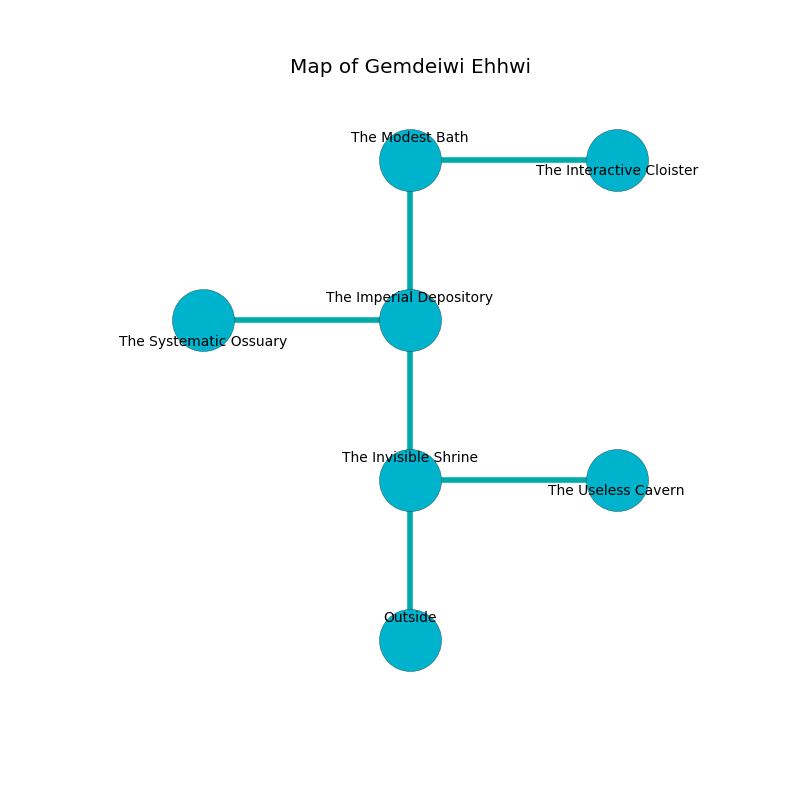

%Ruin Dogs

##Gemdeiwi Ehhwi
###Overview
Gemdeiwi Ehhwi is located in a flooded mountain. Parts of Gemdeiwi Ehhwi are unbearably hot. The ruin is sinking into the earth. It is occupied by Goblins. Dalton Grady The Indecisive, an Assassin is here. The Goblins worship Dalton Grady The Indecisive. He  is founding a new religion. 

###Artifact
####Cafaeh

Cafaeh has the form of a smooth doll. Water slips around it. When touched it destroys itself. 

###Locations

####the invisible shrine
The air smells like thyme here. 

* [Cafaeh](#Cafaeh) is here.
* [Dalton Grady The Indecisive](#Dalton-Grady-The-Indecisive) is here.
* To the east a flooded opening connects to [the useless cavern](#the-useless-cavern).
* To the north a dripping passageway leads to [the imperial depository](#the-imperial-depository).
* To the south is the entrance.

####the imperial depository
There are four Goblins, a Hobgoblin, three Hobgoblin Captains,  here. One of the Goblins is pointing a ballista at the entrance. 

There is an engraving on the ceiling written in common. 

> Dear me! dire you
>
> urban, generous, true
>
> smart and dramatic
>
> the world is bureaucratic
>

* To the west a small gap connects to [the systematic ossuary](#the-systematic-ossuary).
* To the north a windy cave leads to [the modest bath](#the-modest-bath).
* To the south a dripping passageway opens to [the invisible shrine](#the-invisible-shrine).

####the systematic ossuary
Green moss is growing in a patch on the floor. The crystal walls are pristine. There are an Azer, a Hobgoblin Warlord, and a Night Hag here. The floor is smooth. 

* To the east a small gap opens to [the imperial depository](#the-imperial-depository).

####the modest bath
The floor is cluttered with broken glass. 

* To the east a twisted cave opens to [the interactive cloister](#the-interactive-cloister).
* To the south a windy cave opens to [the imperial depository](#the-imperial-depository).

####the interactive cloister
The air tastes like coriander here. The glass walls are ruined. There are a Carrion Crawler and a Yuan-Ti Abomination here. 

* To the west a twisted cave opens to [the modest bath](#the-modest-bath).

####the useless cavern
Blue razorgrass is decaying in cracks in the floor. The floor is glossy. 

* There is a portrait here.
* To the west a flooded opening connects to [the invisible shrine](#the-invisible-shrine).

