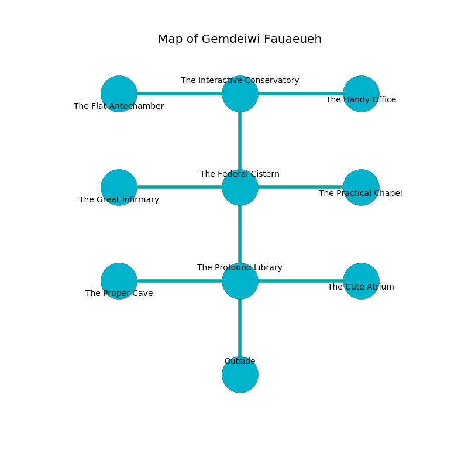

%Ruin Dogs

##Gemdeiwi Fauaeueh
###Overview
Gemdeiwi Fauaeueh is located in a broken plain. Regions of Gemdeiwi Fauaeueh are flooded. The ruin is coming to life. It is occupied by Orcs. Kum Dickey The Possessive, a Veteran is here. The Orcs worship Kum Dickey The Possessive. She  is founding a new religion. 

###Artifact
####Hahaml

Hahaml has the form of a smooth spear. When thrown it becomes a deadly projectile. 

###Locations

####the profound library
White lichens are swaying in broken urns. 

* There is a bottle here.
* To the west a torchlit path opens to [the proper cave](#the-proper-cave).
* To the east a windy path leads to [the cute atrium](#the-cute-atrium).
* To the north a hazy passageway opens to [the federal cistern](#the-federal-cistern).
* To the south is the entrance.

####the proper cave
Gray razorgrass is decaying in cracks in the floor. 

* To the east a torchlit path opens to [the profound library](#the-profound-library).

####the federal cistern
The air tastes like acetone here. There are two Orc Eyes of Gruumsh here. The stone walls are covered in mold. One of the Orcs is working a mechanism that can open a trapodoor in the floor. 

* [Kum Dickey The Possessive](#Kum-Dickey-The-Possessive) is here.
* To the west a torchlit passageway opens to [the great infirmary](#the-great-infirmary).
* To the east a small walkway connects to [the practical chapel](#the-practical-chapel).
* To the north a narrow cavern opens to [the interactive conservatory](#the-interactive-conservatory).
* To the south a hazy passageway opens to [the profound library](#the-profound-library).

####the interactive conservatory
There are two Orc Eyes of Gruumsh here. The floor is smooth. The crystal walls are bloodstained. One of the Orcs is working a mechanism that can flood the room. 

* [Hahaml](#Hahaml) is here.
* To the west a narrow walkway connects to [the flat antechamber](#the-flat-antechamber).
* To the east a windy path connects to [the handy office](#the-handy-office).
* To the south a narrow cavern leads to [the federal cistern](#the-federal-cistern).

####the great infirmary
There are two Orc Eyes of Gruumsh here. The brick walls are scratched. White lichens are swaying from the walls. The floor is cluttered with shells. The Orcs are crazy with bloodlust. 

* To the east a torchlit passageway opens to [the federal cistern](#the-federal-cistern).

####the flat antechamber
White lichens are growing in cracks in the floor. The air smells like violet here. The crystal walls are pristine. 

* There is a triptych here.
* To the east a narrow walkway leads to [the interactive conservatory](#the-interactive-conservatory).

####the cute atrium
The air smells like acetone here. There is a trap here. When activated, a magical rune will open a large pit in the floor. The wooden walls are pristine. 

There is an engraving on the wall written in common. 

> We are joyful
>
> environmental, active, negative
>
> but never colourful
>

* There is a girl here.
* To the west a windy path connects to [the profound library](#the-profound-library).

####the practical chapel
The floor is smooth. Yellow ferns are swaying in a patch on the floor. There are a Swarm of Ravens, a Brown Bear, and an Old Faerie Dragon here. The crystal walls are ruined. The air tastes like red apple here. 

* To the west a small walkway opens to [the federal cistern](#the-federal-cistern).

####the handy office
The floor is smooth. The air smells like incense here. There are two Orc Eyes of Gruumsh here. One of the Orcs is on watch, the rest are feasting. 

* To the west a windy path leads to [the interactive conservatory](#the-interactive-conservatory).

