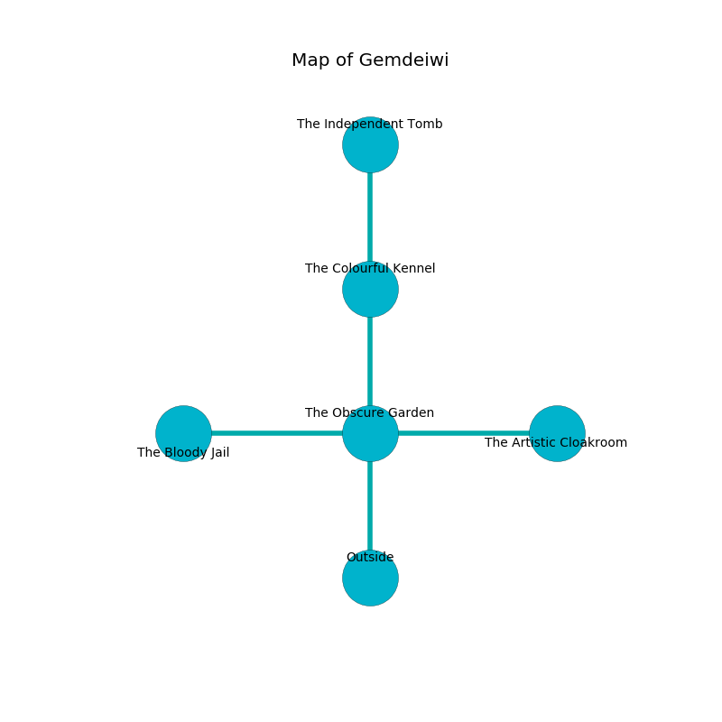

%Ruin Dogs

##Gemdeiwi
###Overview
Gemdeiwi is located on a ruined tree. Parts of Gemdeiwi are flooded. A solar eclipse is happening outside. It is occupied by Deep Gnomes. Calandra Corley The Boring, a Spined Devil is here. The Deep Gnomes worship Calandra Corley The Boring. She  is founding a new religion. 

###Artifact
####Haeuaf

Haeuaf looks like a sharp cube. Gravity shifts around it. When eaten it frightens children. 

###Locations

####the obscure garden
The floor is glossy. 

* There is a seed here.
* To the west a hazy artery leads to [the bloody jail](#the-bloody-jail).
* To the east a small corridor opens to [the artistic cloakroom](#the-artistic-cloakroom).
* To the north a small walkway opens to [the colourful kennel](#the-colourful-kennel).
* To the south is the entrance.

####the colourful kennel
Gray ferns are sprouting from the walls. The air tastes like civet here. 

* There is a brake here.
* [Haeuaf](#Haeuaf) is here.
* To the north a narrow hall connects to [the independent tomb](#the-independent-tomb).
* To the south a small walkway leads to [the obscure garden](#the-obscure-garden).

####the bloody jail
The floor is cluttered with ashes. 

There is an engraving on a monolith written in Deep Gnomes Script. 

> I tried swimming.
>

* To the east a hazy artery connects to [the obscure garden](#the-obscure-garden).

####the artistic cloakroom
There are a Vine Blight, a Poltergeist, and an Orc here. The floor is cluttered with debris. The obsidion walls are unsettled. The air smells like almond here. 

* To the west a small corridor opens to [the obscure garden](#the-obscure-garden).

####the independent tomb
Yellow ferns are growing in broken urns. The air smells like lavender here. The floor is flooded with eight inch deep scalding water. 

* There is a feather here.
* There is a door here.
* [Calandra Corley The Boring](#Calandra-Corley-The-Boring) is here.
* To the south a narrow hall opens to [the colourful kennel](#the-colourful-kennel).

