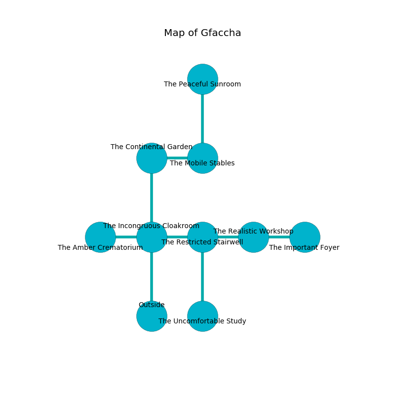

%Ruin Dogs

##Gfaccha
###Overview
Gfaccha is located in a haunted mountain. Some rooms of it are cursed. The ruin is collapsing slowly. It is occupied by Sprites. Darrel Heflin The Sarcastic, a Mind Flayer is here. The Sprites are the slaves of Darrel Heflin The Sarcastic. He  is trying to use [The Content Survivor](#The-Content-Survivor). 

###Artifact
####The Content Survivor

The Content Survivor has the form of a smooth blade. Fire incinerates near it. When touched it sings the hymn of the damned. 

###Locations

####the incongruous cloakroom
The floor is bloodstained. The mirrored walls are pristine. The air tastes like wasabi here. There are a Stirge, a Nightmare, and a Young Remorhaz here. Green razorgrass is swaying in cracks in the floor. 

* To the west a torchlit gap leads to [the amber crematorium](#the-amber-crematorium).
* To the east a small hallway connects to [the restricted stairwell](#the-restricted-stairwell).
* To the north a narrow passageway connects to [the continental garden](#the-continental-garden).
* To the south is the entrance.

####the amber crematorium
Yellow ferns are sprouting in broken urns. The air tastes like milk here. There are a Displacer Beast, a Nothic, an Elk, a Blood Hawk, and a Berserker here. 

* To the east a torchlit gap opens to [the incongruous cloakroom](#the-incongruous-cloakroom).

####the restricted stairwell
The floor is bloodstained. 

* There is a rail here.
* There is an apple here.
* To the west a small hallway connects to [the incongruous cloakroom](#the-incongruous-cloakroom).
* To the east a small hall connects to [the realistic workshop](#the-realistic-workshop).
* To the south a hazy hallway leads to [the uncomfortable study](#the-uncomfortable-study).

####the continental garden
The air smells like medicine here. There are a Vampire Spawn and a Gelatinous Cube here. The floor is glossy. 

* [Darrel Heflin The Sarcastic](#Darrel-Heflin-The-Sarcastic) is here.
* To the east a dripping opening connects to [the mobile stables](#the-mobile-stables).
* To the south a narrow passageway leads to [the incongruous cloakroom](#the-incongruous-cloakroom).

####the realistic workshop
The floor is cluttered with shells. The glass walls are unsettled. There are a Kuo-Toa Archpriest, a Kuo-Toa, a Baboon, and a Swarm of Poisonous Snakes here. The air smells like lettuce here. 

* To the west a small hall leads to [the restricted stairwell](#the-restricted-stairwell).
* To the east a long threshold leads to [the important foyer](#the-important-foyer).

####the important foyer
Gray lichens are decaying in a patch on the floor. There are a Galeb Duhr and a Worg here. The air tastes like green onion here. 

* To the west a long threshold connects to [the realistic workshop](#the-realistic-workshop).

####the uncomfortable study
The air tastes like mushroom here. There are twenty eight Sprites here. Yellow razorgrass is growing in cracks in the floor. The obsidion walls are ruined. If the Sprites notice the Ruin Dogs, one of them will retreat and alert the others. 

There is an engraving on the ceiling written in Sprites Script. 

> Oh my fate is poor
>
> it is always secure
>
> yet never secure
>
> cruelty is obscure
>

* There is a brush here.
* There is a knot here.
* There is a spade here.
* To the north a hazy hallway connects to [the restricted stairwell](#the-restricted-stairwell).

####the mobile stables
The stone walls are unsettled. Gray ferns are sprouting in cracks in the floor. The air tastes like marjoram here. 

There is an engraving on the wall written in Sprites Script. 

> [The Content Survivor](#The-Content-Survivor)
>
> always bold
>
> A book is a mosaic
>
> educational, historical, racial
>

* [The Content Survivor](#The-Content-Survivor) is here.
* To the west a dripping opening opens to [the continental garden](#the-continental-garden).
* To the north a twisted corridor connects to [the peaceful sunroom](#the-peaceful-sunroom).

####the peaceful sunroom
The floor is smooth. The air smells like truffle here. Red razorgrass is decaying in broken urns. 

There is an engraving on the wall written in common. 

> O life is poor
>
> ever secure
>
> yet never thirsty
>
> all is secure
>

* There is a bell here.
* To the south a twisted corridor leads to [the mobile stables](#the-mobile-stables).

