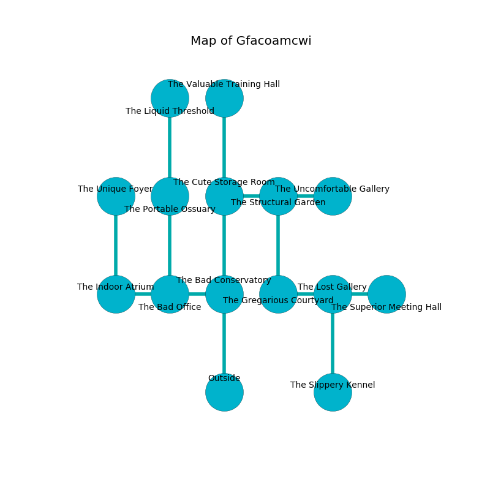

%Ruin Dogs

##Gfacoamcwi
###Overview
Gfacoamcwi is located in a cursed mountain. Parts of Gfacoamcwi are somewhat hot. A lunar eclipse is happening outside. It is occupied by Ogres. Sheldon Ziegler The Bossy, a Barbed Devil is here. The Ogres are battling Sheldon Ziegler The Bossy. He  is founding a new religion. 

###Artifact
####The Decorative Pumpkin

The Decorative Pumpkin has the form of a soft doll. It smells like jam. It is a pale blue color. Psychic energy pours near it. When carried it becomes lost. 

###Locations

####the bad conservatory
The floor is cluttered with bones. 

* To the west a windy cave connects to [the bad office](#the-bad-office).
* To the north a dripping path leads to [the cute storage room](#the-cute-storage-room).
* To the south is the entrance.

####the bad office
The obsidion walls are unsettled. 

* To the west a torchlit walkway connects to [the indoor atrium](#the-indoor-atrium).
* To the east a windy cave opens to [the bad conservatory](#the-bad-conservatory).
* To the north a narrow passageway opens to [the portable ossuary](#the-portable-ossuary).

####the cute storage room
The concrete walls are covered in mold. Yellow moss is sprouting in a patch on the floor. The air tastes like grass here. 

There is an engraving on a monolith written in Ogres Script. 

> [The Decorative Pumpkin](#The-Decorative-Pumpkin)
>
> occupational, marine, aware
>

* To the east a twisted pathway leads to [the structural garden](#the-structural-garden).
* To the north a long artery leads to [the valuable training hall](#the-valuable-training-hall).
* To the south a dripping path opens to [the bad conservatory](#the-bad-conservatory).

####the structural garden
The air tastes like phenolic here. The floor is glossy. 

* To the west a twisted pathway opens to [the cute storage room](#the-cute-storage-room).
* To the east a dark cavern connects to [the uncomfortable gallery](#the-uncomfortable-gallery).
* To the south a narrow gap leads to [the gregarious courtyard](#the-gregarious-courtyard).

####the gregarious courtyard
The wooden walls are unsettled. 

There is an engraving on the floor written in common. 

> [The Decorative Pumpkin](#The-Decorative-Pumpkin)
>
> ever relevant
>
> cute and imperial
>
> you will be destroyed
>

* To the east a torchlit pathway connects to [the lost gallery](#the-lost-gallery).
* To the north a narrow gap opens to [the structural garden](#the-structural-garden).

####the lost gallery
The air tastes like sesame here. There are three Half-Ogres and an Ogre here. The floor is bloodstained. One of the Ogres is working a mechanism that can lock the exits. 

* There is a church here.
* To the west a torchlit pathway leads to [the gregarious courtyard](#the-gregarious-courtyard).
* To the east a hazy hall connects to [the superior meeting hall](#the-superior-meeting-hall).
* To the south a long walkway opens to [the slippery kennel](#the-slippery-kennel).

####the portable ossuary
The floor is smooth. There are a Minotaur, a Mastiff, a Giant Weasel, a Shrieker, and a Gargoyle here. 

* There is a bottle here.
* There is a whistle here.
* To the north a long walkway opens to [the liquid threshold](#the-liquid-threshold).
* To the south a narrow passageway opens to [the bad office](#the-bad-office).

####the liquid threshold
The air tastes like broccoli here. 

* To the south a long walkway opens to [the portable ossuary](#the-portable-ossuary).

####the superior meeting hall

* To the west a hazy hall opens to [the lost gallery](#the-lost-gallery).

####the valuable training hall
The metallic walls are scratched. The air tastes like orange here. Green ferns are swaying in broken urns. 

* To the south a long artery leads to [the cute storage room](#the-cute-storage-room).

####the slippery kennel
The air smells like kiwi here. Gray moss is decaying from the ceiling. There are three Half-Ogres and an Ogre here. If the Ogres notice the Ruin Dogs, one of them will retreat and alert [Sheldon Ziegler](#Sheldon-Ziegler). 

There is an engraving on the floor written in Ogres Script. 

> I discovered this place.
>

* There is a baby here.
* [Sheldon Ziegler The Bossy](#Sheldon-Ziegler-The-Bossy) is here.
* To the north a long walkway leads to [the lost gallery](#the-lost-gallery).

####the indoor atrium
White mushrooms are sprouting in cracks in the floor. There are a Sahuagin, a Goat, a Hippogriff, an Ankylosaurus, and a Vine Blight here. The brick walls are bloodstained. 

There is an engraving on a stone written in common. 

> Dear me! my life is sadistic
>
> applied and realistic
>
> ever traditional
>
> everything is optimistic
>

* [The Decorative Pumpkin](#The-Decorative-Pumpkin) is here.
* To the east a torchlit walkway opens to [the bad office](#the-bad-office).
* To the north a small cavern leads to [the unique foyer](#the-unique-foyer).

####the uncomfortable gallery
The air tastes like buttery	cabbage here. The floor is cluttered with debris. There are a Spined Devil and a Hell Hound here. Gray lichens are decaying from the ceiling. 

* There is a bell here.
* To the west a dark cavern connects to [the structural garden](#the-structural-garden).

####the unique foyer
The floor is bloodstained. 

There is an engraving on a stone written in Ogres Script. 

> Run away.
>

* To the south a small cavern leads to [the indoor atrium](#the-indoor-atrium).

