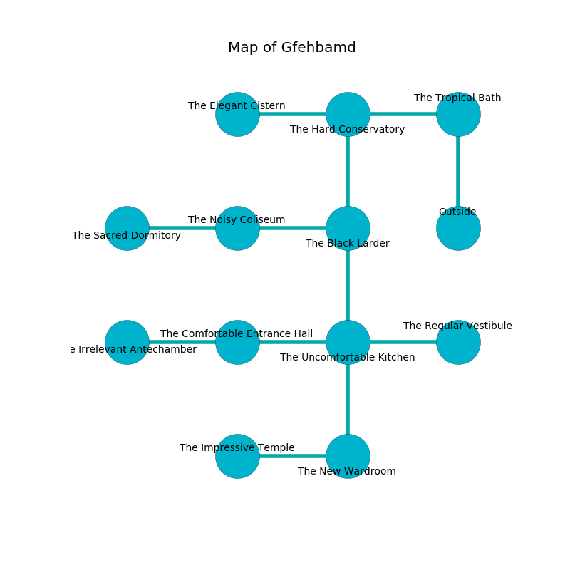

%Ruin Dogs

##Gfehbamd
###Overview
Gfehbamd is located in a ruined plain. Regions of Gfehbamd are somewhat cold. The ruin is larger on the inside than the outside. It is occupied by Sahuagins. Willie Spencer The Superficial, a Kuo-Toa Archpriest is here. The Sahuagins are the slaves of Willie Spencer The Superficial. He  is trying to use [Baemaeidaf](#Baemaeidaf). 

###Artifact
####Baemaeidaf

Baemaeidaf is a powerful artifact in the shape of a wet meteorite. Fire flows from it. It smells like allspice. It is a dark blue color. When picked up it liquifies. 

###Locations

####the tropical bath
There are a Mammoth and a Quadrone here. The concrete walls are covered in mold. Yellow moss is growing in broken urns. 

* To the west a narrow hall opens to [the hard conservatory](#the-hard-conservatory).
* To the south is the entrance.

####the hard conservatory
There are a Crawling Claw and a Stone Giant here. The metallic walls are ruined. Red ferns are growing in broken urns. The air tastes like algae here. 

* To the west a dark hall connects to [the elegant cistern](#the-elegant-cistern).
* To the east a narrow hall opens to [the tropical bath](#the-tropical-bath).
* To the south a flooded hall connects to [the black larder](#the-black-larder).

####the black larder
The crystal walls are unsettled. The floor is smooth. The air smells like fudge here. 

* To the west a hazy threshold connects to [the noisy coliseum](#the-noisy-coliseum).
* To the north a flooded hall opens to [the hard conservatory](#the-hard-conservatory).
* To the south a dark corridor opens to [the uncomfortable kitchen](#the-uncomfortable-kitchen).

####the noisy coliseum
The crystal walls are scratched. The floor is glossy. White ferns are growing in a patch on the floor. The air tastes like logenberry here. 

* To the west a hazy gap connects to [the sacred dormitory](#the-sacred-dormitory).
* To the east a hazy threshold opens to [the black larder](#the-black-larder).

####the elegant cistern
The floor is cluttered with shells. Blue mushrooms are swaying in cracks in the floor. The obsidion walls are unsettled. 

* To the east a dark hall leads to [the hard conservatory](#the-hard-conservatory).

####the uncomfortable kitchen
The crystal walls are ruined. Green mushrooms are sprouting in cracks in the floor. The floor is sticky. 

* [Baemaeidaf](#Baemaeidaf) is here.
* To the west a torchlit hall leads to [the comfortable entrance hall](#the-comfortable-entrance-hall).
* To the east a long path connects to [the regular vestibule](#the-regular-vestibule).
* To the north a dark corridor leads to [the black larder](#the-black-larder).
* To the south a flooded cave leads to [the new wardroom](#the-new-wardroom).

####the comfortable entrance hall
There are a Guard, a Minotaur Skeleton, a Kuo-Toa, and a Yuan-Ti Abomination here. There is a trap here. When activated, a magical proximity detector will cast a curse. The floor is sticky. Green ferns are decaying in broken urns. 

* To the west a narrow artery leads to [the irrelevant antechamber](#the-irrelevant-antechamber).
* To the east a torchlit hall opens to [the uncomfortable kitchen](#the-uncomfortable-kitchen).

####the new wardroom
The stone walls are covered in mold. The air smells like seed here. 

* There is a belt here.
* There is a spade here.
* To the west a long cavern opens to [the impressive temple](#the-impressive-temple).
* To the north a flooded cave leads to [the uncomfortable kitchen](#the-uncomfortable-kitchen).

####the sacred dormitory
The floor is glossy. White moss is swaying in broken urns. The metallic walls are caving in. 

There is an engraving on a stone written in Sahuagins Script. 

> I thought about running.
>

* To the east a hazy gap opens to [the noisy coliseum](#the-noisy-coliseum).

####the impressive temple
The crystal walls are bloodstained. 

* To the east a long cavern connects to [the new wardroom](#the-new-wardroom).

####the irrelevant antechamber
The brick walls are unsettled. The air smells like sand here. Blue ferns are decaying in broken urns. 

* There is a brush here.
* [Willie Spencer The Superficial](#Willie-Spencer-The-Superficial) is here.
* To the east a narrow artery opens to [the comfortable entrance hall](#the-comfortable-entrance-hall).

####the regular vestibule
There is a trap here. When activated, a magical rune will blast flames. There are two Mud Mephits, a Blink Dog, a Dust Mephit, a Gibbering Mouther, a Shrieker, a Scout, a Pony, a Noble, a Wyvern, a Half-Ogre, a Quasit, and  here. The floor is glossy. 

* There is a coat here.
* To the west a long path opens to [the uncomfortable kitchen](#the-uncomfortable-kitchen).

