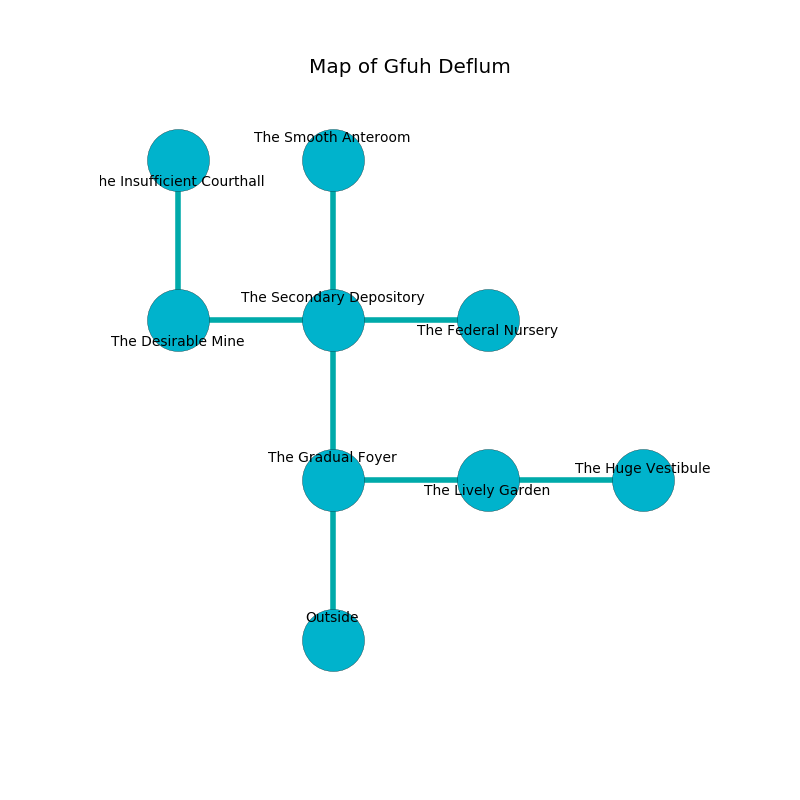

%Ruin Dogs

##Gfuh Deflum
###Overview
Gfuh Deflum is located under a volcanic plain. Some rooms of it are unbearably cold. The ruin is larger on the inside than the outside. It is occupied by Thri-Kreens. Burt Finch The Overemotional, a Quaggoth is here. The Thri-Kreens worship Burt Finch The Overemotional. He  is founding a new religion. 

###Artifact
####The White Lobby

The White Lobby is a powerful artifact in the shape of a sharp cube. Air slips towards it. It is a sickly purple color. When smelled it illuminates its surroundings. 

###Locations

####the gradual foyer
The floor is bloodstained. The stone walls are covered in mold. Gray mushrooms are swaying in broken urns. There are a Sprite, a Wolf, a Swarm of Quippers, a Couatl, a Rust Monster, a Poisonous Snake, a Young Faerie Dragon, a Giant fire beetle, and a Flying Sword here. 

* To the east a narrow pathway connects to [the lively garden](#the-lively-garden).
* To the north a dripping artery leads to [the secondary depository](#the-secondary-depository).
* To the south is the entrance.

####the secondary depository
There are four Thri-Kreens here. The wooden walls are unsettled. One of the Thri-Kreens is pointing a ballista at the entrance. 

* There is a blade here.
* To the west a dripping hall leads to [the desirable mine](#the-desirable-mine).
* To the east a windy cave opens to [the federal nursery](#the-federal-nursery).
* To the north a flooded threshold opens to [the smooth anteroom](#the-smooth-anteroom).
* To the south a dripping artery opens to [the gradual foyer](#the-gradual-foyer).

####the smooth anteroom

* To the south a flooded threshold leads to [the secondary depository](#the-secondary-depository).

####the lively garden
There are four Thri-Kreens here. One of the Thri-Kreens is pointing a ballista at the entrance. 

* To the west a narrow pathway connects to [the gradual foyer](#the-gradual-foyer).
* To the east a twisted walkway leads to [the huge vestibule](#the-huge-vestibule).

####the desirable mine
The air smells like custard here. There is a trap here. When activated, a tripwire will open a large pit in the floor. The wooden walls are bloodstained. 

There is an engraving on the floor written in common. 

> I worship [The White Lobby](#The-White-Lobby).
>

* [The White Lobby](#The-White-Lobby) is here.
* To the east a dripping hall leads to [the secondary depository](#the-secondary-depository).
* To the north a windy hallway connects to [the insufficient courthall](#the-insufficient-courthall).

####the federal nursery
The air smells like paper here. There are a Darkmantle, a Black Bear, a Duodrone, and a Red Dragon Wyrmling here. Green ferns are growing in cracks in the floor. The floor is cluttered with bones. 

* There is a horse here.
* To the west a windy cave leads to [the secondary depository](#the-secondary-depository).

####the huge vestibule
Green lichens are swaying in cracks in the floor. 

There is an engraving on a tablet written in common. 

> Maybe try praying.
>

* To the west a twisted walkway connects to [the lively garden](#the-lively-garden).

####the insufficient courthall
There are a Gray Ooze, a Veteran, and a Gelatinous Cube here. White moss is decaying in cracks in the floor. The stone walls are unsettled. The air smells like gasoline here. The floor is bloodstained. 

* [Burt Finch The Overemotional](#Burt-Finch-The-Overemotional) is here.
* To the south a windy hallway leads to [the desirable mine](#the-desirable-mine).

