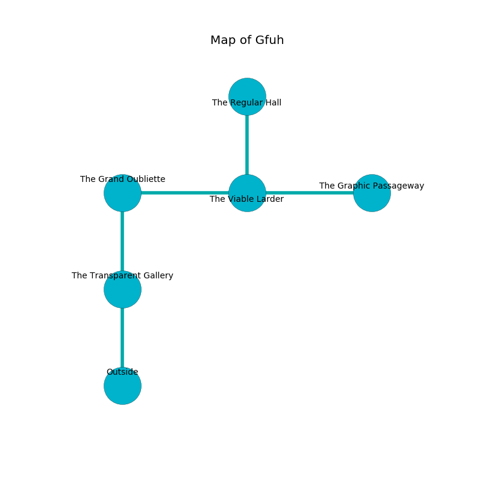

%Ruin Dogs

##Gfuh
###Overview
Gfuh is located on a giant rift. Parts of it are unbearably hot. The ruin is coming to life. It is occupied by Demons. Charity Wild The Indecisive, a Fire Giant is here. The Demons have been charmed by Charity Wild The Indecisive. She  is founding a new religion. 

###Artifact
####Iauhg

Iauhg has the form of a soft doll. It is a light green color. It smells like ozone. Magic glows near it. When rubbed it destroys others. 

###Locations

####the transparent gallery
There is a trap here. When activated, a magical sound detector will blast flames. 

* To the north a dripping opening opens to [the grand oubliette](#the-grand-oubliette).
* To the south is the entrance.

####the grand oubliette
White moss is sprouting in broken urns. There are two Incubi and a Cambion here. The glass walls are covered in mold. The air tastes like smoked sausage here. The Demons are willing to negotiate. 

* [Charity Wild The Indecisive](#Charity-Wild-The-Indecisive) is here.
* To the east a windy artery connects to [the viable larder](#the-viable-larder).
* To the south a dripping opening leads to [the transparent gallery](#the-transparent-gallery).

####the viable larder
Yellow ferns are swaying from the walls. There are an Imp, a Barbed Devil, and a Succubus here. The air smells like apricot here. The Demons are performing a ritual. If not interrupted, [Charity Wild](#Charity-Wild) will be magically alarmed. 

* [Iauhg](#Iauhg) is here.
* To the west a windy artery connects to [the grand oubliette](#the-grand-oubliette).
* To the east a twisted hall leads to [the graphic passageway](#the-graphic-passageway).
* To the north a dripping threshold opens to [the regular hall](#the-regular-hall).

####the regular hall
There are a Dire Wolf, a Berserker, a Young Brass Dragon, a Banshee, a Scarecrow, a Brown Bear, and a Pseudodragon here. The obsidion walls are scratched. 

There is an engraving on the wall written in common. 

> [Iauhg](#Iauhg)
>
> but awake
>
> astonishing and ordinary
>
> agile and weak
>
> blonde and mechanical
>
> central, neutral, warm
>
> yet consistent
>
> distant and viable
>
> loud, unfair, sophisticated
>

* To the south a dripping threshold connects to [the viable larder](#the-viable-larder).

####the graphic passageway
The floor is cluttered with bones. 

There is an engraving on the wall written in common. 

> [Iauhg](#Iauhg)
>
> cheap and realistic
>
> main and considerable
>

* To the west a twisted hall connects to [the viable larder](#the-viable-larder).

