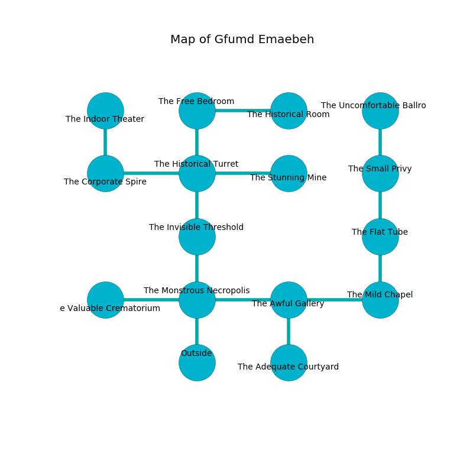

%Ruin Dogs

##Gfumd Emaebeh
###Overview
Gfumd Emaebeh is located on a flooded city. Some rooms of Gfumd Emaebeh are corrupted. A battle between raiders is happening outside. It is occupied by Dryads. Evia Keeton The Quarrelsome, a Cloud Giant is here. The Dryads have been charmed by Evia Keeton The Quarrelsome. She  is trying to use [Daa](#Daa). 

###Artifact
####Daa

Daa has the form of a cold doll. Magic bends away from it. When smelled it projects energy. 

###Locations

####the monstrous necropolis
The obsidion walls are ruined. The floor is bloodstained. There are nine Dryads here. If the Dryads notice the Ruin Dogs, one of them will retreat and alert the others. 

* To the west a dark cave opens to [the valuable crematorium](#the-valuable-crematorium).
* To the east a hazy corridor opens to [the awful gallery](#the-awful-gallery).
* To the north a windy walkway connects to [the invisible threshold](#the-invisible-threshold).
* To the south is the entrance.

####the invisible threshold
There are nine Dryads here. Green moss is swaying in cracks in the floor. The stone walls are scratched. The Dryads are performing a ritual. If not interrupted, [Evia Keeton](#Evia-Keeton) will be magically alarmed. 

* There is a wall here.
* To the north a flooded threshold opens to [the historical turret](#the-historical-turret).
* To the south a windy walkway opens to [the monstrous necropolis](#the-monstrous-necropolis).

####the awful gallery
The crystal walls are ruined. There are nine Dryads here. The air smells like apple skin here. The Dryads are berserk with rage. 

There is an engraving on the wall written in Dryads Script. 

> O life is inhumane
>
> always addicted
>
> secondary, just, vain
>
> everything is restricted
>

* To the west a hazy corridor connects to [the monstrous necropolis](#the-monstrous-necropolis).
* To the east a dripping corridor leads to [the mild chapel](#the-mild-chapel).
* To the south a small artery opens to [the adequate courtyard](#the-adequate-courtyard).

####the valuable crematorium
The floor is bloodstained. Gray lichens are sprouting from the ceiling. 

There is an engraving on the floor written in common. 

> Dig here.
>

* [Evia Keeton The Quarrelsome](#Evia-Keeton-The-Quarrelsome) is here.
* To the east a dark cave connects to [the monstrous necropolis](#the-monstrous-necropolis).

####the historical turret
The floor is sticky. 

* To the west a hazy pathway connects to [the corporate spire](#the-corporate-spire).
* To the east a dripping threshold leads to [the stunning mine](#the-stunning-mine).
* To the north a windy path leads to [the free bedroom](#the-free-bedroom).
* To the south a flooded threshold leads to [the invisible threshold](#the-invisible-threshold).

####the free bedroom
There are nine Dryads here. Gray lichens are decaying from the walls. The floor is flooded with five inch deep cool water. The Dryads are willing to negotiate. 

* To the east a twisted passageway leads to [the historical room](#the-historical-room).
* To the south a windy path connects to [the historical turret](#the-historical-turret).

####the corporate spire
The floor is glossy. The air tastes like soup here. 

* To the east a hazy pathway opens to [the historical turret](#the-historical-turret).
* To the north a narrow cave opens to [the indoor theater](#the-indoor-theater).

####the mild chapel
There are a Jackal, a Tribal Warrior, a Kenku, a Chain Devil, a Slaad Tadpole, a Goat, a Brass Dragon Wyrmling, and a Knight here. 

* To the west a dripping corridor connects to [the awful gallery](#the-awful-gallery).
* To the north a hazy passageway opens to [the flat tube](#the-flat-tube).

####the stunning mine
There are a Winter Wolf, a Dryad, and a Werebear here. The mirrored walls are covered in mold. 

* To the west a dripping threshold leads to [the historical turret](#the-historical-turret).

####the flat tube
Yellow moss is decaying from the walls. The floor is sticky. There are nine Dryads here. There is a trap here. When activated, a magical rune will launch a ceiling pendulum. One of the Dryads is working a mechanism that can open a trapodoor in the floor. 

* There is a cat here.
* To the north a hazy opening opens to [the small privy](#the-small-privy).
* To the south a hazy passageway leads to [the mild chapel](#the-mild-chapel).

####the small privy
Yellow razorgrass is growing in broken urns. The floor is flooded with eight inch deep hot water. 

There is an engraving on the wall written in Dryads Script. 

> [Daa](#Daa)
>
> physical, complex, asleep
>

* [Daa](#Daa) is here.
* To the north a dark hall connects to [the uncomfortable ballroom](#the-uncomfortable-ballroom).
* To the south a hazy opening opens to [the flat tube](#the-flat-tube).

####the indoor theater
Yellow razorgrass is sprouting from the walls. The air tastes like caraway here. 

* To the south a narrow cave opens to [the corporate spire](#the-corporate-spire).

####the adequate courtyard
Green mushrooms are decaying in broken urns. The air smells like praline here. The floor is sticky. The stone walls are bloodstained. 

There is an engraving on the floor written in common. 

> I was injured in Gfumd Emaebeh.
>
> Dig here.
>

* To the north a small artery connects to [the awful gallery](#the-awful-gallery).

####the historical room
White razorgrass is decaying from the walls. There are a Swarm of Rats, a Warhorse Skeleton, a Wererat, a Mage, and a Flesh Golem here. 

* To the west a twisted passageway opens to [the free bedroom](#the-free-bedroom).

####the uncomfortable ballroom
The air smells like pomegranate here. There are nine Dryads here. One of the Dryads is pointing a ballista at the entrance. 

* There is a table here.
* To the south a dark hall connects to [the small privy](#the-small-privy).

